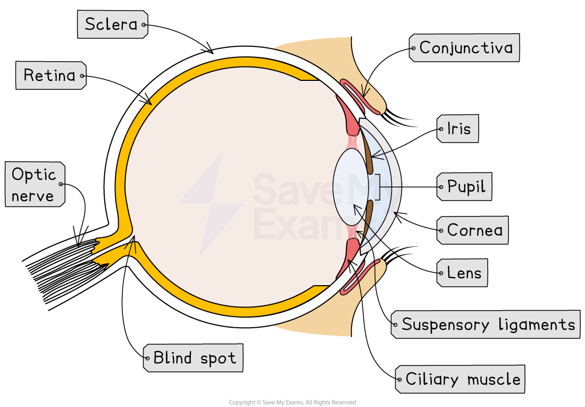

# The Human Eye: Structure

## The Human Eye: Structure

> **Spec point** — `spcpt_tTrzJ7y32nRkFKdw` · describe the structure and function of the eye as a receptor

## The Human Eye: Structure

- The eye is a highly specialised **sense organ** containing receptor cells that allow us to detect the stimulus of light
- The **retina** of the eye contains **receptor cells **sensitive to light

*The eye is a sense organ that contains light receptor cells*

### The structures of the eye

- **Conjunctiva** - a clear membrane that covers the white of the eye and the inside of the eyelids; it lubricates the eye and provides protection from external irritants
- **Cornea** - transparent, curved layer at the front of the eye that refracts light as it enters the eye
- **Sclera** - the strong outer wall of the eyeball that helps to keep the eye in shape and provides a place of attachment for the muscles that move the eye
- **Pupil** - circular opening in the centre of the iris that allows light to enter the eye
- **Iris** - controls how much light enters the pupil
- **Lens** - transparent disc that can change shape to focus light onto the retina
- **Ciliary muscle** - a ring of muscle that contracts and relaxes to change the shape of the lens
- **Suspensory ligaments** - ligaments that connect the ciliary muscle to the lens
- **Retina** - contains receptor cells sensitive to light
- **Fovea** - region of the retina that contains densely packed cones (allows eyes to see in good detail and colour)
- **Optic nerve** - carries impulses between the eye and the brain
- **Blind spot** - the point at which the optic nerve leaves the eye, where there are no light receptor cells

> **Exam Hint**
> Make sure you can identify the structures of the eye on a diagram because diagrams with labels are a very common form of exam question for this topic.
