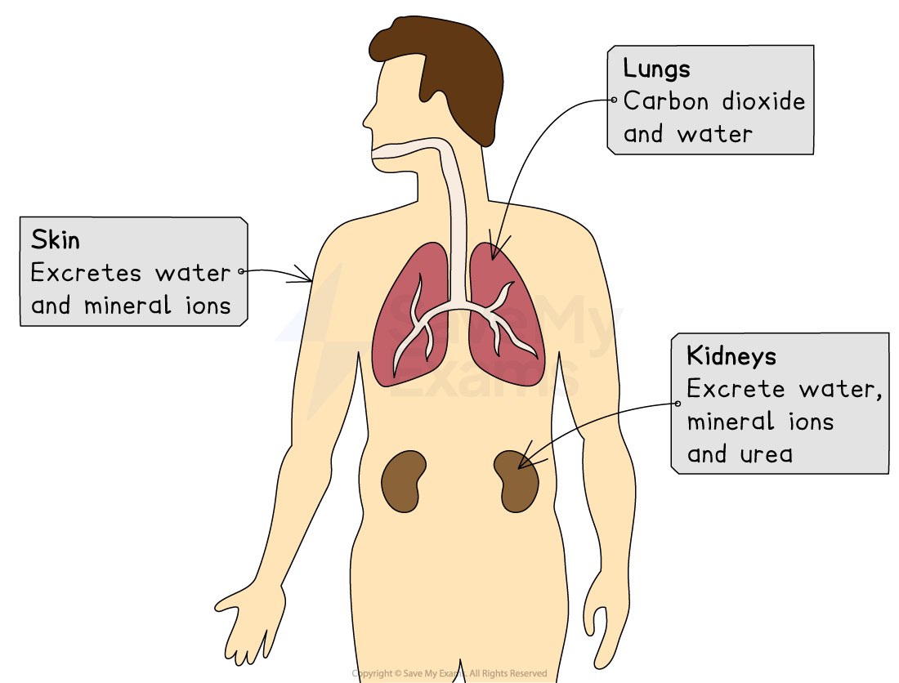

# Excretion in Humans

## The Need for Excretion in Humans

> **Spec point** — `spcpt_9qf4FgFhJKzt96T5` · know the excretory products of the lungs, kidneys and skin (organs of excretion)

## The Need for Excretion in Humans

- Many of the necessary **metabolic reactions** that take place within the cells of organisms produce **waste products**
- **Excretion** is the **removal of the waste substances **of metabolic reactions, **toxic materials** and **substances in excess** of requirements
- Metabolic wastes produced by the human body include:

  - **Carbon dioxide** and **water** from aerobic respiration in cells
  - **Urea** produced by the breakdown of excess proteins (amino acids) in the liver

### The danger of waste products

- If waste products are allowed to build up they can have a range of negative effects on the body:

  - **Toxicity **- waste products can have **toxic effects** if they are allowed to reach **high concentrations**
  
    - **Carbon dioxide** dissolves in water easily to form an acidic solution which can **lower the pH of cells. **This can **reduce the activity of enzymes** in the body which are essential for controlling the rate of metabolic reactions
  - **Osmotic** effect - body fluids can become **more concentrated** due to higher amounts of waste products
  
    - Concentrated body fluids can cause water to move out of cells, changing their water potential and preventing them from carrying out essential reactions
  - Using up necessary **storage** - space within an organism is limited and is required for the storage of more useful molecules

> **Exam Hint**
> A common mistake is to think that faeces is excreted by the body. Faeces mainly consists of undigested food and is not waste from metabolism. So it is incorrect to give faeces as an example of excretion.

## The Organs of Excretion

> **Spec point** — `spcpt_t5XvM8YQwcfbmt9B` · know the excretory products of the lungs, kidneys and skin (organs of excretion)

## The Organs of Excretion

- Humans have organs that are specialised for the removal of certain excretory products
- **Excretory organs** of the human body include:

  - The** kidneys **for the excretion of urea, water and excess ions
  
    - The kidneys excrete these substances in the** urine**
    - Note that the urea comes from the breakdown of excess amino acids in the liver
  - The** lungs **for the excretion of carbon dioxide and water
  
    - During** exhalation** carbon dioxide leaves the lungs, as well as water in the form of vapour
  - The** skin **for the excretion of excess mineral ions (e.g. sodium) and water, as well as some urea
  
    - Excretion at the skin surface occurs via **sweating**

*Organs of excretion*
