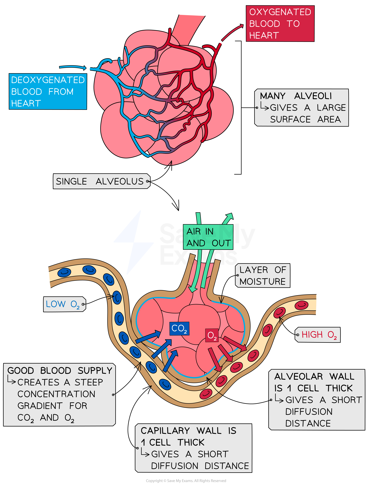

# Alveoli: Adaptations for Gas Exchange

## Alveoli

> **Spec point** — `spcpt_JcxRhbM4GqyB8sJf` · explain how alveoli are adapted for gas exchange by diffusion between air in the lungs and blood in capillaries

## Alveoli

- The alveoli are highly **adapted **and** specialised **for gas exchange

  - There are many rounded alveolar sacs which give a very **large** **surface area to volume ratio**
  - Alveoli (and the capillaries around them) have **thin, single layers of cells to minimise diffusion distance**
  - ***Ventilation*** maintains high levels of **oxygen** and low levels of **carbon dioxide** in the alveolar air space, meaning there is a steep **concentration gradient** for diffusion of gases
  - A **good blood supply** ensures a constant supply of blood high in **carbon dioxide** and low in **oxygen**, again to maintain concentration gradients for diffusion
  - A **layer of moisture** on the surface of the alveoli helps diffusion as gases dissolve

***Alveoli are specifically adapted to maximise gas exchange***
