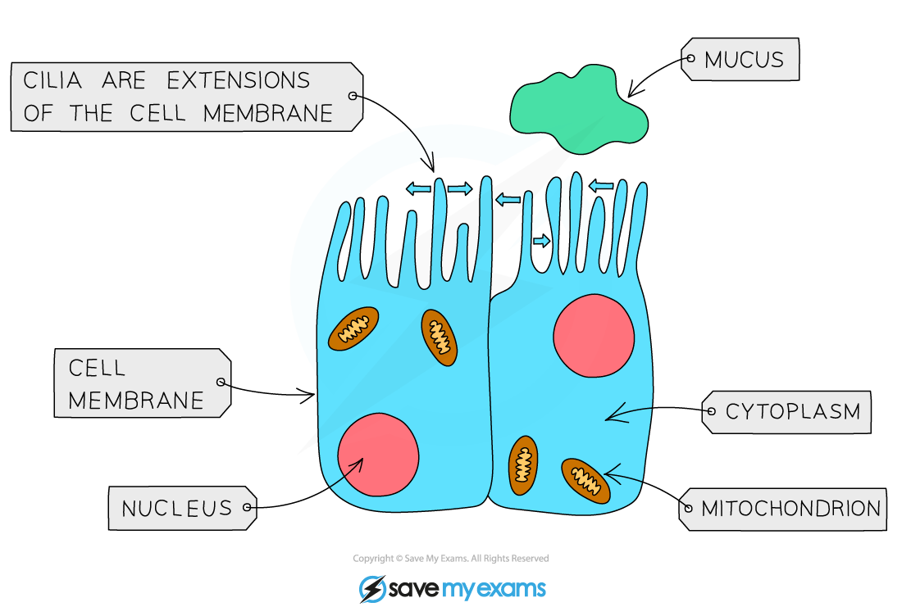
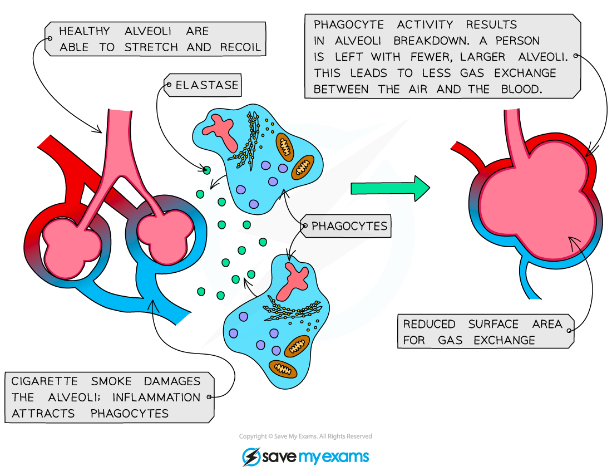

# Smoking & the Gas Exchange System

## Smoking & the Gas Exchange System

> **Spec point** — `spcpt_2fTJb2sx4w44vRkS` · understand the biological consequences of smoking in relation to the lungs and the circulatory system, including coronary heart disease

## Smoking & the Gas Exchange System

- Smoking cigarettes has been linked to **disease in the lungs**, and is also a [risk factor in coronary heart disease](https://www.savemyexams.com/igcse/biology/edexcel/19/revision-notes/2-structure-and-function-in-living-organisms/transport-systems/2-67-risk-factors-for-coronary-heart-disease/)
- There are many harmful chemicals in cigarettes that are linked to disease, e.g.

  - ** **nicotine:
  
    - **narrows blood vessels **and** increases heart rate, **leading to **increased blood pressure**
    - causes high blood pressure that leads to** blood clots** forming in the arteries, potentially resulting in **heart attack** or **stroke**
  - carbon monoxide:
  
    - **binds irreversibly to haemoglobin**, reducing the capacity of blood to carry oxygen
    - puts more strain on the breathing system, as **breathing frequency and depth need to increase **to supply the same amount of oxygen
    - means that the circulatory system needs to pump blood faster, raising blood pressure and increasing the risk of **coronary heart disease **and** stroke**
  - tar:
  
    - is a **carcinogen** linked to increased chances of **cancerous **cells developing in the lungs
    - contributes to **COPD**,** **which occurs when **chronic bronchitis** and **emphysema** occur together

### Diseases of the gas exchange system linked to smoking

#### Chronic bronchitis

- **Tar** stimulates goblet cells and mucus glands to enlarge and **produce more mucus**
- **Mucus** **builds up**, blocking the smallest bronchioles and leading to infections

  - The build-up of mucus can result in **damage to the cilia**, preventing them from beating and removing the mucus
- A **smoker's cough** is the attempt to move the mucus

***In healthy airways cilia are present, and beat to move mucus up and out of the lungs; in smokers the cilia are damaged so mucus is not removed***

#### Emphysema

- Emphysema is a result of **frequent infection**

  - Infections occur more frequently in smokers due to the build-up of mucus that occurs in the lungs
- Emphysema develops as follows:

  - phagocytes that enter the lungs release elastase, an enzyme that breaks down the elastic fibres in the alveoli
  - the **alveoli **become** less elastic and cannot stretch**, so many burst
  - the breakdown of alveoli **reduces the surface area for gas exchange**
- Emphysema patients become **breathless and wheezy**, and may need a constant supply of oxygen to stay alive

***The breakdown of alveoli in emphysema reduces the surface area for gas exchange***
