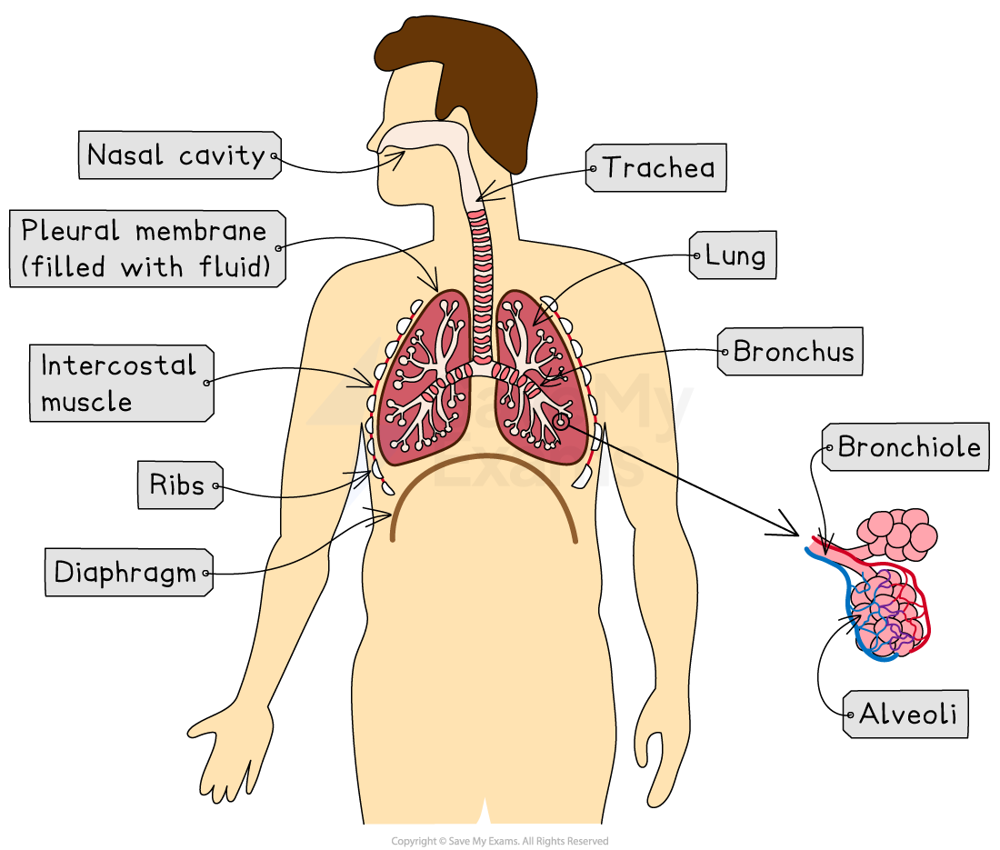

# Structure of the Breathing System

## Structure of the Respiratory System

> **Spec point** — `spcpt_zDmyZnfnwwDNGVvR` · describe the structure of the thorax, including the ribs, intercostal muscles, diaphragm, trachea, bronchi, bronchioles, alveoli and pleural membranes

## Structure of the Respiratory System

- Gas exchange occurs in the respiratory system. The human respiratory system is located in the **thorax**
- The **thorax** is the **chest cavity** in humans. It contains:

  - the **ribs**
  - the **intercostal muscles**
  - the **diaphragm**
  - the **trachea**
  - the **lungs**, which contain:
  
    - the **bronchi**
    - the **bronchioles**
    - the **alveoli **
  - the **pleural membranes**

> **Exam Hint**
> In addition to being able to recognise and describe the structures of the thorax, you also need to know the order that air passes through them into and out of the respiratory system. 
> 
> Take care not to mix up the order of the bronchi and the bronchioles. During inhalation (breathing in) air passes first through the trachea to the **bronchi** and then into the **bronchioles: **trachea ➔ bronchus ➔ bronchiole ➔ alveolus.

- All gas exchange surfaces share adaptations that maximise the rate of diffusion so that oxygen and carbon dioxide can be exchanged efficiently
- Adaptations of the human respiratory system include:

  - **Large surface area **- provided by many alveoli, increasing the area over which gases can be exchanged by diffusion between air in the lungs and blood in the capillaries
  - The **walls** of the alveoli and capillaries supplying blood to them are **one cell thick**, keeping the distance over which gases are exchanged as short as possible
  - **Good ventilation with air - **movement of air in and out of the lungs maintains a **high concentration gradient** for oxygen and carbon dioxide between the air in the lungs and blood in the capillaries
  - **Good blood supply - **maintains a **high concentration gradient** by carrying blood with a high concentration of oxygen away from the alveoli

***Structures in the human respiratory system, located in the thorax***

#### Structures in the thorax

| Structure | Description |
|---|---|
| Ribs | Bone structure that protects internal organs (eg. the lungs) |
| Intercostal muscle | Muscles between the ribs which control their movement causing inhalation and exhalation |
| Diaphragm | Sheet of connective tissue and muscle at the bottom of the thorax that helps change the volume of the thorax to allow inhalation and exhalation |
| Trachea | Windpipe that connects the mouth and nose to the lungs |
| Bronchi | Large tubes branching off the trachea that connect to the bronchioles. The human lungs contain two bronchi, each tube is known as a bronchus:  - **Bronchi** (plural) - **Bronchus** (singular) |
| Bronchioles | Smaller tubes that connect the bronchi to the alveoli |
| Alveoli | Tiny, balloon-like air sacs found at the ends of the bronchioles in the lungs. The alveoli are the **specialised gas exchange surfaces** where oxygen diffuses into the blood and carbon dioxide diffuses out.  - **Alveoli** (plural) - **Alveolus** (singular) |
| Pleural membranes | Thin layers of tissue that surround the lungs and line the inside of the thorax. |

> **Exam Hint**
> You could be asked a question about a non-human respiratory system in your exam, but one that has the same structures. Make sure you know the order of tubes that lead from the mouth/throat to the alveoli.
