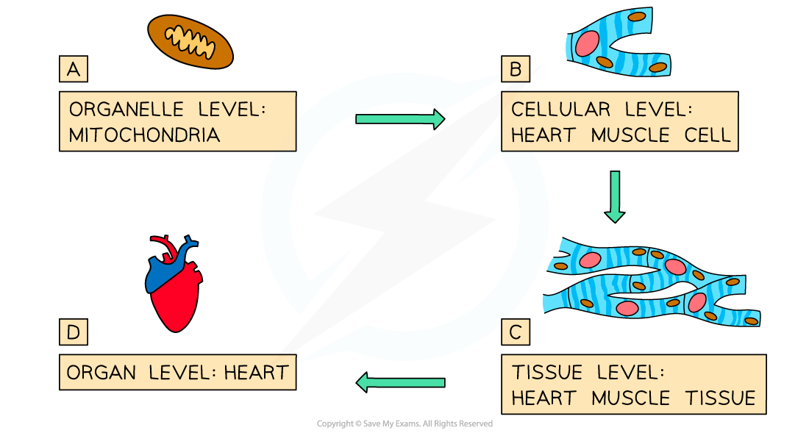
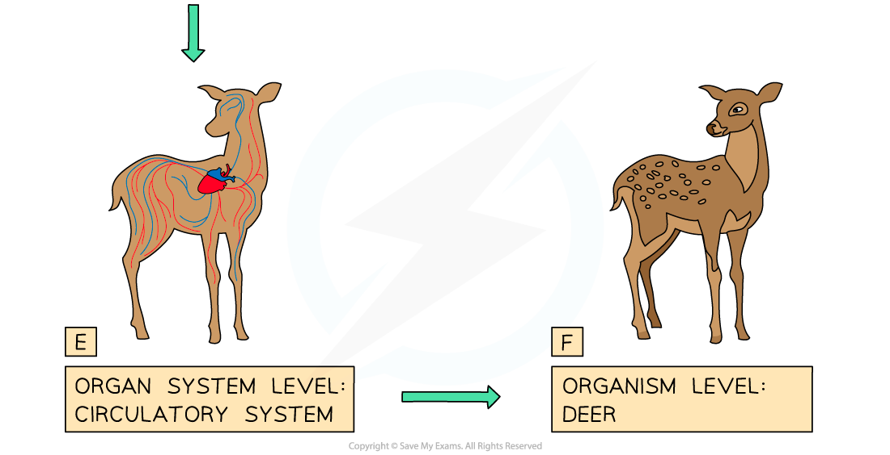

# Levels of Organisation

## Cells, Tissues, Organs & Organ Systems

> **Spec point** — `spcpt_ShbyQ3PDxvb4gYv3` · describe the levels of organisation in organisms: organelles, cells, tissues, organs and systems

## Cells, Tissues, Organs & Organ Systems

- Cells are the basic building blocks of all living organisms
- **Unicellular** organisms are made from one cell, whereas **multicellular** organisms are made up of collections of cells
- Cells are made up of structures called **organelles**, such as the nucleus, mitochondria and ribosomes
- In complex multicellular organisms:

  - Cells are **specialised** to carry out particular functions
  - These specialised cells form **tissues**
  - The tissues form **organs**
  - The organs form** organ systems**

#### Different Levels of Organisation Table

| Level | Description |
|---|---|
| Organelles | - Specialised structures within a cell that carry out specific functions - An example of an organelle is the mitochondrion, which is where  aerobic respiration  occurs |
| Cells | - Basic structural and functional units of all living organisms |
| Tissues | - A group of similar cells that work together to carry out a particular function |
| Organs | - A structure made up of different tissues working together to perform a specific function |
| Organ systems | - A group of organs that work together to carry out a particular function |

***Multicellular organisms have many levels of organisation***

#### Examples of Organ Systems in Animals & Plants Table

| Organ system | Organs | Tissue examples |
|---|---|---|
| Shoot system | - Leaf - Stem - Flower - Fruit | - Epidermis - Mesophyll - Xylem - Phloem |
| Root system | - Root - Tuber | - Xylem - Phloem |
| Digestive system | - Oesophagus - Stomach - Small intestine - Large intestine | - Muscle - Connective - Nerve - Epithelial |
| Circulatory system | - Heart | - Muscle - Connective - Nerve - Epithelial - Veins - Arteries |
| Respiratory system | - Trachea - Lungs | - Connective - Muscle - Epithelial |
| Excretory system | - Lungs - Kidneys - Skin | - Muscle - Connective - Nerve - Epithelial |
| Nervous system | - Brain - Spinal cord | - Nerves |
| Reproductive system | - Ovary - Uterus - Testes | - Muscle - Connective - Nerve |

> **Worked Example**
> 
> 
> The answer is **B**: 1 is the leaf organ, 2 is a palisade mesophyll cell and 3 is the upper epidermis.
