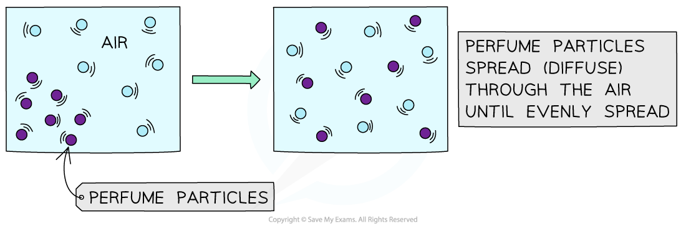
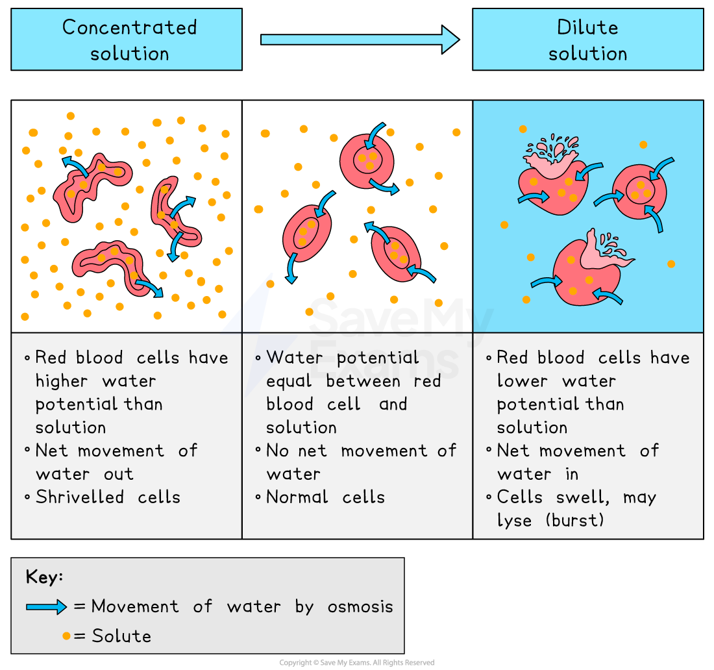
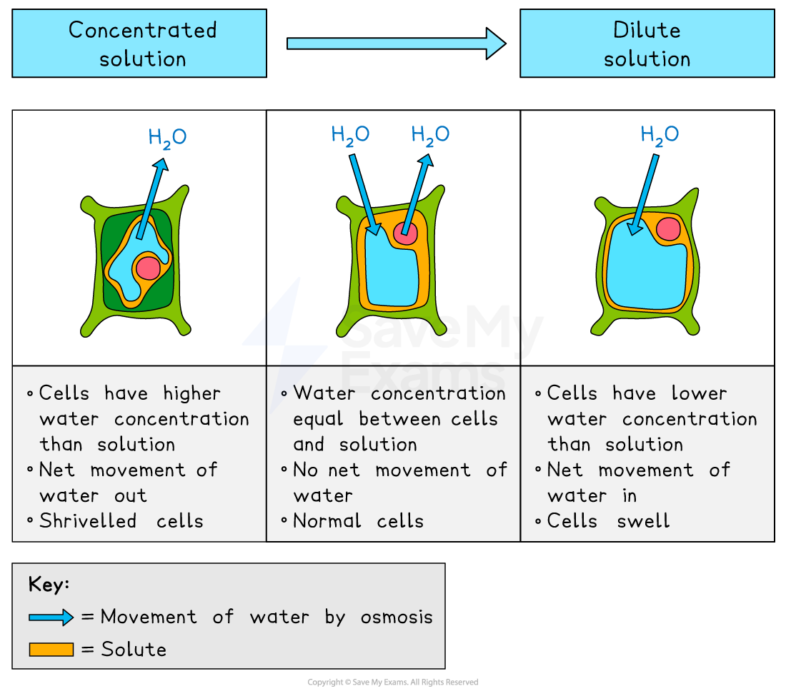
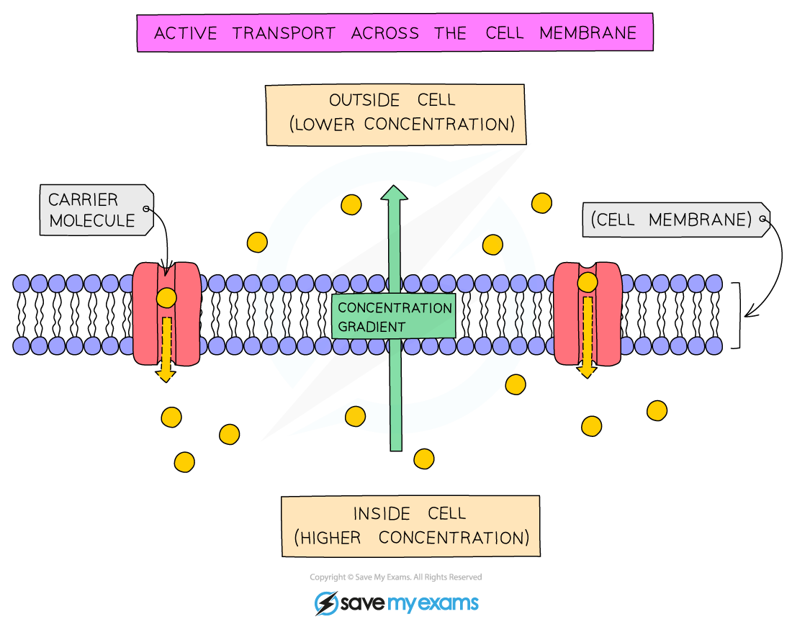

# Diffusion, Osmosis & Active Transport

## Diffusion

> **Spec point** — `spcpt_bmMPC75n99bxDsDy` · understand the processes of diffusion, osmosis and active transport by which substances move into and out of cells

## Diffusion

- Diffusion can be defined as:

**The movement of particles from a region of higher concentration to a region of lower concentration**

- Particles **move down a concentration gradient **
- Note that the movement of particles is **random**, but the result of this random movement is the spreading out of particles until they are at even concentration throughout the available space
- Diffusion is a passive process as it doesn't require energy from the cell, rather the particles diffusing have kinetic energy and they will randomly spread out from a high to a low concentration until they are evenly spread

### Diffusion in living organisms

- Gases and small molecules move into or out of living cells by diffusion when they cross the** cell membrane**

  - The cell membrane is **partially permeable**, meaning that it allows some gases and molecules to cross, but not others
  - E.g. small molecules, like oxygen, can diffuse freely across the membrane (so long as there is a concentration gradient) but larger molecules, like starch, cannot
- Examples of diffusion in living organisms include:

  - In a leaf: the concentration of **carbon dioxide** in the chloroplasts inside of the cells of the leaf will be lower than the atmosphere surrounding it when it's photosynthesising, so carbon dioxide diffuses into the cells by diffusion
  - In the lungs: the concentration of **oxygen** inside the alveoli (air sacs) is higher than the concentration of oxygen in the blood of the capillaries, so oxygen diffuses into the blood to be transported around the body
  - In the liver: the concentration of **urea**, a waste product, is higher in the liver cells than the blood flowing through the liver, so urea diffuses out of the liver cells into the blood

> **Exam Hint**
> Remember that diffusion is the movement of particles from an area of **high concentration to an area of low** concentration.

## Osmosis

> **Spec point** — `spcpt_Z6QnrpBgKZ2Wgptp` · understand the processes of diffusion, osmosis and active transport by which substances move into and out of cells

## Osmosis

- Osmosis can be defined as:

**The movement of water molecules from a region of higher water concentration (a dilute solution) to a region of lower water concentration (a concentrated solution), through a partially permeable membrane**

- Osmosis is the **diffusion** of water, as the water is moving **down** its **concentration gradient**
- Partially permeable membranes prevent the movement of** larger molecules**, e.g. sugars, but allow the movement of small water molecules

***Osmosis is the diffusion of water molecules across a partially permeable membrane***

- Scientists often describe osmosis using the term **water potential** instead of water concentration:

  - Water moves from an area of  higher water potential to an area of lower water potential
  - The more solute (eg. sugar or salt) a solution contains, the lower its water potential (the lower its water concentration)
  
    - And vice versa, the less solute a solution contains, the higher its water potential (the higher the water concentration)
  - Pure water has the highest water potential

> **Exam Hint**
> If you are asked to describe what is meant by the term **osmosis** in your exam, you must first state that it is "**the diffusion  of water through a partially permeable membrane"**. Then you can **either** say "water moves from a dilute to a concentrated solution" (which is like saying water moves from a high concentration of water to a low concentration of water) **or** you can say "water moves from a high water potential to a low water potential".
> 
> You don't need to use the term **water potential** but it is more accurate to do so.

#### Osmosis in animal cells

- **Without a cell wall**, osmosis can have severe effects on animal cells:

  - In a **strong sugar solution** (lower water concentration), the cell** loses water,** becoming **crenated (shrivelled)**
  - In** distilled water** (higher water concentration), the cell **gains water**, eventually** bursting** as it lacks a cell wall to maintain structure

***Effect of osmosis on animal cells***

#### Osmosis in plant cells

- Due to the cell wall, plant cells are protected from bursting:

  - In a **strong sugar solution** (lower water concentration), the cell **loses water,** the vacuole shrinks, and the cell membrane pulls away from the wall, making the **cell flaccid or plasmolysed**
  - In **distilled water** (higher water concentration), the cell** gains water**, the vacuole expands, and the membrane pushes against the cell wall, making the **cell turgid**
  
    - Turgid cells provide **structural support** and **prevent wilting** in plants

***The effect of osmosis on plant cells***

> **Exam Hint**
> Students can find osmosis confusing, so remember the following:
> 
> - Osmosis always refers to the movement of **water**
> - Osmosis always occurs across a **partially permeable membrane**
> - Water moves from a **dilute to a more concentrated solution** (or from a higher water potential to a lower water potential)

## Active Transport

> **Spec point** — `spcpt_zrKYppTcvRSg5Q3w` · understand the processes of diffusion, osmosis and active transport by which substances move into and out of cells

## Active Transport

- Active transport can be defined as:

**The movement of particles across a cell membrane from a region of lower concentration to a region of higher concentration, requiring energy released by respiration**

- **Energy** is needed for active transport because particles are being moved **against a concentration gradient**

  - Energy is released during cellular **respiration**
- Active transport across the cell membrane involves **protein pumps** that are embedded in the cell membrane
- Examples of active transport in cells include:

  - absorption of the products of digestion into the bloodstream from the lumen of the small intestine
  - absorption of mineral ions** **from the soil into the root hair cells of plants

***Active transport involves movement against a concentration gradient, and so requires energy***
