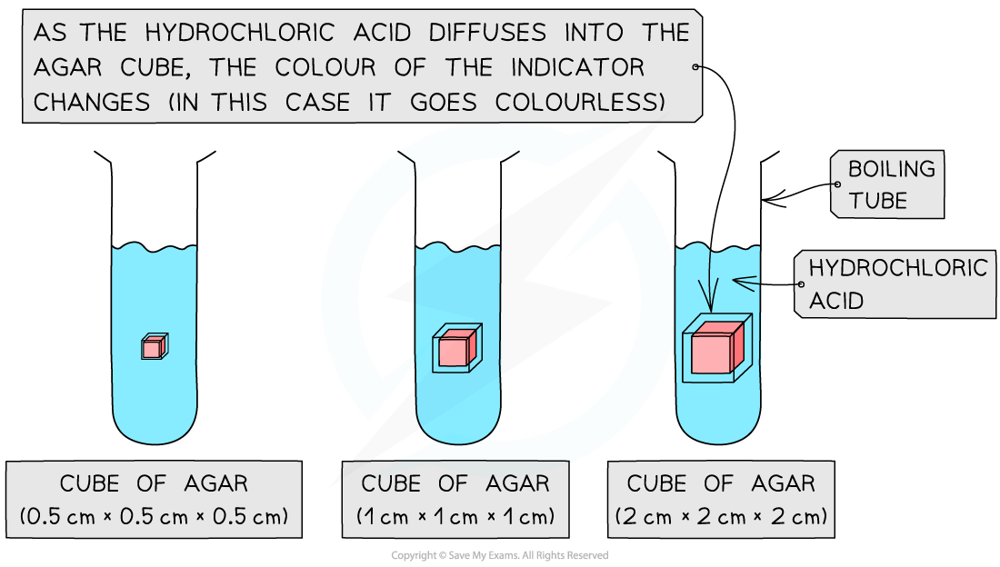
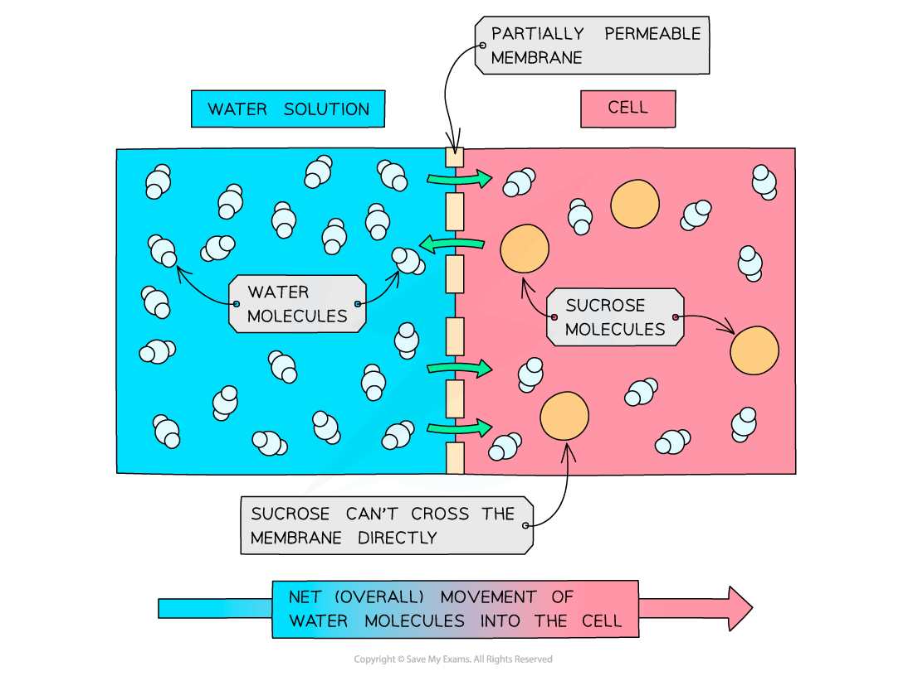
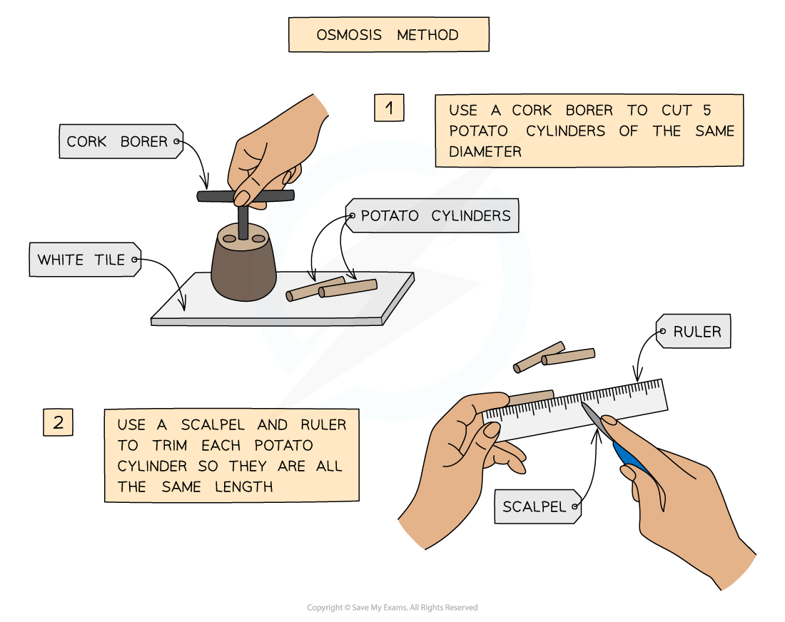
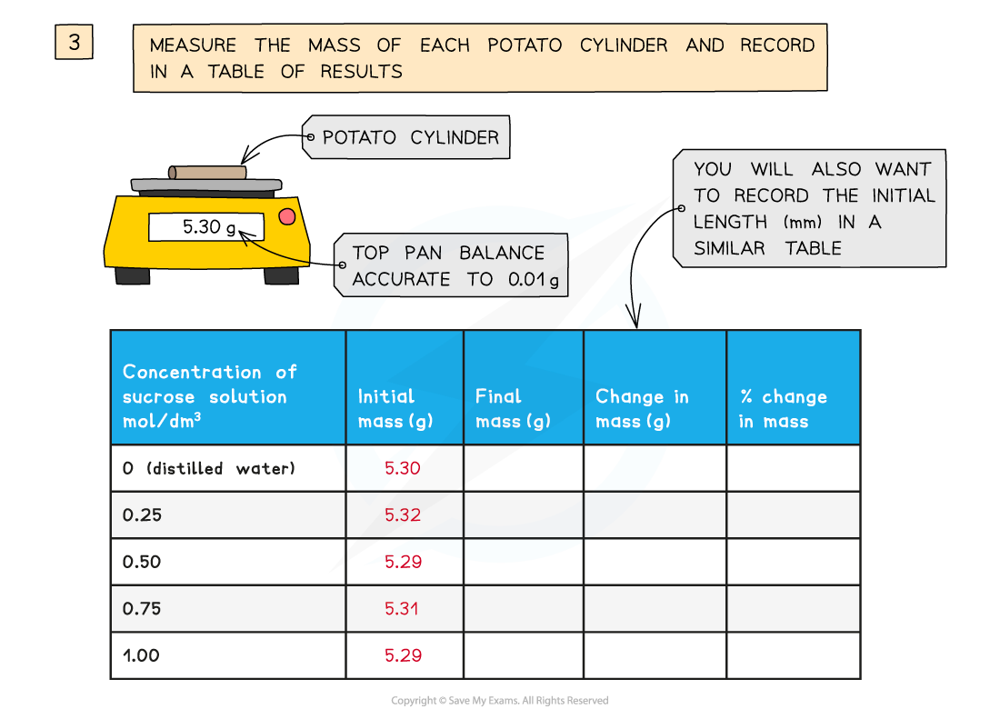
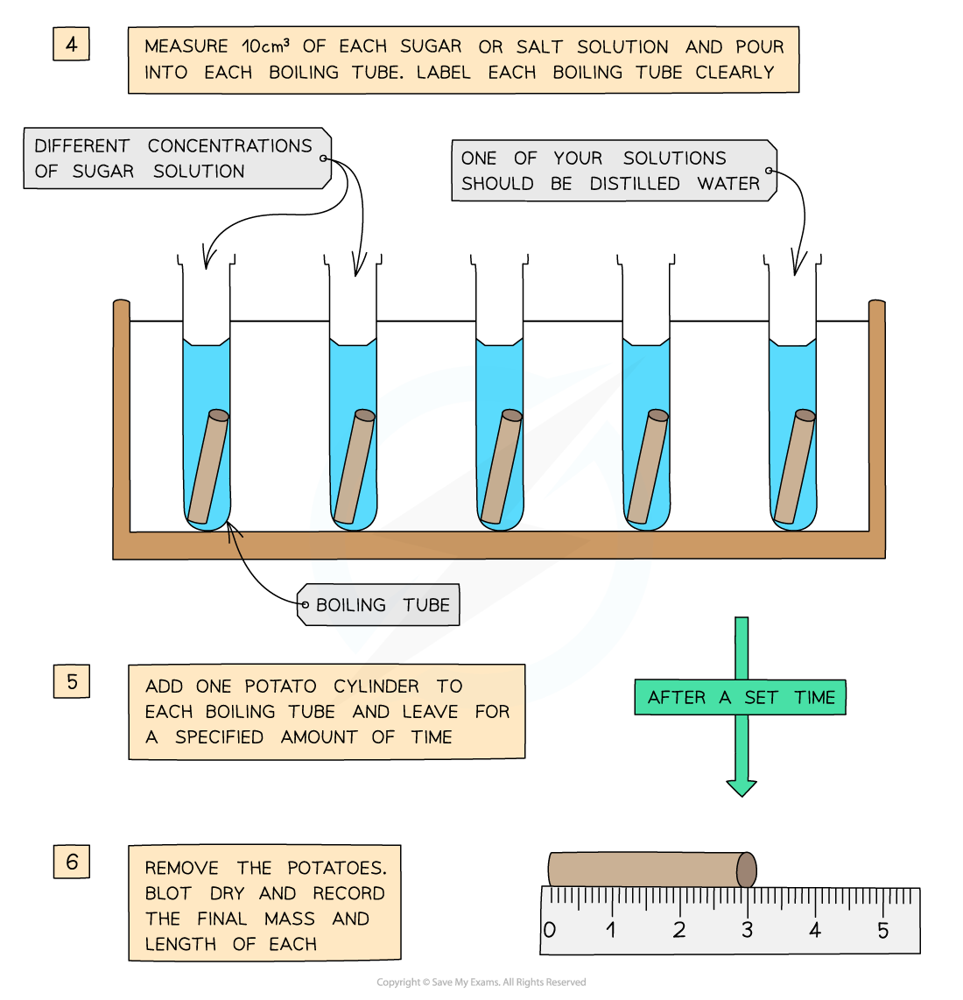
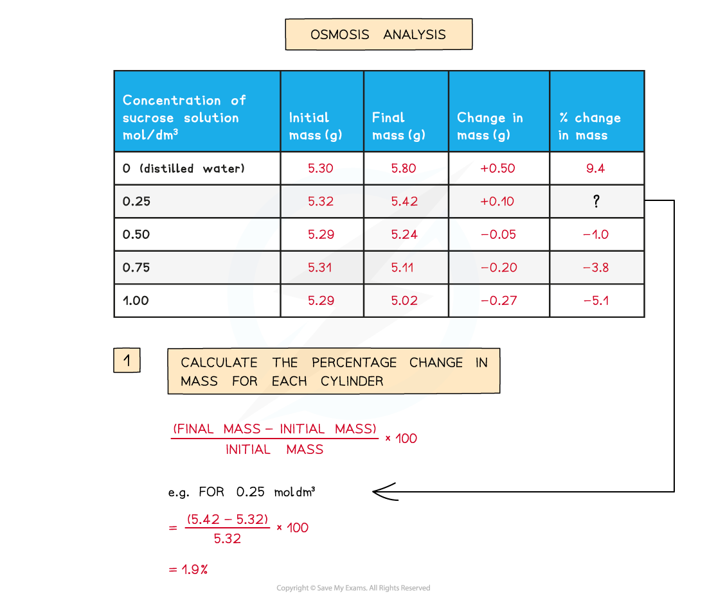
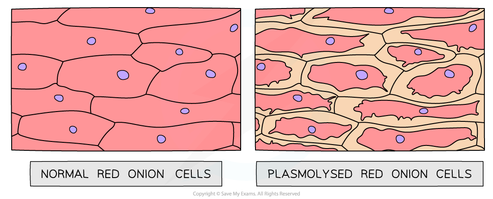

# Practical: Investigating Diffusion & Osmosis

## Practical: Factors that Influence Diffusion

> **Spec point** — `spcpt_p8BJk2TPQyWfryZf` · practical: investigate diffusion and osmosis using living and non-living systems

## Practical: Factors that Influence Diffusion

- Diffusion is the **movement of particles** from a region of **higher** concentration to a region of **lower** concentration
- The rate of diffusion is influenced by several factors:

  - Surface area
  - Temperature
  - Concentration gradient
  - Diffusion distance
- Alkaline agar blocks can be used to investigate diffusion

  - Agar is a clear jelly-like substance
  - When molten agar is mixed with sodium hydroxide (an alkali) and phenolphthalein indicator, pink agar is produced. When cooled, the solid pink agar can be cut into blocks
  
    - Phenolphthalein is an indicator that is **colourless** in solutions with a **pH <8.3** and **pink** in **alkaline solutions**
  - The **pink alkaline agar blocks will turn colourless when placed in an acidic solution** (eg. dilute hydrochloric acid)
  
    - As the acid **diffuses** into the agar blocks, a neutralisation reaction occurs between the acid and the alkaline sodium hydroxide in the agar block
- The effect of surface area to volume ratio (SA:V) on diffusion can be investigated using these agar blocks

### Investigating the effect of surface area to volume ratio on diffusion

#### Apparatus

- Pink agar (contains sodium hydroxide and phenolphthalein indicator)
- White tile
- Scalpel (knife)
- Dilute hydrochloric acid
- Boiling tubes
- Thermometer
- Water baths
- Ice
- Forceps
- Stopwatch

#### Safety

- Dilute hydrochloric acid
- Scalpel
- Agar prepared with sodium hydroxide and phenolphthalein indicator

#### Method

Prepare the agar cubes:

- Using a scalpel (knife), cut the** **cubes of pink agar on the white tile to different dimensions

  - Suggested sizes are cubes with 0.5 cm, 1 cm, and 2 cm side lengths
- To calculate the surface area to volume ratio for each cube:

  - Surface area = (area of 1 side) x number of sides
  - Volume = length x width x height

| **Cube side length (cm)** | **Surface area (cm****2****)** | **Volume (cm****3****)** | **SA : V** |
|---|---|---|---|
| 0.5 | 1.5 | 0.13 | 12 : 1 |
| 1.0 | 6.0 | 1.0 | 6 : 1 |
| 2.0 | 24.0 | 8.0 | 3 : 1 |

- Pour 50 ml of dilute hydrochloric acid into a boiling tube
- Using forceps, place the 0.5 cm cube into the boiling tube and start a timer
- Observe what happens. Stop the timer when the pink agar cube has turned colourless. Record the time for this to happen
- Repeat the same steps at least two more times for cubes with the same side length (0.5 cm) - this is to increase reliability in results
- Repeat the experiment for cubes with different side lengths (eg. 1 cm and 2 cm side lengths)

#### Results and analysis

- When the agar cubes are placed in the hydrochloric acid, the acid diffuses into the cube and reacts with the sodium hydroxide. This causes the pink phenolphthalein indicator to turn colourless

- The time taken for cubes of different sizes to become colourless can be compared

  - Smaller cubes have a larger surface area to volume ratio (SA:V) than larger cubes. This means that for their size, smaller cubes have more surface area available for diffusion per unit volume. As a result:
  
    - The acid has more area to enter relative to the cube’s size
    - The diffusion distance to the centre is shorter
  - As cube size increases, volume increases faster than surface area, so the SA:V ratio decreases. This means that:
  
    - Larger cubes have less surface area per unit volume
    - It takes longer for the acid to diffuse to the centre of the cube (the diffusion distance to the centre is longer)
  - In this experiment, the larger cubes take longer to lose their colour
- The rate of diffusion through the agar itself remains constant (since the concentration gradient and temperature are the same), but the **total rate of exchange** depends on the cube’s SA:V ratio
- This investigation models how small organisms or cells with a high SA:V ratio can rely on diffusion alone for the exchange of substances like oxygen and carbon dioxide, while larger organisms cannot

#### Limitations

- Determining the endpoint (when the cube turns completely colourless) is difficult to judge accurately and introduces human error

  - An improvement would be to measure the distance in mm that the acid has diffused into the cubes after a set period of time
  - This would provide a quantitative measurement that is easier to compare between cubes of different sizes
- Another limitation is that it is difficult to cut the cubes to the same size, and small differences in side length affect the surface area to volume ratio and the rate of diffusion.

  - Use a ruler and a sharp scalpel to cut the cubes as accurately as possible

## Practical: Factors that Influence Osmosis

> **Spec point** — `spcpt_Hs32YpKcnr685xNN` · practical: investigate diffusion and osmosis using living and non-living systems

## Practical: Factors that Influence Osmosis

- Osmosis is the diffusion of water molecules from a **dilute solution** (high concentration of water) to a **more concentrated solution** (low concentration of water) across a **partially permeable membrane**

***Osmosis in cells***

- We can investigate osmosis using **cylinders of potato** and placing them into **distilled water** and **sucrose solutions** of increasing concentration

#### Apparatus

- Potatoes
- Cork borer
- Knife
- Sucrose solutions (from 0 Mol/dm3 to 1 mol/dm3)
- Test tubes
- Balance
- Paper towels
- Ruler
- Test tube rack

#### Method

- Prepare a range of sucrose (sugar) solutions ranging from 0 Mol/dm3 (distilled water) to 1 mol/dm3
- Set up 6 labelled test tubes with 10cm3 of each of the sucrose solutions
- Using the knife, cork borer and ruler, cut 6 equally-sized cylinders of potato
- Blot each one with a paper towel and weigh on the balance
- Put 1 piece into each concentration of sucrose solution
- After 4 hours, remove them, blot with paper towels and reweigh them

***Experimental method for investigating osmosis in potato cylinders***

#### Results and analysis

- The **percentage change in mass** can be calculated for each piece of potato

***Calculating percentage change in mass***

- The potato in **distilled water will gain the most mass** due to a high concentration gradient, causing** water to move into the cells **by osmosis, increasing turgor pressure and making the potato firm.
- The potato in the **strongest sucrose solution will lose the most mass **as water moves** out of the cells** by osmosis, making them flaccid and the potato soft (as the cells become plasmolysed)

***Plasmolysed red onion cells***

- If there is a potato cylinder that has not increased or decreased in mass, it means there was **no overall net movement of water** into or out of the potato cells
- This is because the solution that the cylinder was in was the same concentration as the solution found in the cytoplasm of the potato cells, so there was **no concentration gradient**

#### Limitations

- Slight differences in potato cylinders may mean that results aren't reliable or comparable

  - Solution: for each sucrose concentration, repeat the investigation with several potato cylinders. Making a series of repeat experiments means that any anomalous results can be identified and ignored when a mean is calculated

#### Applying CORMS evaluation to practical work

- The CORMS prompt can be applied to designing an osmosis investigation

***CORMS evaluation***

- For this investigation:

  - **C** - changing the concentration of sucrose solution
  - **O** - the potato cylinders will all be taken from the same potato or potatoes of the same age
  - **R** - repeat the investigation several times to ensure results are reliable
  - **M1** - measure the change in mass of the potato cylinders
  - **M2** - ...after 4 hours
  - **S** - control the volume of sucrose solution used, the dimensions of the potato cylinders and each cylinder must be blotted before it is weighed each time

> **Exam Hint**
> Questions involving osmosis experiments are common and you should be able to use your knowledge of these processes to **explain the results**. Don’t worry if it is an experiment you haven’t done – simply **figure out where the higher water potential is** –this is the more dilute solution with no or few solutes- and explain which way the water molecules will move in relation to this.
