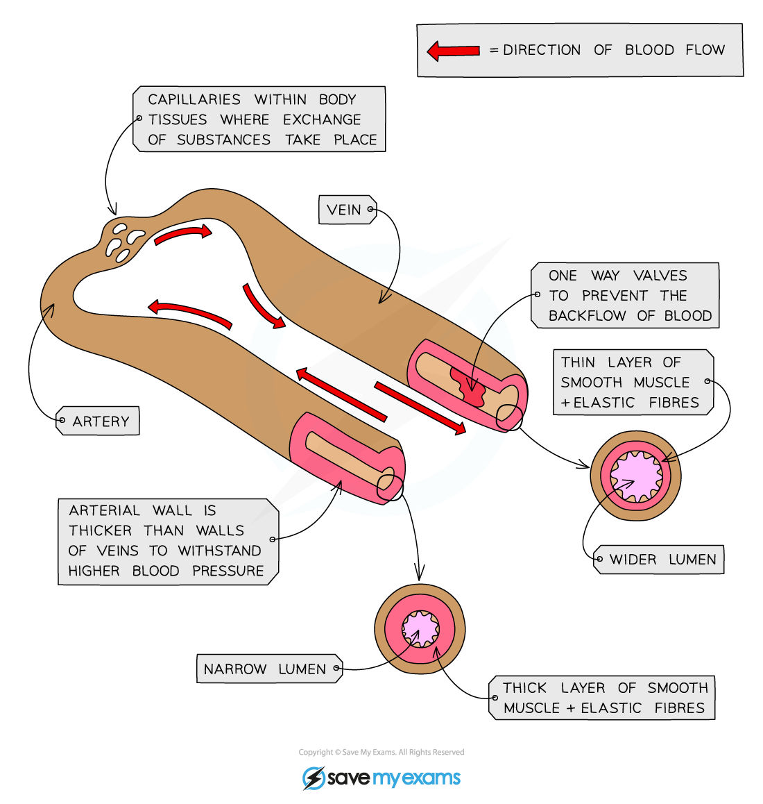
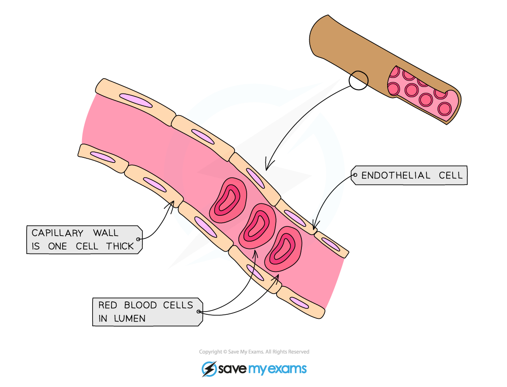

# Blood Vessels: Structure & Function

## Blood Vessels

> **Spec point** — `spcpt_GgKHgwqcJ7wyZvGJ` · understand how the structure of arteries, veins and capillaries relate to their function

## Blood Vessels

- There are three main types of blood vessel:

  - **Arteries**
  - **Veins**
  - **Capillaries**
- Smaller vessels that branch off from arteries are called  **arterioles** (small arteries) and those that branch into veins are called **venules** (small veins)
- Each vessel has a particular function and is **specifically adapted** to carry out that function efficiently

#### Arteries

- Key features:

  - Carry blood at **high pressure away from the heart**
  - Carry **oxygenated** blood (except the pulmonary artery)
  - Have **thick muscular walls** containing **elastic fibres**
  - Have a **narrow lumen**
  - Blood flows through at a** fast** speed
- The structure of an artery is **adapted to its function** in the following ways

  - Thick muscular walls containing elastic fibres** withstand the high pressure **of blood and **maintain** the blood pressure as it** recoils **after the blood has passed through
  - A narrow lumen also helps to **maintain high pressure**

#### Veins

- Key features:

  - Carry blood at **low pressure towards the heart**
  - Carry **deoxygenated** blood (other than the pulmonary vein)
  - Have **thin **walls
  - Have a **large lumen**
  - Contain **valves**
  - Blood flows through at a **slow speed**
- The structure of a vein is **adapted to its function** in the following ways:

  - A large lumen **reduces resistance** to blood flow under** low pressure**
  - Valves** prevent the backflow **of blood as it is under low pressure

***Comparing the structure of arteries and veins***

#### Capillaries

- Key features:

  - Carry blood at **low pressure** within tissues
  - Carry **both oxygenated and deoxygenated blood**
  - Have walls that are **one cell thick**
  - Have ‘leaky’ walls
  - Speed of blood flow is **slow**
- The structure of a capillary is **adapted to its function** in the following ways:

  - Capillaries have walls that are **one cell thick** (short diffusion distance) so substances** can easily diffuse** in and out of them
  - The ‘leaky’ walls **allow blood plasma to leak out and form tissue fluid **surrounding cells

***Structure of a capillary***
