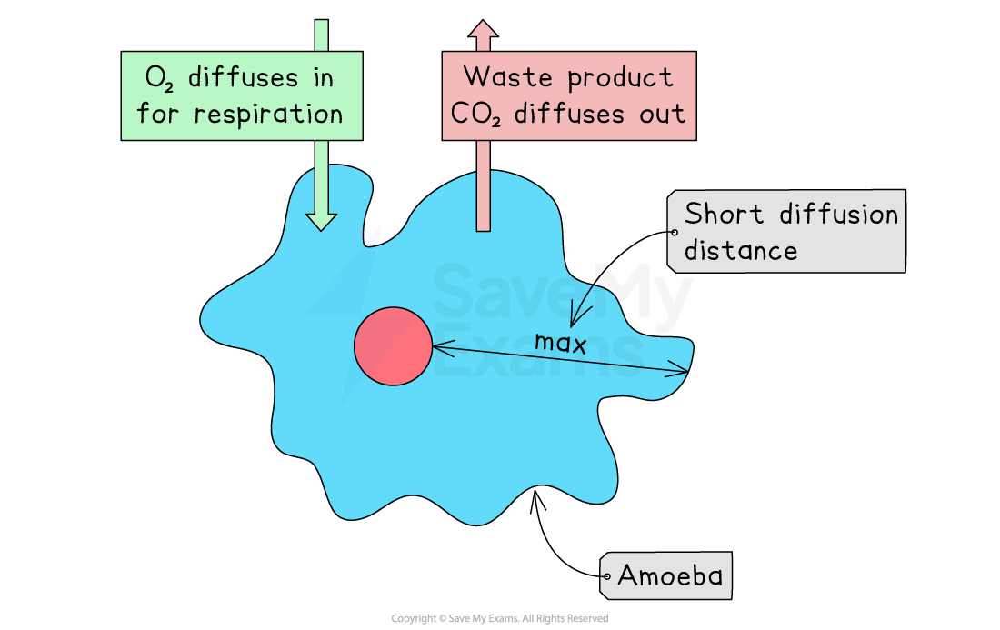
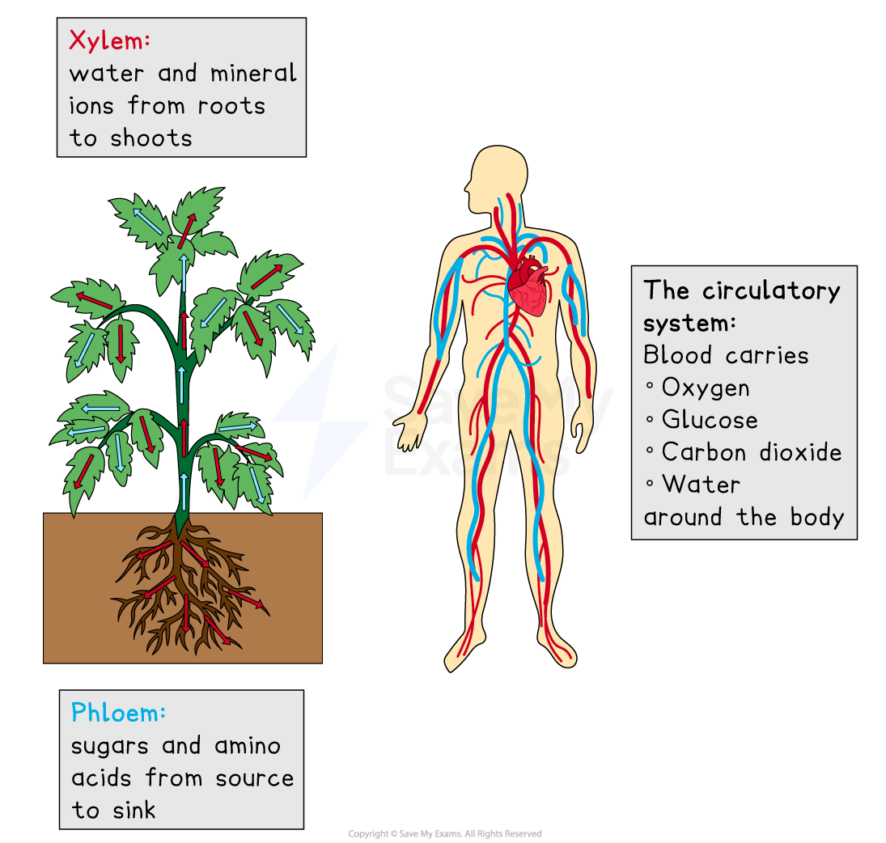

# The Need for a Transport System

## Unicellular Organisms

> **Spec point** — `spcpt_JzqXDyF2DZCZwSfg` · understand why simple, unicellular organisms can rely on diffusion for movement of substances in and out of the cell

## Unicellular Organisms

- To function properly, organisms must exchange substances, like **food molecules and waste**, with their environment

  - This exchange happens via **diffusion, osmosis,** and **active transport** across the cell membrane
- Unicellular organisms, like amoebas, have **large surface areas relative to their volume**, meaning the distance from the surface of the cell to the centre is small

  - Consequently, they **don't need specialised exchange surfaces** or transport systems, as diffusion, osmosis, and active transport through the cell membrane are sufficient for their needs

***Unicellular organisms such as amoeba do not require transport systems due to their large surface area to volume ratio***

## Multicellular Organisms

> **Spec point** — `spcpt_c9jcmsYjSm5MJFYc` · understand the need for a transport system in multicellular organisms

## Multicellular Organisms

- **Multicellular organisms**, like humans, have bodies composed of many cells
- These organisms have multiple cell layers, making the **distance** from the surface to the centre too long for diffusion alone
- Diffusion to all cells would be too slow to meet the organism's needs, so larger organisms require **transport systems**

  - In animals, the **circulatory system** carries essential substances in the blood
  
    - Eg. oxygen, glucose, carbon dioxide, water and urea
  - In plants, the **vascular system **transports substances:
  
    - the **xylem **moves water and minerals from roots to shoots
    - the **phloem** distributes sugars and amino acids throughout the plant.

***Humans and some plants have specialised transport systems***
