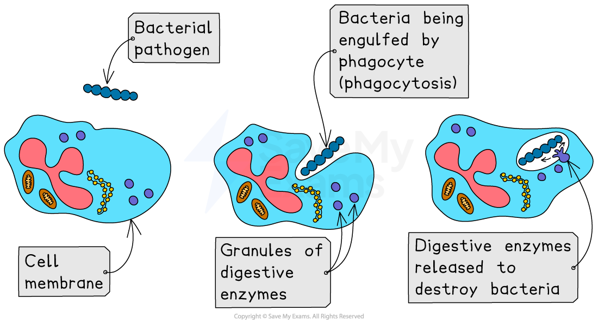
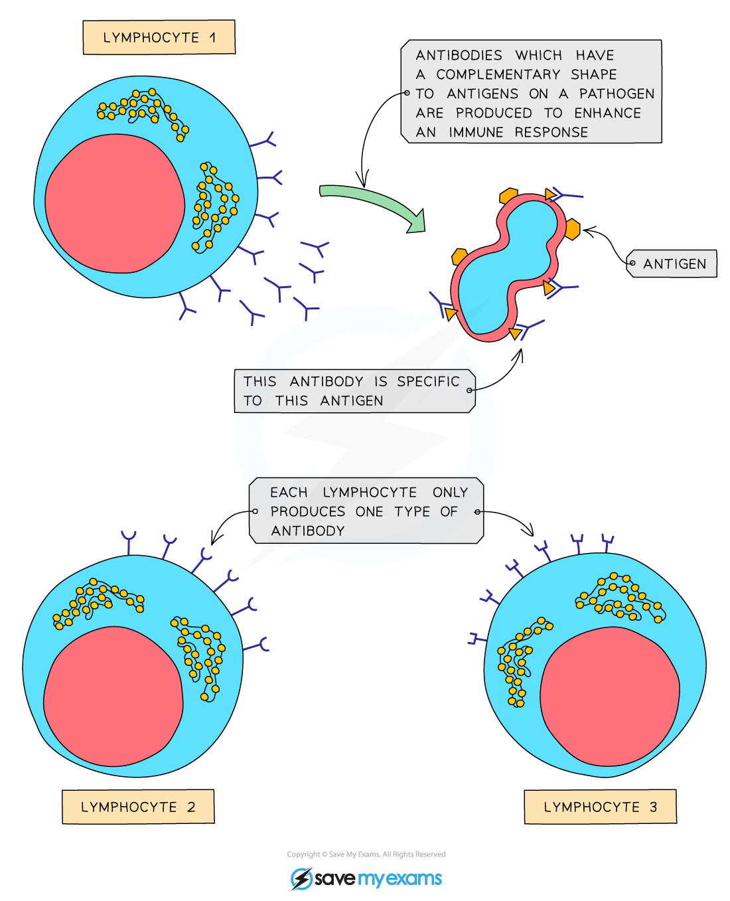

# White Blood Cells & Immunity

## White Blood Cells

> **Spec point** — `spcpt_7s6MrrHv654c36M6` · understand how the immune system responds to disease using white blood cells, illustrated by phagocytes ingesting pathogens and lymphocytes releasing antibodies specific to the pathogen

## White Blood Cells

- White blood cells are part of the body’s **immune system**
- These specialised cells defend against pathogenic microorganisms
- There are two main types of white blood cell:

  - **Phagocytes**
  - **Lymphocytes**

#### Phagocytes

- Phagocytes carry out **phagocytosis** by **ingesting pathogens**

  - Phagocytes have a sensitive cell surface membrane that can detect chemicals produced by pathogens
  - Once they encounter a pathogen, phagocytes will engulf it and release digestive enzymes to digest it
  - This is a **non-specific** immune response

***The process of phagocytosis***

#### Lymphocytes

- **Lymphocytes** produce **antibodies**
- Antibodies are proteins with a shape that is **specific** (complementary) to the** antigens** on the surface of the pathogen

  - An **antigen** is a **marker on the surface of a cell or pathogen** that the body sees as foreign and causes the immune system to respond
- Lymphocytes provide a **specific** immune response as the antibodies produced will only fit one type of antigen

***The lymphocytes produce antibodies that are specific to the antigen on the pathogen***

## Immunity

> **Spec point** — `spcpt_QdHcY2Z2FgBHjGsn` · understand how the immune system responds to disease using white blood cells, illustrated by phagocytes ingesting pathogens and lymphocytes releasing antibodies specific to the pathogen

## Immunity

- The body's** immune system** is highly complex, with white blood cells being the main component
- Once a pathogen has entered the body the role of the immune system is to prevent the infectious organism from reproducing and to destroy it
- An organism has immunity when its **immune system can respond quickly** if the pathogen enters the body. This protection can come from **having enough antibodies already present** *or* from **memory cells** that can produce antibodies rapidly when needed

  - Memory cells are a type of lymphocyte that remains in the body for a long time
- As a result, someone infected with a pathogen that they have immunity to does not suffer from the disease the pathogen can cause or its symptoms

#### Response to infection

- The stages of infection and the subsequent immune response are as follows:

  1. The pathogen enters the bloodstream and **multiplies**
  2. A release of **toxins** (in the case of bacteria) and **infection of body cells** causes **symptoms** in the patient
  3. **Phagocytes** that encounter the pathogen recognise that it is an invading pathogen and **engulf and digest** (**non-specific response)**
  4. Eventually, the pathogen encounters a **lymphocyte** which recognises its **antigens**
  5. The lymphocyte starts to produce **specific antibodies** to combat that particular pathogen
  6. The lymphocyte also** clones itself** to produce lots of lymphocytes (all producing the specific **antibody** required)
  7. Antibodies support the destruction of pathogens by recognising and binding to them, marking them for destruction
  8. **Phagocytes** engulf and digest the destroyed pathogens

> **Exam Hint**
> Make sure you know the difference between antigen and antibody:
> 
> - An **antigen** is a molecule found on the surface of a cell
> - An **antibody** is a protein made by lymphocytes that is complementary to an antigen and, when attached, clumps them together and signals the cells they are on for destruction
