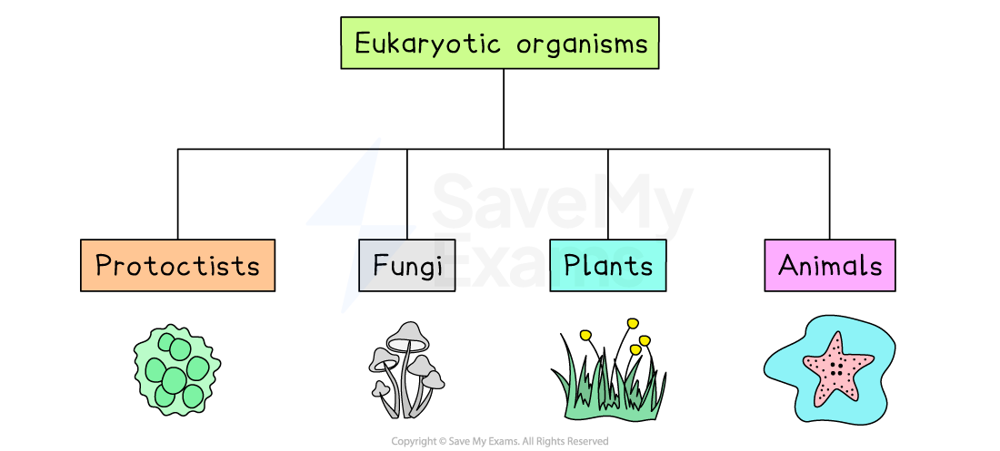
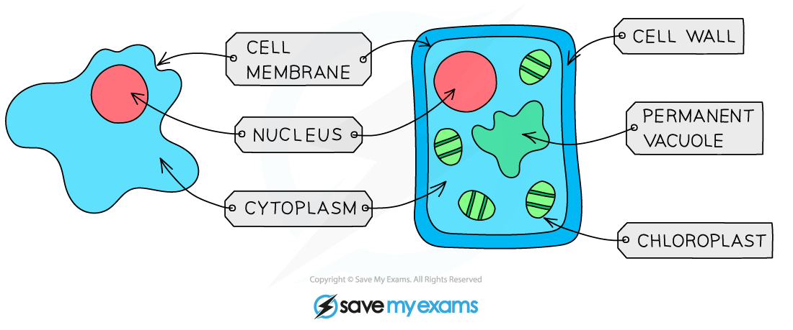
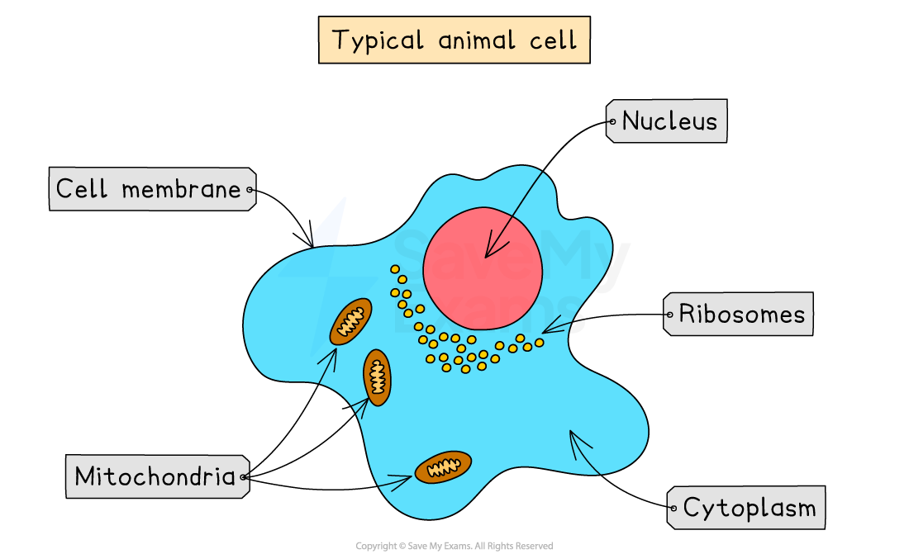
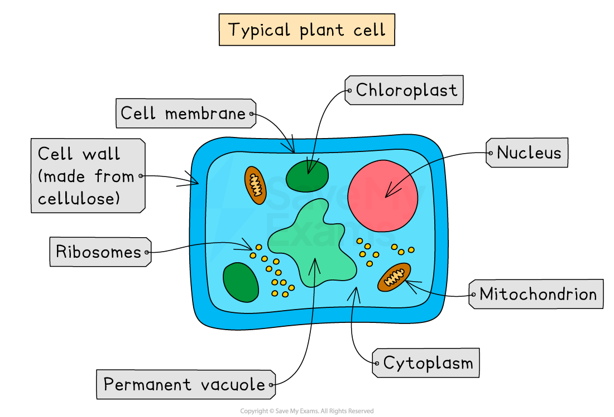
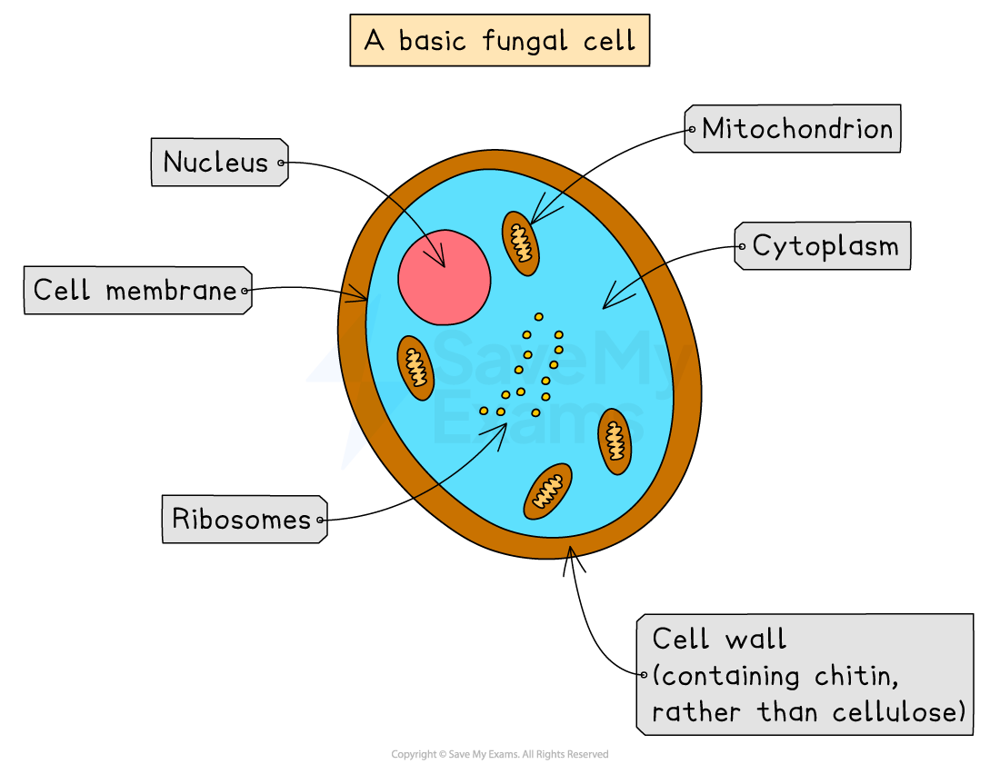
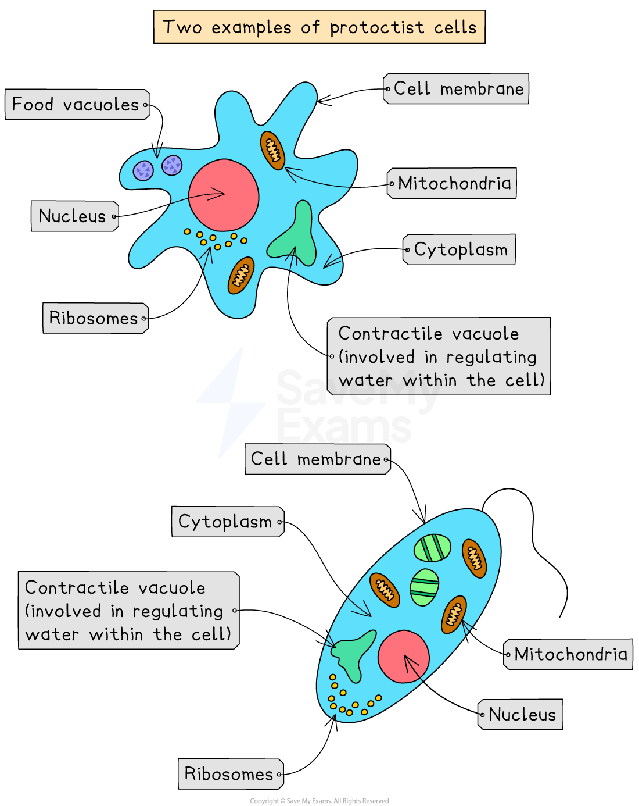

# Common Features: Eukaryotic Organisms

## Common Features of Eukaryotic Organisms: Basics

> **Spec point** — `spcpt_j2VhT6TgfSNbkqGb` · describe the common features shown by eukaryotic organisms: plants, animals, fungi and protoctists

## Common Features of Eukaryotic Organisms: Basics

- All living organisms share characteristics. Organisms can be grouped together based on common features they share into the following groups:

  - **Plants**
  - **Animals**
  - **Fungi**
  - **Protoctists**
  - **Prokaryotes**
- Organisms in the first four groups of this list (plants, animals, fungi and protoctists) are all **eukaryotic organisms **(also known as **eukaryotes**)

*Animals, plants, fungi and protoctists are all eukaryotes.*

- Eukaryotic organisms can be **multicellular or single-celled**. The common feature of all eukaryotes are cells that contain a **nucleus **with a** distinct membrane**

***An animal cell (left) and plant cell (right) as seen under a light microscope. They are both eukaryotic cells as they both have a distinct membrane-bound nucleus.***

- **Prokaryotic organisms** (also known as **prokaryotes**) are **different** from eukaryotes as they are **always single-celled** and their cells **do not contain a nucleus**

  - **Bacteria** are prokaryotic organisms
- The **genetic material** of prokaryotic cells is found in the **cytoplasm** as a single, circular chromosome of DNA
- Prokaryotic cells are also substantially **smaller** than eukaryotic cells

## Animals

> **Spec point** — `spcpt_w8KVx3SdzmTrbWbJ` · Animals: these are multicellular organisms; their cells do not contain chloroplasts and are not able to carry out photosynthesis; they have no cell walls; they usually have nervous co-ordination and are able to move from one place to another; they often store carbohydrate as glycogen. Examples include mammals (for example, humans) and insects (for example, housefly and mosquito).

## Animals

- **The main features of animals:**

  - They are **multicellular**
  - Their cells contain a **nucleus** with a **distinct membrane**
  - Their cells **do not** have **cellulose cell walls**
  - Their cells **do not** contain **chloroplasts** (so they **are unable** to carry out **photosynthesis**)
  - They feed on organic substances made by other living things
  - They often store carbohydrates as **glycogen**
  - They usually have **nervous coordination**
  - They are able to **move** from place to place

*A typical animal cell*

## Plants

> **Spec point** — `spcpt_WwknBFhYKNMDPnGD` · Plants: these are multicellular organisms; their cells contain chloroplasts and are able to carry out photosynthesis; their cells have cellulose cell walls; they store carbohydrates as starch or sucrose. Examples include flowering plants, such as a cereal (for example, maize), and a herbaceous legume (for example, peas or beans).

## Plants

- **The main features of plants:**

  - They are **multicellular**
  - Their cells contain a **nucleus** with a **distinct membrane**
  - Their cells have **cell walls** made out of **cellulose**
  - Their cells contain **chloroplasts**
  - They feed by **photosynthesis**
  - They store carbohydrates as **starch** or **sucrose**
  - They **do not** have nervous coordination

*A typical plant cell*

> **Exam Hint**
> It's important that you are able to recall the common characteristic features of organisms in each group, and that you are aware of the similarities and differences between them. For example, you could be asked  in an exam to complete a table comparing features of three of the groups.

## Fungi

> **Spec point** — `spcpt_fZdHWDNTMJK3wNJ4` · Fungi: these are organisms that are not able to carry out photosynthesis; their body is usually organised into a mycelium made from thread-like structures called hyphae, which contain many nuclei; some examples are single-celled; their cells have walls made of chitin; they feed by extracellular secretion of digestive enzymes onto food material and absorption of the organic products; this is known as saprotrophic nutrition; they may store carbohydrate as glycogen. Examples include Mucor, which has the typical fungal hyphal structure, and yeast, which is single-celled.

## Fungi

- **Main features of fungi:**

  - They are** **usually multicellular (e.g. *Mucor* ) but some are single-celled (e.g. yeast)
  - Multicellular fungi are mainly made up of thread-like structures known as **hyphae** that contain **many nuclei** and are organised into a **network** known as a **mycelium**
  - Their cells contain a nucleus with a distinct membrane
  - Their cells have cell walls made of **chitin** (chitinous cell walls)
  - Their cells** **do not contain chloroplasts (so they cannot carry out photosynthesis)
  - They feed by **secreting extracellular digestive enzymes** (outside the mycelium) onto the food (usually decaying organic matter) and then absorbing the digested molecules. This method of feeding is known as **saprotrophic nutrition**
  - Some fungi are** **parasitic and feed on living material
  - Some fungi store carbohydrates as **glycogen**
  - They do not have nervous coordination
  - Examples of fungi include: moulds, mushrooms, yeasts

*A typical fungal cell*

## Protoctists

> **Spec point** — `spcpt_M9r2hWkX8BWZQdKT` · Protoctists: these are microscopic single-celled organisms. Some, like Amoeba, that live in pond water, have features like an animal cell, while others, like Chlorella, have chloroplasts and are more like plants. A pathogenic example is Plasmodium, responsible for causing malaria.

## Protoctists

- **Main features of protoctists:**

  - The protoctists are a very **diverse** group of organisms. They have features which are different from the other three eukaryotic groups of organisms  (animals, plants and fungi)
  - They are** mainly microscopic and single-celled** but some **aggregate** (group together) into** larger forms**, such as colonies or chains of cells that form filaments
  - Their cells contain a **nucleus** with a **distinct membrane**
  - Some have features making them more like animal cells e.g. ***Plasmodium*** (the protoctist that causes **malaria**)
  - Some have features, such as **cell walls** and **chloroplasts**, making them more like plant cells e.g. **green algae**, such as ***Chlorella***
  - This means **some** protoctists **photosynthesise** and some feed on organic substances made by other living things
  - They **do not** have **nervous coordination**
  - Examples of protoctists include: amoeba, *Paramecium*, *Plasmodium*, *Chlorella*

*Two examples of protoctist cells*

> **Exam Hint**
> You need to be able to recognise, draw and interpret images of cells, so practice drawing and labelling fungal cells and protoctist cells as part of your revision.
