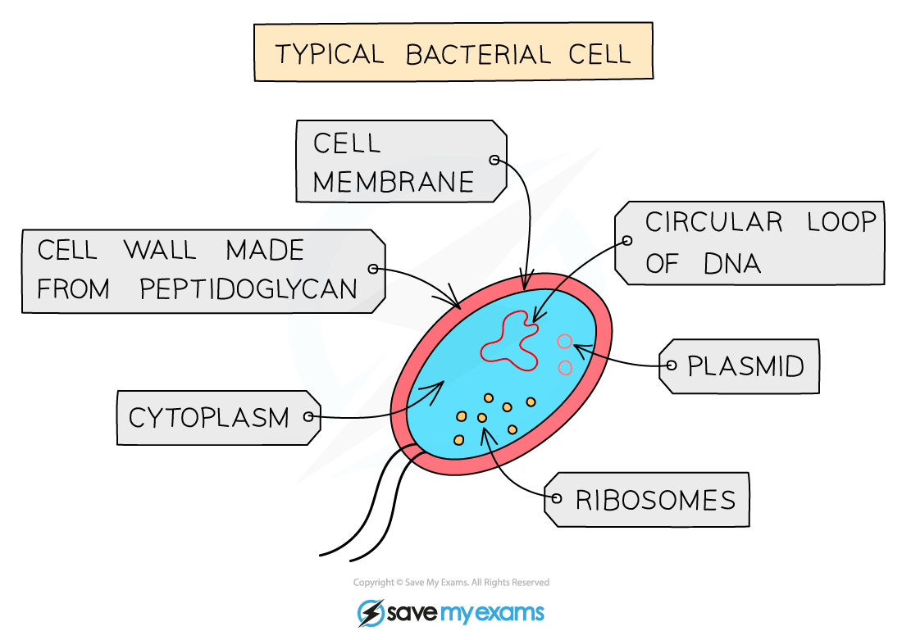

# Common Features: Prokaryotic Organisms

## Prokaryotes

> **Spec point** — `spcpt_HvZQqkrYJndjGym3` · "describe the common features shown by prokaryotic organisms such as bacteria
Bacteria: these are microscopic single-celled organisms; they have a cell wall, cell membrane, cytoplasm and plasmids; they lack a nucleus but contain a circular chromosome of DNA; some bacteria can carry out photosynthesis but most feed off other living or dead organisms.
Examples include Lactobacillus bulgaricus, a rod-shaped bacterium used in the production of yoghurt from milk, and Pneumococcus, a spherical bacterium that acts as the pathogen causing pneumonia."

## Prokaryotes

- All living organisms can be grouped together into groups based on the characteristics and features that they share:

  - **Plants**
  - **Animals**
  - **Fungi**
  - **Protoctists**
  - **Prokaryotes**
- The **prokaryotes **are **different** from the other four groups, which are all eukaryotes
- Features of prokaryotic organisms include:

  - they are **single-celled**
  - they have **no nucleus**
  - the **nuclear material** is found in the **cytoplasm**
- **Bacteria** are prokaryotic organisms

### Bacteria

- Bacteria share the following biological characteristics:

  - they are **microscopic**,** single-celled organisms**
  - they have a **cell wall**, **cell membrane**, **cytoplasm** and ***plasmids***
  - they **lack a nucleus** but contain a **circular chromosome of DNA**
  - they** lack mitochondria **and have **no other membrane-bound organelles**
- Examples of bacteria include:

  - ***Lactobacillus*** ***bulgaricus***
  
    - A rod-shaped bacterium used in the production of yoghurt from milk
  - ***Pneumococcus***
  
    - A spherical bacterium that acts as the pathogen causing pneumonia
- Bacteria **feed** in **different ways**:

  - Some bacteria carry out **photosynthesis **despite having no chloroplasts; this is because they still possess chlorophyll-like substances** **and have the **enzymes** necessary to synthesise sugars
  - Most feed on other **living or dead organisms**
  
    - If they feed on **dead organic matter** then they are known as **saprobionts** or **decomposers**

***Bacteria have a**** ****cell wall****, ****cell membrane****, ****cytoplasm, plasmids and circular DNA***

#### Components of prokaryotic and eukaryotic cells table

| **Component** | **Eukaryotes** | **Prokaryotes** |
|---|---|---|
| Cell membrane | Y | Y |
| Cytoplasm | Y | Y |
| Genetic material | Y - in a nucleus | Y - in the cytoplasm |
| Nucleus | Y | N |
| Cell wall | Some types | Y |
