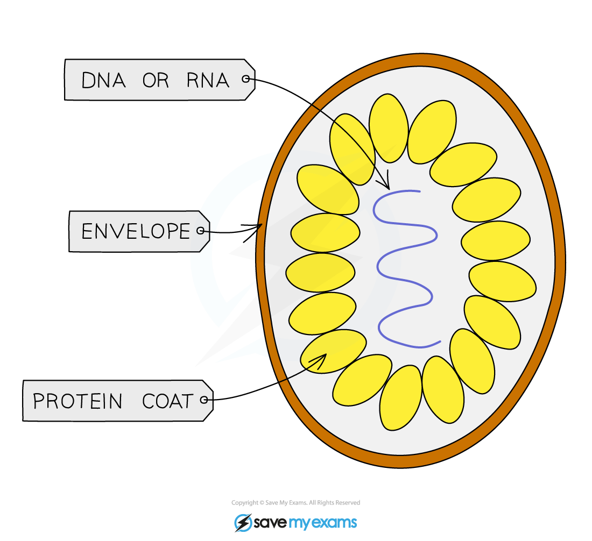

# Pathogens

## Types of Pathogen

> **Spec point** — `spcpt_2bjVfphyG3c6dHXd` · understand the term pathogen and know that pathogens may include fungi, bacteria, protoctists or viruses

## Types of Pathogen

- A **pathogen **is an organism that **causes disease** in another organism
- Groups of organisms that include pathogens are:

  - bacteria
  - fungi
  - protoctists
  - viruses

### Pathogenic bacteria

- Pathogenic bacteria do not always infect the cells of hosts, they can remain within body cavities or spaces
- Example: ***Pneumococcus**** *is a spherical bacterium that acts as the pathogen, causing pneumonia

  - Pneumonia is an inflammation of the lungs caused by an infection by a pathogen, resulting in coughing, fever and shortness of breath

### Pathogenic fungi

- Fungal diseases are much more common in plants than animals
- Some (but not all) species of the *Mucor*  fungi are pathogenic

### Pathogenic protoctists

- *Plasmodium falciparum* is a protoctist that causes severe forms of** malaria** in humans

  - The parasite is spread by mosquitoes
  - Infected individuals experience fever, chills and fatigue

## Viruses

> **Spec point** — `spcpt_tkkQxgt7wfMs26P4` · Viruses: these are not living organisms. They are small particles, smaller than bacteria; they are parasitic and can reproduce only inside living cells; they infect every type of living organism. They have a wide variety of shapes and sizes; they have no cellular structure but have a protein coat and contain one type of nucleic acid, either DNA or RNA. Examples include the tobacco mosaic virus that causes discolouring of the leaves of tobacco plants by preventing the formation of chloroplasts, the influenza virus that causes ‘flu’ and the HIV virus that causes AIDS.

## Viruses

- ***Viruses*** are not usually included in the classification of living organisms as they are **not considered to be living organisms**

  - This is due to the fact that viruses **do not carry out the eight life processes** for themselves
- In fact, the only life process they seem to display is reproduction but even to carry out this process they must **take over a host cell’s metabolic pathways** in order to make multiple copies of themselves
- Viruses, which have a wide variety of shapes and sizes, all share the following biological characteristics:

  - They are small particles (**always smaller than bacteria**)
  - They are parasitic and **can only reproduce inside living cells**
  - They infect** every type of living organism**
  - They have** no cellular structure** but have a** protein coat** and contain one type of **nucleic acid**, either **DNA **or** RNA**

***Structure of a typical virus***

- Examples of viruses include:

  - The** tobacco mosaic virus **(TMV) causes discolouring of the leaves on tobacco plants by preventing the formation of chloroplasts
  - The **HIV virus** causes **AIDS**
  - The **influenza virus** causes the ‘**flu**’

#### Tobacco mosaic virus

- Tobacco mosaic virus (TMV) was the first virus to be isolated by scientists
- It is a widespread plant pathogen that infects about 150 species of plants including tomato plants and cucumbers
- The symptoms of tobacco mosaic virus are the distinctive **mosaic pattern of discolouration **of the leaves as the virus infects the chloroplasts

  - The plant will not grow as much due to the **lack of photosynthesis** - this reduces the yield of crops
- The virus is spread by:

  - Plants in direct contact with an infected plant
  - The virus can stay in the soil for about 50 years

- There is no treatment for tobacco mosaic virus and the best method of control is good field hygiene to prevent the spread of the virus

  - Farmers are also using tobacco mosaic virus-resistant strains of crop plants

#### HIV

- HIV (Human Immunodeficiency Virus) is a virus that can eventually lead to Acquired Immunodeficiency Syndrome (**AIDS**)
- Symptoms:

  - HIV starts with a flu-like illness
  - If untreated it can travel to the lymph nodes and **attack cells of the immune system**
  - It can stay hidden in the immune system for many years until the immune system is so badly damaged it can **no longer deal with other infections or cancers** (this is late-stage HIV infection, known as AIDS)
- The virus is spread by:

  - Direct **sexual contact**
  - The exchange of **bodily fluids** such as blood, for example, can be transmitted when drug users share needles
  - From mother to child during birth or in breast milk
- There is **no cure **for HIV, although the use of antiretroviral drugs used early in the infection can now effectively control the disease to slow or halt the progress to AIDS

#### Influenza virus

- The **influenza virus **infects humans causing 'flu'

  - The virus infects cells that line the airways, leading to a highly infectious illness (flu) with symptoms of a high temperature, body aches and fatigue
