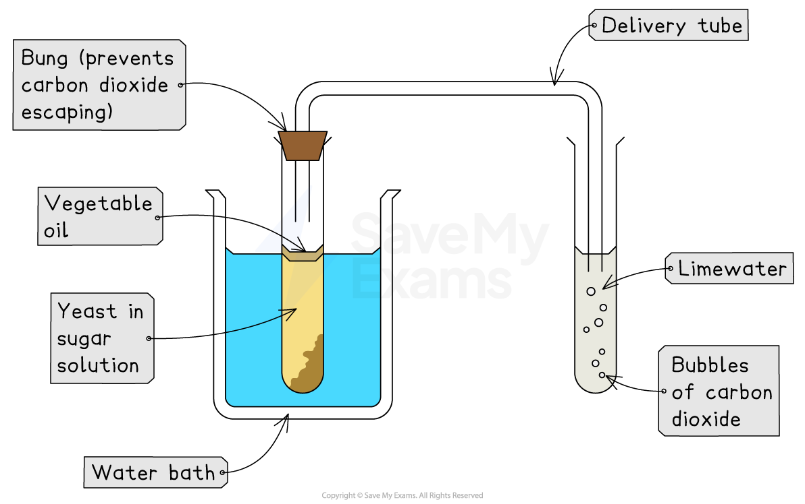

# Practical: Investigating Anaerobic Respiration in Yeast

## Practical: Investigating Anaerobic Respiration in Yeast

> **Spec point** — `spcpt_KFTwYPxY8s55rMMN` · practical: investigate the role of anaerobic respiration by yeast in different conditions

## Practical: investigating anaerobic respiration in yeast

- Yeast can respire **anaerobically** (without oxygen), breaking down glucose in the absence of oxygen to produce **ethanol** and **carbon dioxide**
- Anaerobic respiration in yeast cells is called **fermentation**
- Fermentation is economically important in the manufacture of **bread** (where the production of carbon dioxide makes dough rise) and alcoholic drinks (as ethanol is a type of alcohol)
- It is possible to investigate **the effect of temperature on yeast fermentation**, by seeing how temperature affects the **rate of anaerobic respiration** in yeast

***The process of anaerobic respiration in yeast***

#### Apparatus

- Boiling tubes
- Capillary tubes
- Bungs
- Yeast
- Sugar solution
- Oil
- Stopwatch
- Water bath
- Limewater

#### Method

- Mix yeast with sugar solution in a boiling tube

  - The sugar solution provides the yeast with **glucose** for anaerobic respiration
- Carefully add a layer of oil on top of the solution

  - This prevents oxygen from entering the solution (**prevents aerobic respiration in the yeast**)
- Using a capillary tube, connect this boiling tube with another boiling tube that is filled with **limewater**
- Place the boiling tube with yeast and sugar solution into a **water bath** at a **set temperature** and **count the number of bubbles produced in a fixed time **(e.g. 2 minutes)

  - The rate that carbon dioxide is produced by yeast can be used to measure the **rate of anaerobic respiration** (i.e. the **rate of fermentation**)
- Change the temperature of the water bath and repeat

*Experimental set up for investigating anaerobic respiration in yeast*

#### Results and analysis

- Compare results at **different temperatures** to find out at which temperature yeast **respires fastest**
- The **higher the temperature**, the **more bubbles** of carbon dioxide should be produced as higher temperatures will be closer to the **optimum temperature** of enzymes in yeast, **increasing enzyme activity**
- As respiration is an** enzyme controlled reaction**, as enzyme activity increases the rate of anaerobic respiration will increase
- If the temperature is **too high** (beyond the optimum temperature), the enzymes will **denature** causing carbon dioxide production to **slow down** and eventually **stop**

#### Applying CORMS to practical work

- When working with practical investigations, remember to consider your CORMS evaluation:

***CORMS evaluation***

- In this investigation, your evaluation should look something like this:

  - **C** – We are changing the temperature in each repeat
  - **O** – The type (species) of yeast we are using must be the **same**
  - **R** – We will repeat the investigation several times at each temperature to make sure our results are reliable
  - **M1** – We will measure the number of bubbles (of carbon dioxide) produced
  - **M2** – in a set time period (e.g. 2 minutes)
  - **S** – We will control the concentration, volume and pH of the sugar solution, as well as the mass of yeast added
