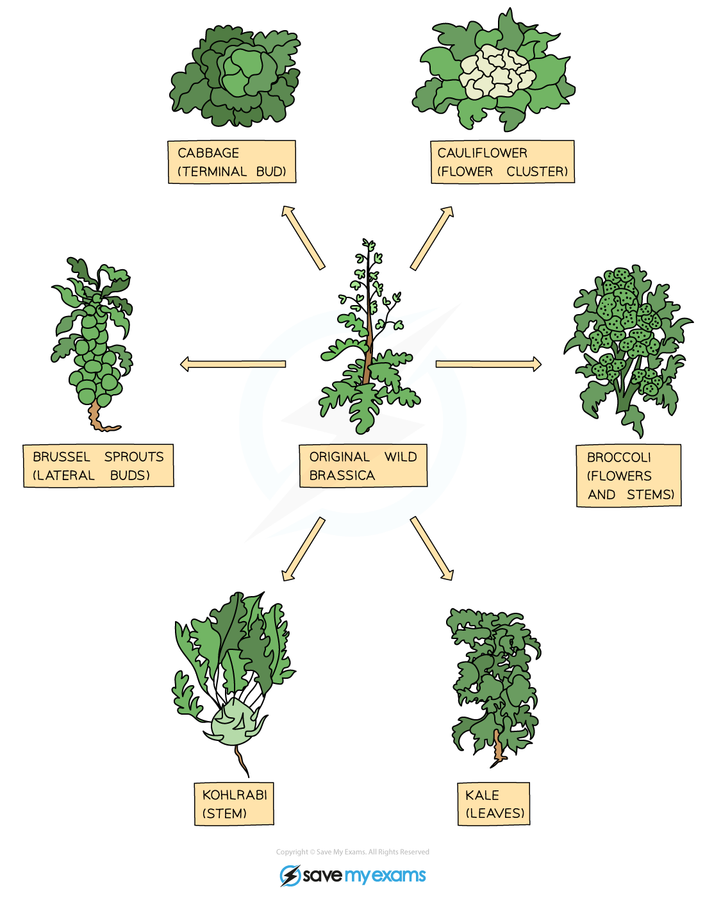

# Selective Breeding in Plants

## Selective Breeding in Plants

> **Spec point** — `spcpt_6kfNB5G2D22mDSMq` · understand how selective breeding can develop plants with desired characteristics 

## Selective Breeding in Plants

### Selective breeding definition

- Selective breeding or artificial selection means to **select individuals with desirable characteristics and breed them together**
- The process doesn’t stop there though because it’s likely that not all of the offspring will show the characteristics you want so **offspring that do show the desired characteristics are selected and bred together**
- This process has to be **repeated for many successive generations** before you can definitely say you have a **‘new breed’** that will **reliably** show those selected characteristics in all offspring

### Selective breeding in plants

- Plants are selectively bred by humans for development of many characteristics, including:

  - **Disease resistance **in food crops
  - **Increased crop yield**
  - **Hardiness to weather conditions** (e.g. drought tolerance)
  - Better tasting fruits
  - Large or unusual flowers
- An example of a plant that has been selectively bred in multiple ways is wild brassica, which has given rise to cauliflower, cabbage, broccoli, Brussels sprouts, kale and kohlrabi:

***An example of selective breeding in plants***

### Problems with selective breeding

- Selective breeding can lead to **‘inbreeding’**
- This occurs when only the ‘best’ animals or plants (which are **closely related to each other**) are bred together
- This results in a **reduction in the gene pool** – this is a reduction in the number of **alleles** (different versions of genes) in a **population**
- As inbreeding limits the size of the gene pool, there is an increased chance of:

  - Organisms inheriting **harmful genetic defects**
  - Organisms being vulnerable to **new diseases **(there is less chance of resistant alleles being present in the reduced gene pool)
