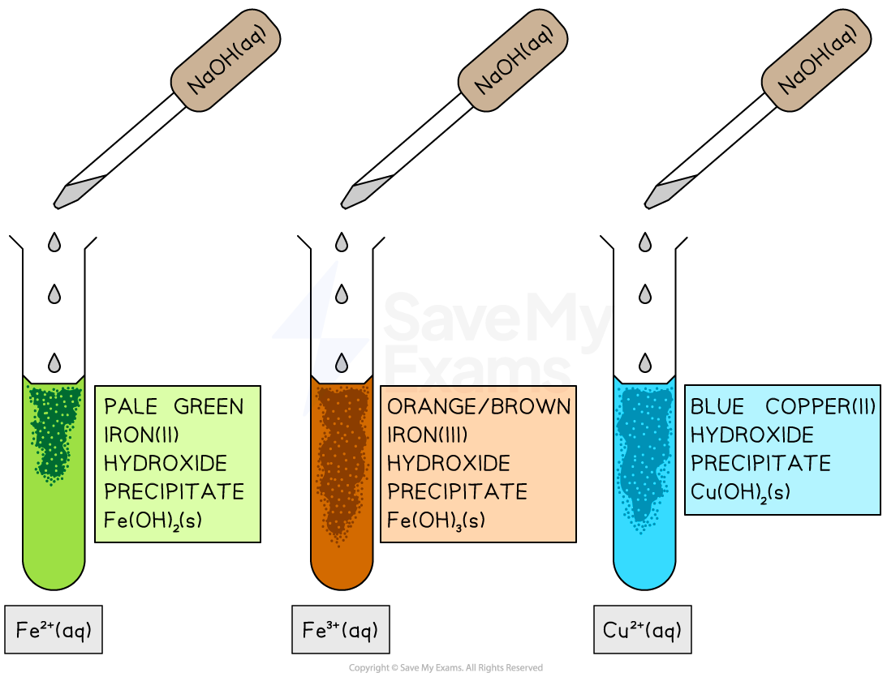

# Tests for Cations

## Tests for Cations

> **Spec point** — `spcpt_nZSG8QtkxBzvBNWf` · describe tests for these cations: 
• NH4 + using sodium hydroxide solution and identifying the gas evolved 
• Cu2+, Fe2+ and Fe3+ using sodium hydroxide solution.

## Tests for cations

### Testing for metal cations

- Metal cations in aqueous solution can be identified by the **colour **of the precipitate formed when sodium hydroxide (NaOH) is added
- A few drops of NaOH is added at first and any colour changes or precipitates formed are noted

***The addition of sodium hydroxide to the metal ions forms precipitates of different colours***

- A metal hydroxide **precipitate **typically forms if the hydroxide is insoluble in water
- If **no precipitate** forms, the hydroxide may be soluble or there may not be enough of the metal ion present

- A summary of the reactions is shown in the table below

#### Table showing the colour of the precipitates formed

| **Metal ion** | **Reaction ** | **Colour** |
|---|---|---|
| Fe2+ | Fe2+ (aq) + 2OH– (aq) → Fe(OH)2 (s) | Pale green precipitate |
| Fe3+ | Fe3+ (aq) + 3OH– (aq) → Fe(OH)3 (s) | Orange / brown precipitate |
| Cu2+ | Cu2+ (aq) + 2OH– (aq) → Cu(OH)2 (s) | Blue precipitate |

> **Exam Hint**
> Examiners are often quite specific about the copper(II) ions, Cu2+ (aq). You need to specifically state **light blue** for the precipitate colour to be sure of the mark

### Test for ammonium ion, NH4+

- Add NaOH and warm the mixture
- Observation with NaOH**:** Ammonia gas is released
- Ionic equation:

NH4+ (aq) + OH- (aq) → NH3 (g) + H2O (l)

- [Test for ammonia gas](https://www.savemyexams.com/igcse/chemistry/edexcel/19/revision-notes/2-inorganic-chemistry/2-8-chemical-tests/2-8-1-tests-for-gases/): Ammonia turns damp red litmus paper blue

> **Exam Hint**
> Sometimes the cation may be present in very small amounts, so the precipitate might appear only as a slight cloudiness or faint colour change - this can still indicate a positive test result.
