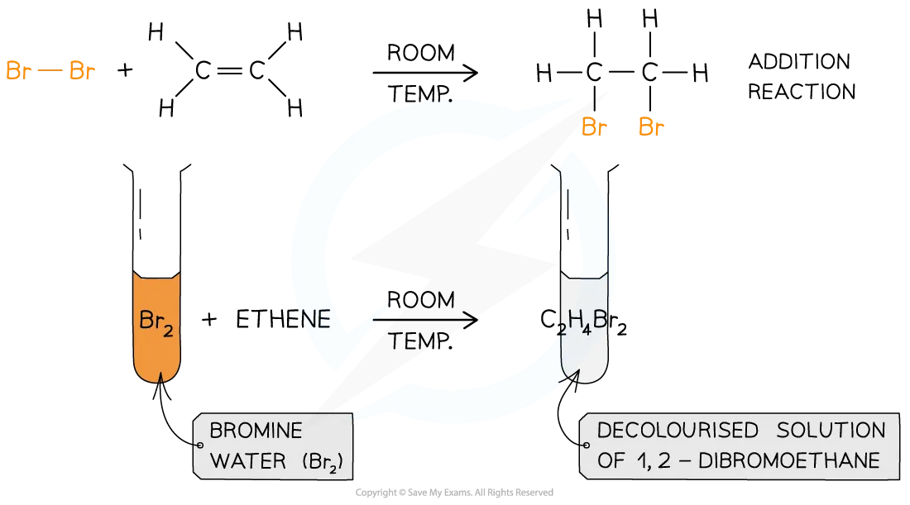

# Bromine & Alkenes

## Bromine & Alkenes

> **Spec point** — `spcpt_7V48Vmpvwnjvtgrf` · describe the reactions of alkenes with bromine to produce dibromoalkanes

## Bromine & alkenes

### Bromination of alkenes

- Alkenes undergo [addition reactions](https://www.savemyexams.com/igcse/chemistry/edexcel/19/revision-notes/4-organic-chemistry/4-1-introduction/4-1-3-classifying-organic-reactions/) in which atoms of a simple molecule **add** **across** the C=C double bond
- When bromine is reacted with an alkene a** dibromoalkane **is formed
- The reaction between bromine and ethene is an example of an addition reaction and forms dibromoethane
- The same process works for any **halogen** and **any alkene** in which the halogen atoms always add to the carbon atoms across the C=C double bond

#### Addition of bromine to ethene

***Bromine atoms add across the C=C in the addition reaction of ethene and bromine***

## Testing for Alkenes

> **Spec point** — `spcpt_68wpBWzR3njry5Mj` · describe how bromine water can be used to distinguish between an alkane and an alkene

## Testing for alkenes

### Bromine water test

- Alkanes and alkenes have different molecular structures
- All [alkanes](https://www.savemyexams.com/igcse/chemistry/edexcel/19/revision-notes/4-organic-chemistry/4-3-alkanes/4-3-1-alkanes/) are **saturated** and [alkenes](https://www.savemyexams.com/igcse/chemistry/edexcel/19/revision-notes/4-organic-chemistry/4-4-alkenes/4-4-1-alkenes/) are **unsaturated**
- The presence of the C=C double bond allows alkenes to react in ways that alkanes cannot
- This allows us to tell alkenes apart from alkanes using a simple chemical test called the bromine water test

  - Bromine water is used in the test for alkenes as it is safer and easier to handle than bromine

- Bromine water is an** orange** coloured solution
- When bromine water is added to an alkane, it will remain as an orange solution as alkanes do not have double carbon bonds (C=C) so the bromine remains in solution
- But when bromine water is added to an alkene:

  - The bromine atoms add across the C=C bond
  - The solution no longer contains free bromine so it loses its colour / decolourises

#### Bromine water test

***Diagram showing the result of the test using bromine water with alkanes and alkenes***

> **Exam Hint**
> Alkenes are more reactive than alkanes due to the presence of the carbon-carbon double bond which contains an area of high electron density.
