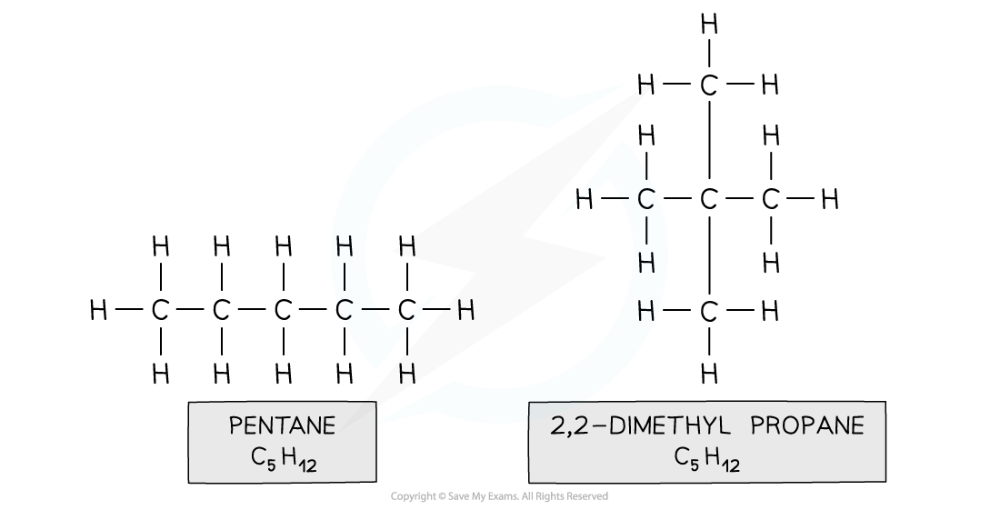

# Naming Organic Compounds

## Naming Organic Compounds

> **Spec point** — `spcpt_k3w75bQbTJKDQQK5` · understand how to name compounds relevant to this specification using the rules of International Union of Pure and Applied Chemistry (IUPAC) nomenclature students will be expected to name compounds containing up to six carbon atoms

## Naming organic compounds

### Names of compounds

- The names of organic compounds have two parts: the prefix or stem and the end part (or suffix)
- The prefix tells you how many carbon atoms are present in the longest continuous chain in the compound
- The suffix tells you what ***functional group*** is on the compound

#### Examples of naming organic molecules

| **First part of name** | **Second part of name** |   |   |   |
|---|---|---|---|---|
| **Name** | **Number of carbon atoms** | **Name** | **Functional group** | **Family** |
| Meth... | 1 | ...ane | None | Alkane |
| Eth... | 2 | ...ene | C=C bond | Alkene |
| Prop... | 3 | ...anol | R-OH | Alcohol |
| But... | 4 | ...anoic acid | R-C=O-OH | Carboxylic acid |
| Pent... | 5 | ....amine | R-NH2 | Amine |
| Hex... | 6 | ...yl ...anoate | R-C=O-O-R | Ester |

### Further rules for naming compounds

- When there is more than one carbon atom where a functional group can be located it is important to distinguish exactly **which carbon **the functional group is on
- Each carbon is numbered and these numbers are used to describe where the functional group is
- When 2 functional groups are present **di-** is used as a prefix to the second part of the name

#### Naming isomers

***Isomers can be distinguished by following the naming rules***

> **Exam Hint**
> For Double Award, you’re mainly expected to name **simple (straight-chain) compounds** and **unbranched isomers**.
> 
> You might still *see* branched names in questions, so make sure you understand that the numbers show the **positions of side chains**, but you usually won’t need to generate branched names from scratch
