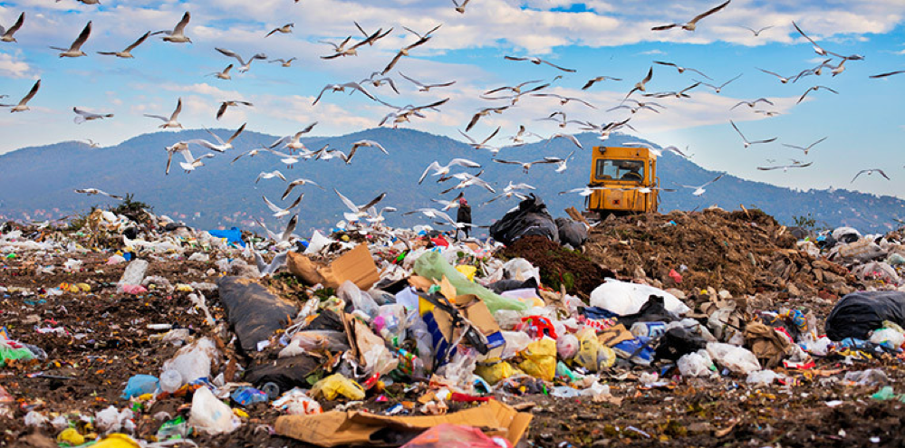

# Disposal of Addition Polymers

## Disposal of Addition Polymers

> **Spec point** — `spcpt_ySB9WYg6d8j3kxdw` · explain problems in the disposal of addition polymers, including: 
• their inertness and inability to biodegrade 
• the production of toxic gases when they are burned.

## Disposal of polymers

- Addition polymers are formed by the joining up of many small molecules with **strong C-C bonds** This makes addition polymers unreactive and chemically **inert** so don’t easily biodegrade

***Disposal of addition polymers is an environmental problem***

### Landfills

- Waste polymers are disposed of in landfill sites but this takes up valuable land, as addition polymers are non-biodegradable so micro-organisms such as decomposers cannot break them down
- This causes sites to quickly fill up

### Incineration

- Polymers release a lot of heat energy when they burn and produces carbon dioxide which is a greenhouse gas that contributes to climate change
- Polymers that contain chlorine such as PVC release **toxic hydrogen chloride** gas when burned
- If incinerated by incomplete combustion, carbon monoxide will be produced which is a toxic gas that reduces the capacity of the blood to carry oxygen
