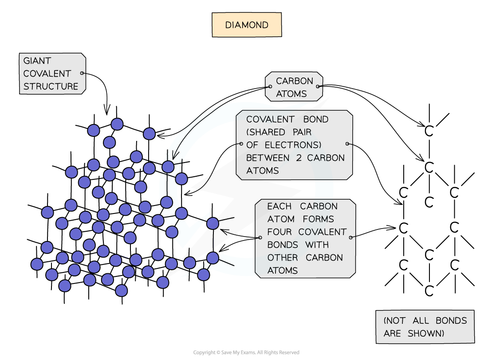
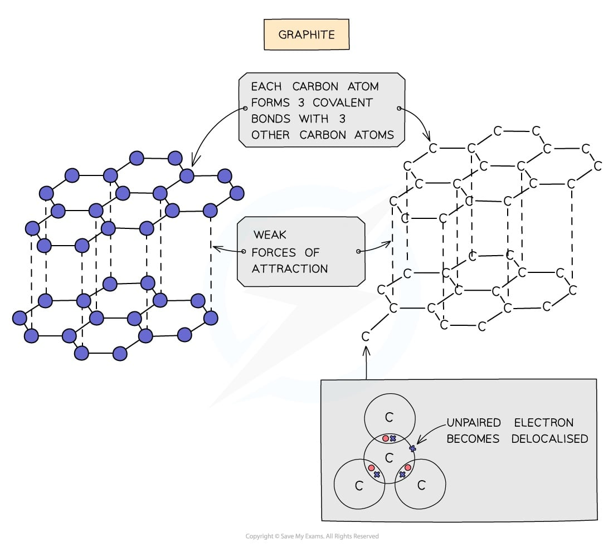

# Giant Covalent Structures

## Giant Covalent Structures

> **Spec point** — `spcpt_Kg4PMQ62PMxNwk2D` · explain why substances with giant covalent structures are solids with high melting and boiling points

## Giant covalent structures

- Giant covalent structures are **solids** with** high melting points**
- They have a huge number of non-metal atoms bonded to other non-metal atoms via strong **[covalent](https://www.savemyexams.com/igcse/chemistry_double-science/edexcel/19/revision-notes/1-principles-of-chemistry/1-7-covalent-bonding/1-7-1-formation-of-covalent-bonds/)**bonds
- These structures can also be called **giant lattices** and have a** **fixed ratio of atoms in the overall structure
- Examples include diamond and graphite
- All giant covalent structures have **high melting points** because:

  - There are strong covalent bonds between atoms
  - These require lots of energy to overcome

> **Exam Hint**
> Giant covalent structures can also be called macromolecules.

## Diamond & Graphite

> **Spec point** — `spcpt_yj2wwzKVCmV2CDwk` · explain how the structures of diamond and graphite influence their physical properties, including electrical conductivity and hardness

## Diamond and graphite

### Diamond

- Diamond and graphite are  ***allotropes*** of carbon
- Both substances contain only **carbon atoms** but due to the differences in bonding arrangements they are physically completely different
- In diamond, each carbon atom bonds with** four** other carbons, forming a tetrahedron
- Each covalent bond is very strong

#### What are the properties of diamond?

- Diamond is very **hard** because:

  - Each carbon atom is covalently bonded to four other carbon atoms
  - The covalent bonds are very strong
  - The hardness of diamond makes it useful for cutting tools
- Diamond has a **high melting point** because:

  - It has a giant covalent structure
  - There are strong covalent bonds between atoms which need lots of energy to break

> **Exam Hint**
> Diamond is the hardest naturally occurring mineral, but it is by no means the strongest.
> 
> Students often confuse **hard** with **strong**, thinking it is the opposites of weak.
> 
> Diamonds are hard, but brittle – that is, they can be smashed fairly easily with a hammer.
> 
> The opposite of saying a material is hard is to describe it as **soft**.

#### The bonding and structure in diamond

*Each carbon atom is bonded to four other carbon atoms*

### Graphite

- Each carbon atom in graphite is bonded to **three** others forming **layers** of **hexagons**, leaving one free electron per carbon atom

#### What are the properties of graphite?

- Graphite is **soft **and **slippery**

  - Each carbon atom is bonded to three other carbon atom forming layers
  - The layers are free to slide over each other because there are only weak forces between the layers, not covalent bonds
- Graphite can **conduct electricity** and **heat**

  - Due to each carbon atom only forming three bonds, one electron from each carbon atom is delocalised
  - The delocalised electrons are free to move
  - Graphite is similar to metals in that it has delocalised electrons
- Graphite has a **high melting point** because:

  - It has a giant covalent structure
  - There are strong covalent bonds between atoms which need lots of energy to break

> **Exam Hint**
> Don’t confuse pencil lead with the metal lead – they have nothing in common.
> 
> Pencil lead is actually graphite, and historical research suggests that in the past, lead miners sometimes confused the mineral galena (lead sulfide) with graphite; since the two looked similar they termed both minerals ‘lead’.
> 
> The word graphite derives from the Greek word ‘grapho’ meaning ‘I write’, so it is a well named mineral!

#### Bonding and structure in graphite

*Structure of graphite showing weak forces between the planes *

> **Exam Hint**
> **Remember: **Explaining the melting point for any giant covalent structure is always the same:
> 
> - They have giant covalent structures
> - There are many strong covalent bonds
> - These need lots of energy to break
