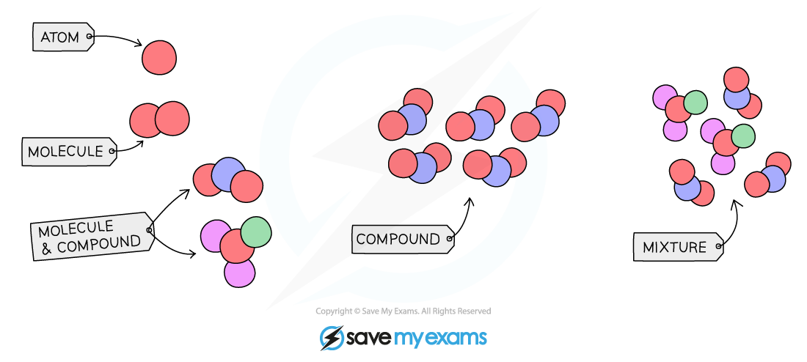

# Element, Compound or Mixture

## Classify an Element, Compound or Mixture

> **Spec point** — `spcpt_Q8Q28zgmgdb3gG9B` · understand how to classify a substance as an element, compound or mixture

## Element, compounds and mixtures

- All substances can be classified into one of these three types

  - Elements
  - Compounds
  - Mixtures

### What is an element?

- A substance made of atoms that all contain the **same number of protons **and cannot be split into anything simpler
- There are 118 elements found in the Periodic Table

  - E.g. copper, iron, magnesium

### What is a compound?

- A pure substance made up of two or more different elements **chemically combined**
- There is a **vast **number of compounds
- Compounds cannot be separated into their elements by physical means

  - E.g. copper(II) sulfate (CuSO4), calcium carbonate (CaCO3), carbon dioxide (CO2)

### What is a mixture?

- A combination of two or more substances (elements and/or compounds) that are **not **chemically combined
- Mixtures can be separated by **physical methods** such as filtration or evaporation

  - E.g. sand and water, oil and water, sulfur powder and iron filings

#### Particle diagram showing elements, compounds and mixtures

***All substances can be classified as an element, compound or mixture***

> **Exam Hint**
> As well as learning the definitions for an element, compound and mixture, you must be able to classify any given substance.
