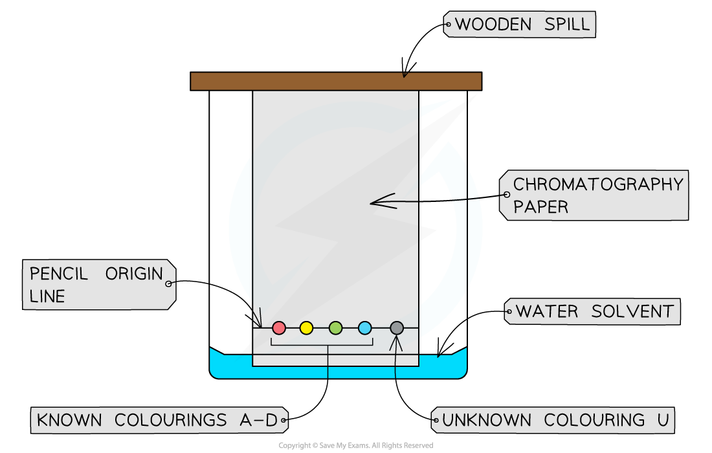

# Practical: Investigating Paper Chromatography

## Practical: Investigate Paper Chromatography Using Inks & Food Colourings

> **Spec point** — `spcpt_cndDJFNXGZ5KY3gZ` · practical: investigate paper chromatography using inks/food colourings

## Practical: Investigate Paper Chromatography Using Inks & Food Colourings

### Aim:

Investigate how paper chromatography can be used to separate and identify a mixture of food colourings

### Apparatus:

- A 250 cm3 beaker
- A wooden spill
- A rectangle of chromatography paper
- Four known food colourings labelled A–D
- An unknown mixture of food colourings labelled U
- Five glass capillary tubes
- Paper clip
- Ruler & pencil

#### Diagram of the apparatus needed for paper chromatography

### Method:

1. Use a ruler to draw a horizontal pencil line 2 cm from the end of the chromatography paper
2. Use a different capillary tube to put a tiny spot of each colouring A, B, C and D on the line
3. Use the fifth tube to put a small spot of the unknown mixture U on the line
4. Make sure each spot is no more than 2-3 mm in diameter and label each spot in pencil
5. Pour water into the beaker to a depth of no more than 1 cm and clip the top of the chromatography paper to the wooden spill. The top end is the furthest from the spots
6. Carefully rest the wooden spill on the top edge of the beaker. The bottom edge of the paper should dip into the solvent
7. Allow the solvent to travel undisturbed at least three quarters of the way up the paper
8. Remove the paper and draw another pencil line on the dry part of the paper as close to the wet edge as possible. This is called the solvent front line
9. Measure the distance in mm between the two pencil lines. This is the distance travelled by the water solvent
10. For each of food colour A, B, C and D measure the distance in mm from the start line to the middle of the spot

### Common errors & sources of inaccuracy

- When carrying out paper chromatography, it is important to be aware of the potential sources of error to ensure your results are accurate

#### Starting line drawn in ink

- The ink is a mixture of dyes and will run with the solvent
- This will interfere with the chromatogram and make it difficult to interpret the results
- **Solution: **Always draw the starting line in pencil

#### Large sample spots

- This can cause the separated spots to merge or spread out
- This can lead to smearing and an inaccurate measurement of the *R*f value
- **Solution: **Keep the sample spots as small and concentrated as possible

#### Solvent level above the starting line

- The samples will dissolve directly into the solvent
- This means that the samples will not move up the chromatogram and there will be no separation
- **Solution: **Ensure the solvent is always below the pencil starting line

#### Solvent front runs off the top of the paper

- If the solvent runs off the end of the paper, you cannot measure the distance it travelled
- Therefore, you cannot calculate the *R*f values
- **Solution: **Remove the chromatogram from the beaker before the solvent front reaches the very top

#### Beaker is not covered

- The solvent will evaporate from the surface of the paper as it moves up
- This can slow down the separation and affect the final position of the spots
- **Solution: **Place a lid (such as a watch glass or plastic wrap) on top of the beaker to create a saturated atmosphere of solvent vapour

### Results:

- Record your results in a suitable table

| **Food colouring ** | **Distance moved by spot (mm)** | **Distance Moved by solvent (mm)** | ***R*****f ****value ** |
|---|---|---|---|
| A |   |   |   |
| B |   |   |   |
| C |   |   |   |
| D |   |   |   |

- The *R*f values of food colours A, B, C and D should be compared to that for the unknown sample as well as a visual comparison being made
- Substances with matching Rf values are the same substance and will move the same distance up the paper
