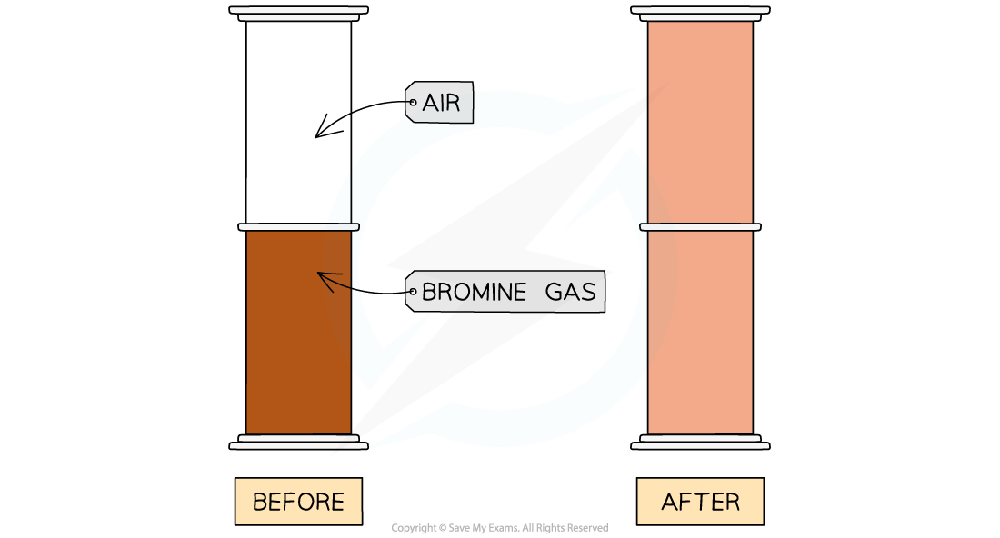

# Diffusion & Dilution

## Diffusion & Dilution

> **Spec point** — `spcpt_2g4Qfpg487fjpxCH` · understand how the results of experiments involving the dilution of coloured solutions
and diffusion of gases can be explained

## Diffusion and dilution

- Diffusion and dilution experiments support a theory that all matter (solids, liquids and gases) is made up of tiny, moving particles

#### Diffusion

- Diffusion occurs in gases and liquids, due to the random motion of their particles
- It is where particles move from an area of **high concentration **to an area of **low concentration**
- Eventually the concentration of particles is **even** as the particles are evenly spread throughout the available space
- Diffusion happens on its own and no energy input is required

  - Although, it occurs faster at higher temperatures because the particles have more kinetic energy

### Diffusion in gases

***Diffusion of red-brown bromine gas***

**Description:**

- Here, we see the diffusion of bromine gas from one gas jar to another
- After 5 minutes the bromine gas has diffused from the bottom jar to the top jar

**Explanation: **

- The air and bromine particles are moving randomly and there are large gaps between particles
- The particles can therefore easily mix together

### Diffusion in liquids

***Diffusion of potassium manganate(VII) in water over time***

**Description:**

- When potassium manganate (VII) crystals are dissolved in water, a purple solution is formed
- A small number of crystals produce a highly intense colour

**Explanation: **

- The water and potassium manganate (VII) particles are moving randomly and the particles can slide over each other
- The particles can therefore easily mix together
- Diffusion in liquids is slower than in gases because the particles in a liquid are closely packed together and move more slowly

### Dilution

- Dilution is the process of adding more solvent (usually water) to a solution
- This **decreases the concentration** of solute particles
- The solute particles become **more spread out** but are still present in the solution
- The colour of the solution becomes **fainter** with each dilution, but it does not disappear immediately
- Dilution does not remove particles

  - It **spreads them out** more

***Dissolving potassium manganate (VII) in water***

**Description:**

- When potassium magnate (VII) crystals are dissolved in water, the solution can be diluted several times
- The colour fades but does not disappear until a lot of dilutions have been done

**Explanation:**

- This indicates that there are a lot of particles in a small amount of potassium manganate (VII) and therefore the particles must be very small

> **Exam Hint**
> Diffusion and dilution provide evidence for the kinetic theory of matter.
