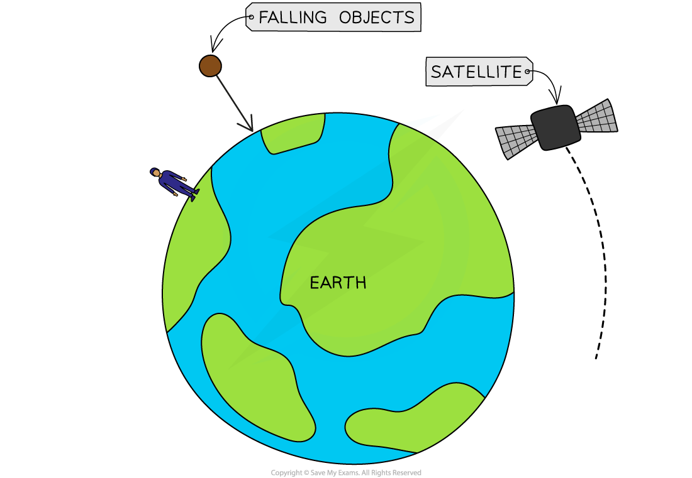
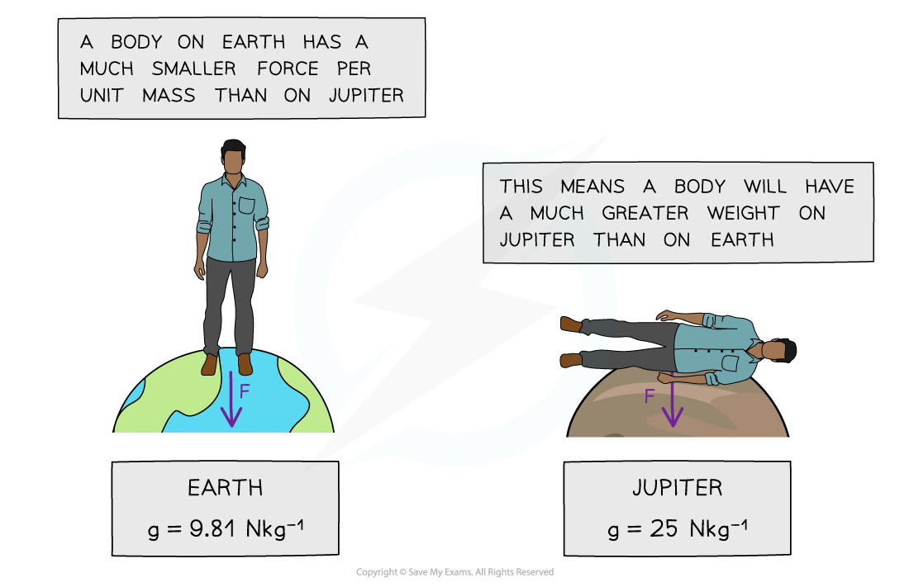

# Gravitational Field Strength

## Gravitational field strength

> **Spec point** — `spcpt_ccctmkmpJvdDv3Kc` · understand why gravitational field strength, g, varies and know that it is different on other planets and the Moon from that on the Earth 

## Gravitational field strength

- The strength of gravity on different planets affects an object's weight on that planet
- Weight is defined as: **The force acting on an object due to gravitational attraction**
- Planets have strong gravitational fields

  - Hence, they attract nearby masses with a strong gravitational force

- The force of weight is responsible for:

  - objects staying firmly on the ground
  - objects always falling to the ground
  - satellites being kept in orbit

***Objects are attracted towards the centre of the Earth due to its gravitational field strength***

- Weight and gravitational field strength both vary on the different objects in the Solar System

  - The greater the mass of the planet then the greater its gravitational field strength
  - A higher gravitational field strength means a larger attractive force towards the centre of that planet or moon

- The value of *g* varies with the distance from a planet, but on the surface of the planet, it is roughly the **same**
- However, the value of *g* varies dramatically for different planets and moons

- The gravitational field strength (*g*) on the **Earth** is approximately 10 N/kg
- The gravitational field strength on the surface of the **Moon** is **less** than on the Earth

  - This means it would be **easier** to lift a mass on the surface of the Moon than on the Earth

- The gravitational field strength on the surface of the gas giants (e.g. Jupiter and Saturn) is **more** than on the Earth

  - This means it would be **harder** to lift a mass on the gas giants than on the Earth

***Value for g on the different objects in the Solar System***

- The mass of an object is always the same, but its weight changes depending on the gravitational field

  - This means that on both Earth and Jupiter, an object’s **mass **will have the **same **value
  - However, their **weight **will be a lot **greater **on Jupiter than on Earth, so much so that a human would not be able to stand up on the surface of Jupiter

***A person’s weight on Jupiter would be so large a human would be unable to fully stand up***

> **Exam Hint**
> You do not need to remember the value of *g* on different planets for your exam, the value of *g* for Earth will be given in the exam question.
