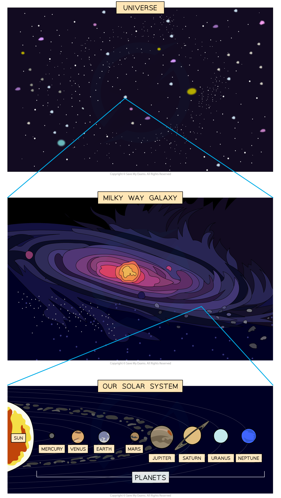

# Objects in Space

## Planets, stars & galaxies

> **Spec point** — `spcpt_H3jnS96Krmv4DttM` · know that: 
•        the universe is a large collection of billions of galaxies
•        a galaxy is a large collection of billions of stars
•        our solar system is in the Milky Way galaxy.

## Planets, stars & galaxies

### The Universe

- The Universe is defined as **A large collection of billions of galaxies**
- It is also the name given to the entirety of space

### Galaxies

- A galaxy is defined as **A large collection of billions of stars**
- Stars are large astronomical objects such as the Sun

### The Solar System

- Stars may be a part of a **planetary system**

  - In a planetary system, planets and other astronomical objects orbit around a star at the centre

- Our Solar System is in the **Milky Way galaxy**
- The Sun is at the **centre** of our Solar System
- Our planet, the Earth, is the third of eight planets in our **Solar System**

#### Hierarchy of the Solar System

***The Universe is a large collection of galaxies and a galaxy is a large collection of stars. The Sun is a star at the centre of our Solar System in the Milky Way galaxy***
