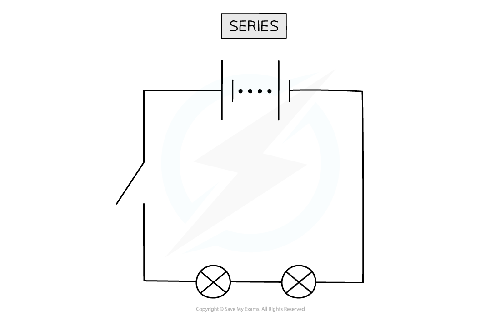
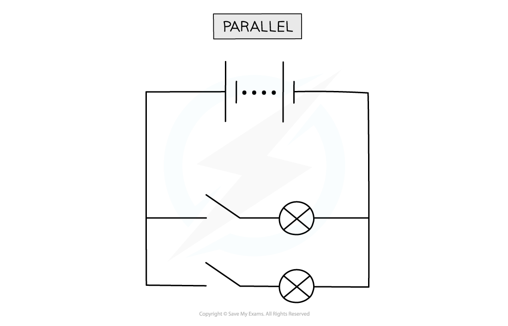

# Voltage in Series & Parallel

## Voltage in series & parallel

> **Spec point** — `spcpt_cCp6mY3XwwC7bvxq` · know that the voltage across two components connected in parallel is the same 

## Voltage in series & parallel

### Voltage in series

- In a series circuit, the **total voltage** of a power supply is **shared **between the components

***Lamps connected in a series circuit share the potential difference from the battery***

- For two identical components (with equal resistance), the voltage across them will be:

  - the **same**
  - equal to **half the total voltage **of the power supply

- For two non-identical components (with different values of resistance), the voltage will be:

  - **higher **across the component with the higher resistance
  - **lower **across the component with lower resistance

### Voltage in parallel

- In a parallel circuit, the **total voltage** across each branch is the **same **as the voltage of the power supply

***Lamps connected in a parallel circuit all have the same voltage across them***

## Advantages & disadvantages

> **Spec point** — `spcpt_9M4cmmqvMpGh6Ssb` · explain why a series or parallel circuit is more appropriate for particular applications, including domestic lighting 

## Advantages & disadvantages

### Advantages and disadvantages of a series circuit

- A **series** circuit consists of a string of two or more components connected in a loop

***In a series circuit, only one switch is needed to control all of the lamps. This can be seen as an advantage or as a disadvantage***

#### Advantages of a series circuit

- All of the components are controlled by a **single** **switch**
- Fewer wires are required

#### Disadvantages of a series circuit

- The components cannot be controlled **separately**
- If one component breaks, all other components stop working

### Advantages and disadvantages of parallel circuits

- A **parallel** circuit consists of two or more components attached across **different** **branches** of the circuit

***In a parallel circuit, the lamps are connected in parallel and can be switched on and off by their own switches***

#### Advantages of a parallel circuit

- The components can be **individually** **controlled** using their own switches
- If one component breaks, then the others will continue to function

#### Disadvantages of a parallel circuit

- Many more wires are involved which can be more complicated to set up
- All branches have the same voltage as the supply making it more difficult to control the voltage across individual components

> **Exam Hint**
> You may have noticed that for a parallel circuit, all of the components can be controlled by a single switch - like a series circuit.
> 
> Note that the current does not always split equally in a parallel circuit – often there will be more current in some branches than in others. The current in each branch will only be identical if the **resistance** of the components along each branch is identical. However, the voltage across two components connected in parallel is always the **same.**
