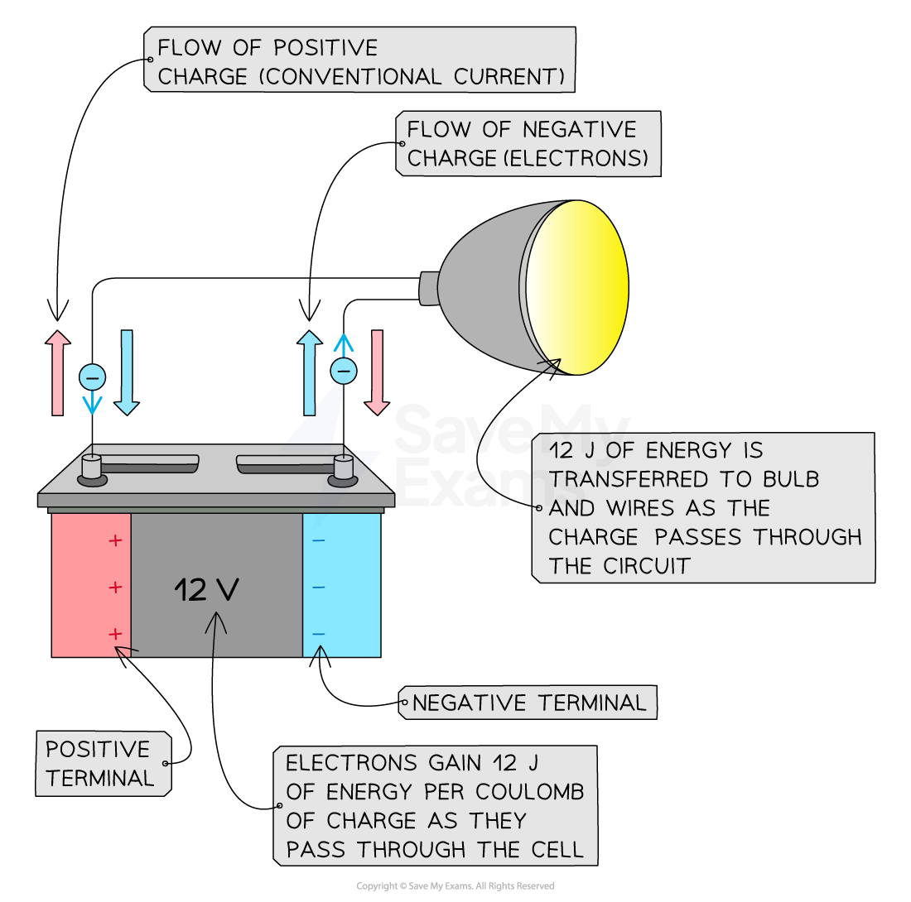
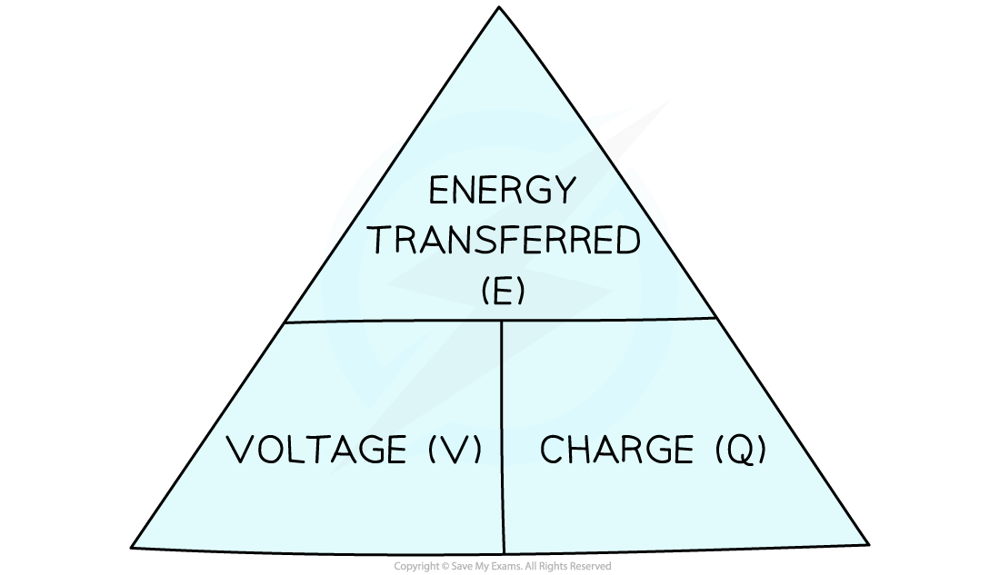

# Voltage & Energy

## Voltage

> **Spec point** — `spcpt_j6FRhbvmhNH9mV3K`

## Voltage

- Voltage is defined as **The energy transferred per unit charge passing between two points**
- Voltage is measured in units of **volts (V)**

  - 1 volt is equivalent to the transfer of 1 joule of energy by 1 coulomb of charge, or 1 V = 1 J/C

- The terminals of a cell make one end of the circuit **positive** and the other **negative**

- As electrons flow through a cell, they **gain **energy

  - For example, in a 12 V cell, every coulomb of charge passing through gains 12 J of energy

- As electrons flow through a circuit, they **lose **energy

  - For example, after leaving the 12 V cell, each coulomb of charge will transfer 12 J of energy to the wires and components in the circuit

***Electrons gain energy as they pass through a cell. As they flow through the light bulb, energy is transferred to the surroundings by heating and radiation***

### Measuring voltage

- Voltage can be measured using a **voltmeter**
- Voltmeters must be set up in **parallel **with the component being measured

***Voltage can be measured by connecting a voltmeter in parallel between two points in a circuit***

> **Exam Hint**
> When you are building a circuit in class, always **connect the voltmeter last. **Make the whole circuit first and check it works, and then connect the voltmeter so that the leads are on each side of the component you are measuring. This will save you a lot of time waiting for your teacher to troubleshoot your circuit!
> 
> You might sometimes see voltage called potential difference. This term can be useful when thinking about voltmeters as the potential difference describes a **difference **between **two **points, therefore the voltmeter has to be connected between **two **points in the circuit.

## Calculating voltage

> **Spec point** — `spcpt_J66zR2Cvw8hsHP2T`

## Calculating voltage

- The equation linking the energy transferred, voltage and charge is given below:

energy transferred = charge × voltage

$E=Q\timesV$

- Where:

  - *E = *energy transferred, measured in joules (J)
  - *Q = *charge moved, measured in coulombs (C)
  - *V = *voltage, measured in volts (V)

- This can be rearranged using the formula triangle below:

#### Energy charge voltage formula triangle

***Formula triangle for the energy transferred, voltage and charge equation***

- Check out this revision note on [speed, distance and time](https://www.savemyexams.com/igcse/science/edexcel/double-award/17/physics/revision-notes/forces-and-motion/movement-and-position/speed/) if you need a reminder on how to use formula triangles

> **Worked Example**
> The normal operating voltage for a lamp is 6 V.
> 
> Calculate how much energy is transferred in the lamp when 4200 C of charge flows through it.
> 
> **Answer:**
> 
> **Step 1: List the known quantities**
> 
> - Voltage, *V = *6 V
> - Charge, *Q* = 4200 C
> 
> **Step 2: State the equation linking potential difference, energy and charge**
> 
> - The equation linking potential difference, energy and charge is:
> 
> $E=Q\timesV$
> 
> **Step 3: Substitute the known values and calculate the energy transferred**
> 
> *E = *6 × 4200 = 25 200 J
> 
> - Therefore, **25 200 J** of energy is transferred in the lamp

> **Exam Hint**
> Don't be confused by the symbol for voltage (the **symbol** *V*) being the same as its unit (the **volt**, V). Learn the equation and remember especially that one volt is equivalent to 'a joule per coulomb'.
