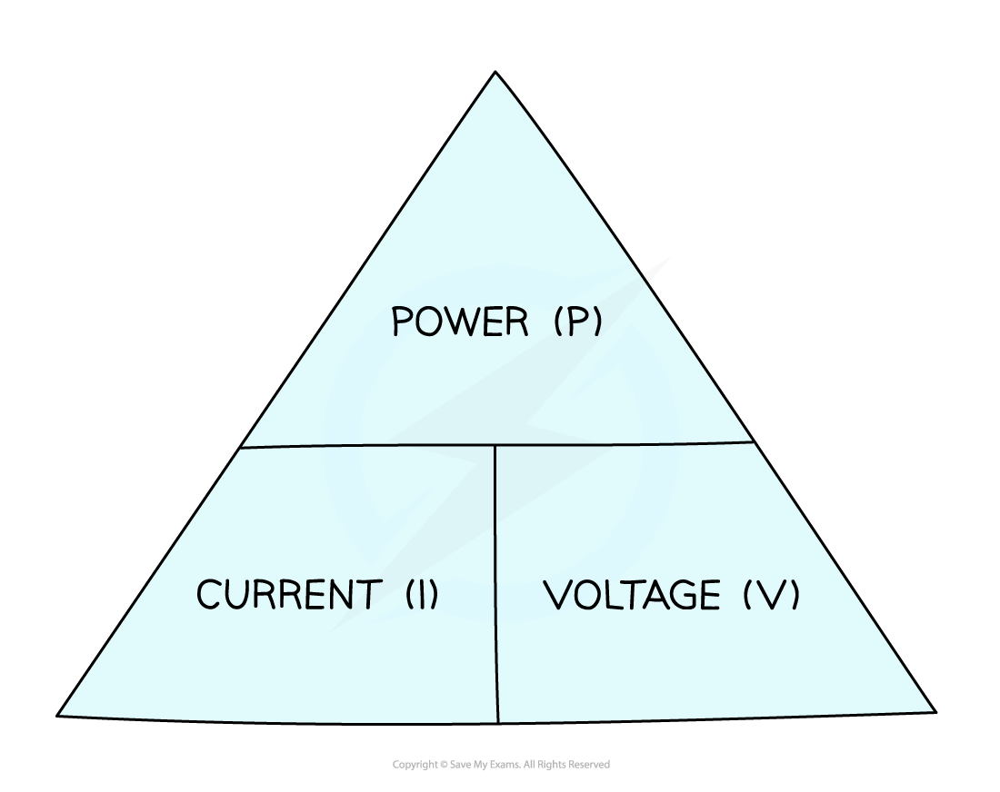

# Electrical Power & Fuses

## Electrical power

> **Spec point** — `spcpt_3jfZD4Z7YjmjnS7X`

## Electrical power

- Power is defined as **The rate of energy transfer or the amount of energy transferred per second**
- The electrical power of a device depends on:

  - The **voltage** (potential difference) of the device
  - The **current** of the device
- The power of an electrical component (or appliance) is given by the equation:

$P=IV$

- Where:

  - *P *= power, measured in Watts (W)
  - *I *= current, measured in amperes (A)
  - *V *= potential difference, measured in volts (V)

- The unit of power is the **Watt** (W), which is the same as a joule per second (J/s)

#### A formula triangle can help rearrange the electrical power equation

***Power, current, voltage formula triangle***

- For more information on how to use a formula triangle refer to the revision note on [Speed](https://www.savemyexams.com/igcse/science/edexcel/double-award/17/physics/revision-notes/forces-and-motion/movement-and-position/speed/)

> **Worked Example**
> Calculate the potential difference through a 48 W electric motor with a current of 4 A.
> 
> **Answer:**
> 
> **Step 1: List the known quantities**
> 
> - Power, *P* = 48 W
> - Current, *I* = 4 A
> 
> **Step 2: Write down the relevant equation**
> 
> $P=IV$
> 
> **Step 3: Rearrange for potential difference, *****V***
> 
> $V=\frac{P}{I}$
> 
> **Step 4: Substitute the values**
> 
> $V=\frac{48}{4}$
> 
> $V=12V$

> **Exam Hint**
> Remember: Power is just energy **per second**. Think of it this way will help you to remember the relationship between power and energy. You can remember the unit by the phrase: “**Watt** is the unit of **power**?”

## Selecting fuses

> **Spec point** — `spcpt_rkCvX5G7cTYGNGxt`

## Selecting fuses

- A fuse is a safety device designed to **cut off the flow of electricity to an appliance if the current becomes too large** (due to a fault or a surge)

#### Fuse circuit symbol

***The circuit symbol for a fuse - take care not to confuse this with a resistor***

- Fuses usually consist of a glass cylinder containing a thin metal wire
- If the current in the wire becomes too **large**:

  - The wire heats up and **melts**
  - This causes the wire to **break**, breaking the circuit and stopping the current
- This makes sure that more current doesn't keep flowing through the circuit and causing more damage to the equipment, or, causing a fire

### Fuse sizes

- Fuses come in a **variety** of sizes, typically 3 A, 5 A and 13 A

  - In order to select the right fuse for the job, the **current** through an appliance needs to be known

- If the **electrical power** of the appliance is known (along with **mains** **voltage**), the current can be calculated using the equation:

$I=\frac{P}{V}$

- Where:

  - *I* = current in amperes (A)
  - *P* = power in watts (W)
  - *V* = voltage in volts (V)
- The fuse should always have a current rating that is slightly **higher** than the current needed by the appliance

  - Because of this, the rule of thumb is to **always** choose the **next size up**
- If the fuse current rating is too low, it will break the circuit even when an acceptable current is flowing through
- If the fuse current rating is too high, it will not break the circuit in enough time before damage occurs

> **Worked Example**
> If an appliance uses a current of 3.1 A, what would be a suitable rating for a fuse?
> 
> **Answer:**
> 
> **Step 1: Consider a 3 A fuse**
> 
> - A 3 A fuse would be too small
> 
>   - The fuse would blow as soon as the appliance was switched on
> 
> **Step 2: Consider a 5 A fuse**
> 
> - A 5 A fuse would be an appropriate choice
> 
>   - It is the next size up from the current required
> 
> **Step 3: Consider a 13 A fuse**
> 
> - A 13 A fuse would be too large
> 
>   - It would allow an extra 10 amperes to pass through the appliance before it finally blew

> **Exam Hint**
> Remember there are two steps involved in selecting a correctly sized fuse for an appliance:
> 
> 1. Calculating the current required using the **electrical power equation**
> 
> 2. Selecting the **next size up** fuse
