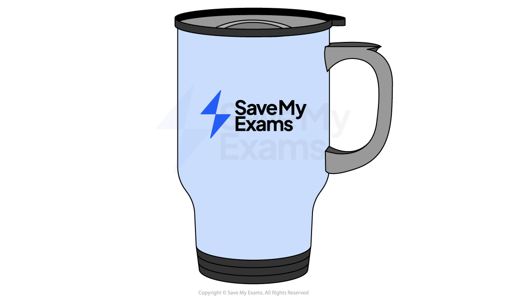
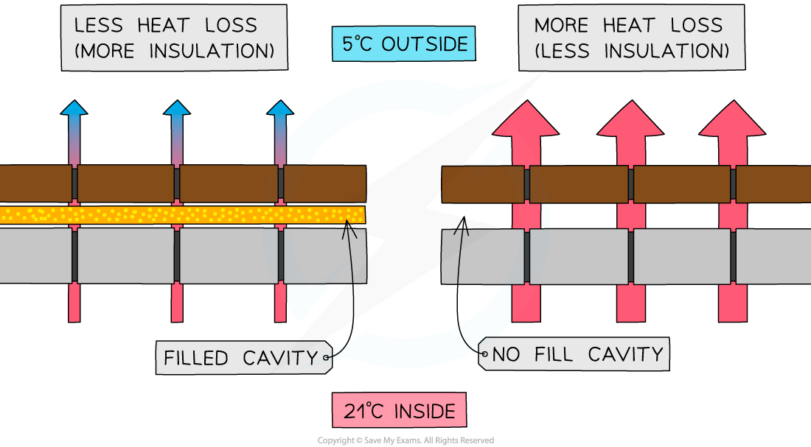

# Reducing Energy Loss

## Reducing energy loss

> **Spec point** — `spcpt_Dq7k3WTHQkYRW5QF` · explain ways of reducing unwanted energy transfer, such as insulation 

## Reducing energy loss

- There are many situations where energy transfers are actually **unwanted**:

  - Keeping a house warm
  - Keeping a drink hot or cold
  - Dressing to stay warm in cold weather

***Insulated mugs are used to maintain the temperature of hot or cold drinks***

*** ***

- When an appliance is used for heating something (a kettle, a heater, a tumble dryer, a central heating system, etc.), the appliance requires a lot of energy

  - It can become expensive for a household to run such appliances
  - The production of electricity using fossil fuels produces greenhouse gases, which contribute to global warming
  - The combustion of (methane) gas produces greenhouse gases, which contribute to global warming

- Therefore, it is often useful to explore ways of **reducing **unwanted energy transfers

- Energy that is **dissipated to the surroundings** is often the main source of **wasted **energy transfers
- If these unwanted energy transfers can be prevented, or reduced, the **useful **energy transfers can be made more **efficient**

### Reducing conduction

- Energy transfers by heating due to **conduction **are one of the most common sources of dissipated energy
- To reduce energy transfers by **conduction**, materials with a **low **thermal conductivity should be used

  - Materials with low thermal conduction are called **insulators**

### Reducing convection

- **Convection **can also be a source of dissipated energy
- To reduce energy transfers by convection, **convection currents** must be prevented from forming
- Therefore, the **fluid **(liquid or gas)** **that forms the currents must be prevented from **moving**

### Insulation

- **Insulation **reduces energy transfers from both **conduction **and **convection**
- The effectiveness of an insulator is dependent upon:

  - The thermal **conductivity **of the material
  
    - The lower the conductivity, the less energy is transferred

  - The **density **of the material
  
    - The more dense the insulator, the more conduction can occur
    - In a denser material, the particles are closer together so they can transfer energy to one another more easily

  - The **thickness **of the material
  
    - The thicker the material, the better it will insulate
- Insulating the loft of a house lowers its rate of cooling, meaning less energy is transferred to the surroundings (outside)
- The insulation is often made from fibreglass (or glass fibre)

  - This is a reinforced plastic material composed of woven material with glass fibres laid across and held together
  - The air trapped between the fibres makes it a **good** insulator
- The gaps or cavities between external walls are often filled with insulation

  - This is called **cavity wall insulation**
  - This is often done by drilling a hole through the external wall to reach the cavity and filling it with a special type of foam which is made from blown mineral fibre filled with gas
  - This lowers the **conduction **of heat through the walls from the inside to the outside

#### Cavity insulation

***Less energy is transferred by conduction and convection if the cavity is insulated***

> **Exam Hint**
> A **common mistake** when explaining how an insulator keeps something warm is to state something along the lines of “The object warms up the insulator which then warms the object up”.
> 
> **Avoid giving this kind of answer!**
> 
> The real explanation is:
> 
> - The insulator contains trapped air, which is a poor thermal conductor
> - Trapping the air also prevents it from transferring energy by convection
> - This reduces the rate of energy transfer from the object, meaning that it will stay warmer for longer
> 
> Other things to watch out for:
> 
> - **Heat does not rise** (only hot gases or liquids rise)
> - **Shiny things do not reflect heat **(they reflect thermal radiation)
> - **Black things do not absorb heat **(they absorb thermal radiation)
> 
> And remember, a good answer will often include references to more than one method of thermal energy transfer.
