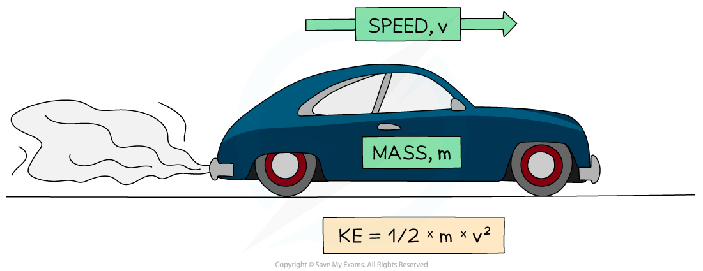

# Kinetic Energy

## Kinetic energy

> **Spec point** — `spcpt_chRcMh2hPKrJ8HGV` · know and use the relationship: 
kinetic energy =  1/2 × mass × speed2 
KE = 1 / 2 × m× v

## Kinetic energy

- Energy in an object's kinetic store is defined as: **The amount of energy an object has as a result of its mass and speed**
- This means that any object in **motion** has energy in its kinetic energy store

- Kinetic energy can be calculated using the equation:

$KE=\frac{1}{2}\timesm\timesv^{2}$

- Where:

  - KE = kinetic energy in joules (J)
  - *m* = mass of the object in kilograms (kg)
  - *v* = speed of the object in metres per second (m/s)

> **Worked Example**
> Calculate the kinetic energy stored in a vehicle of mass 1200 kg moving at a speed of 27 m/s.
> 
> **Answer:**
> 
> **Step 1: List the known quantities**
> 
> - Mass of the vehicle, *m* = 1200 kg
> - Speed of the vehicle, v = 27 m/s
> 
> **Step 2: Write down the equation for kinetic energy**
> 
> $KE=\frac{1}{2}\timesm\timesv^{2}$
> 
> **Step 3: Calculate the kinetic energy**
> 
> `K E space equals space 1 half space cross times space 1200 space cross times space open parentheses 27 close parentheses squared`
> 
> $KE=437400J$
> 
> **Step 4: Round the final answer to 2 significant figures**
> 
> $KE=440000J$

> **Exam Hint**
> When performing calculations using the kinetic energy equation, always double-check that you have squared the speed. Forgetting to do this is the most common mistake that students make.
