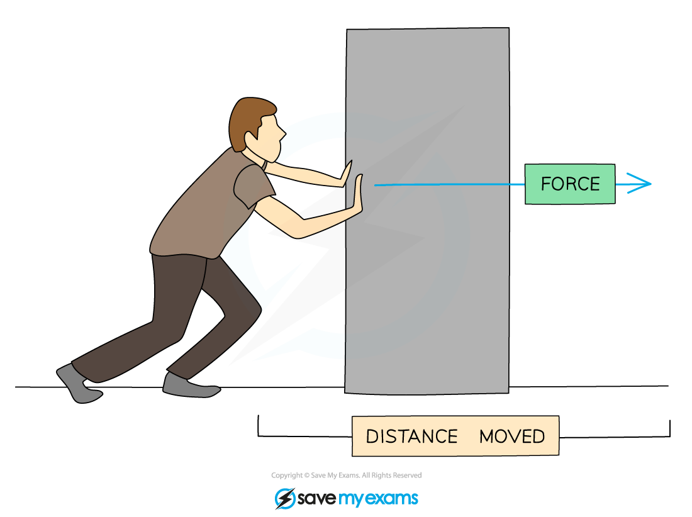
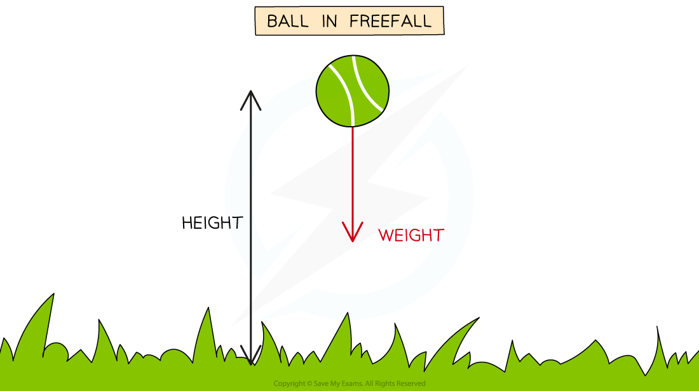
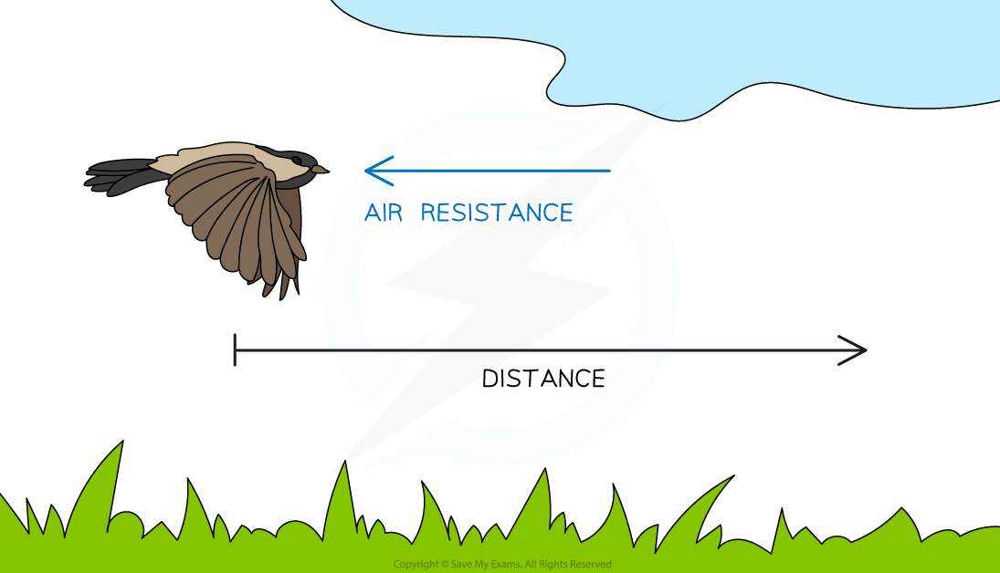
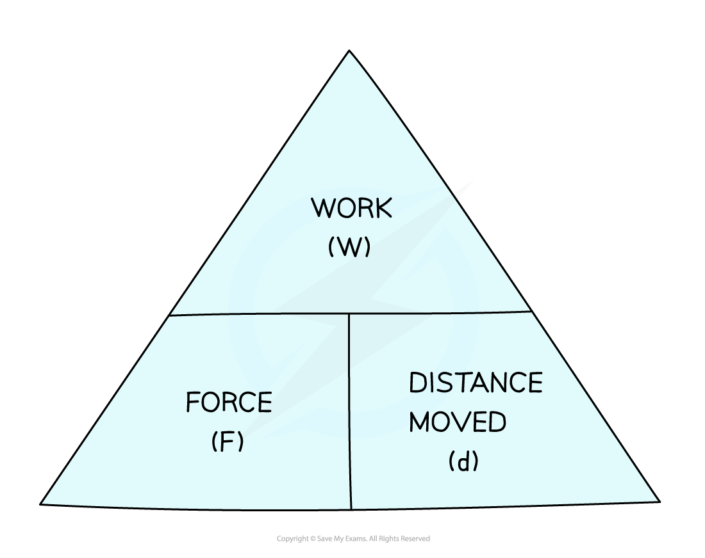

# Work Done

## Work done

> **Spec point** — `spcpt_jrvRw9GjzWJMk2mh`

## Work done

### What is work done?

- Work is done when an object is moved over a **distance** by a **force** applied in the **direction** of its displacement

  - It is said that the **force does work** on the object
  - If a force is applied to an object but doesn’t result in any movement, no work is done

### Work done and energy transfer

- When work is done on an object, **energy is transferred**
- The amount of energy transferred (in joules) is equal to the work done (also in joules)

**energy transferred (J) = work done (J)**

** **

#### Work done pushing a box

***Work is done when a force is used to move an object over a distance, and energy is transferred from the person to the box***

- If a force acts **in the direction** that an object is moving, then the object will **gain energy** (usually to its kinetic energy store)
- If the force acts in the **opposite direction** to the movement, then the object will **lose energy** (dissipated to the surroundings, usually by heating)

### Examples of work done

- Work is done on a ball when it is lifted to a height

  - The energy is transferred mechanically from the ball's kinetic energy store to its gravitational potential energy store

#### Work done on a ball

***The weight on the ball produced by the gravitational field does work on the ball over a distance ***

- Work is done when a bird flies through the air

  - The bird must travel against air resistance, therefore energy is transferred from the bird's **kinetic store **to its **thermal store **and **dissipated **to the **thermal store** of the surroundings

#### Work done by a bird

*** ***

***The bird does work against air resistance (drag) as it flies through the air***

## Calculating work done

> **Spec point** — `spcpt_gHxnzCG9hKTCw3Xg`

## Calculating Work Done

### The work done equation

- The amount of work that is done is related to the magnitude of the **force **and the **distance **moved by the object in the direction of the force
- To calculate the amount of work done on an object by a force, the work done equation is used:

**W = f × d**

- Where:

  - *W* = ***work done*** in joules (J) or newton-metres (N m)
  - *F* = force in newtons (N)
  - *d* = distance in metres (m)

#### Work done formula triangle

***Work, force, distance formula triangle***

- For help with how to use formula triangles, see the revision note on [Speed](https://www.savemyexams.com/igcse/science/edexcel/double-award/17/physics/revision-notes/forces-and-motion/movement-and-position/speed/)

> **Worked Example**
> A car moving at speed begins to apply the brakes. The brakes of the car apply a force of 500 N which brings it to a stop after 23 m.
> 
> 
> 
> Calculate the work done by the brakes in stopping the car.
> 
> **Answer: **
> 
> **Step 1: List the known quantities**
> 
> - Distance, *d* = 23 m
> - Force, *F* = 500 N
> 
> **Step 2: Write out the equation relating work, force and distance**
> 
> *W = F × d*
> 
> **Step 3: Calculate the work done on the car by the brakes**
> 
> *W* = 500 × 23
> 
> *W* = **11 500 J**

> **Exam Hint**
> Remember to always convert the distance into **metres** and force into n**ewtons** so that the work done is in j**oules** or** newton-metres**
