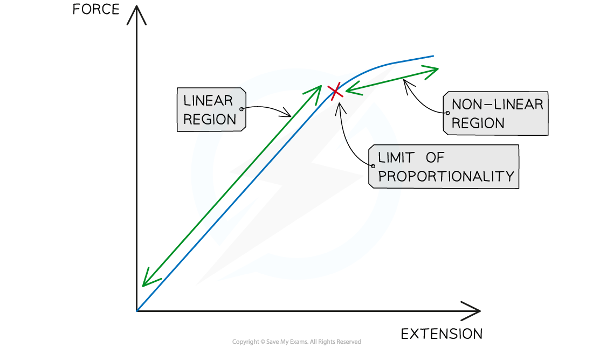
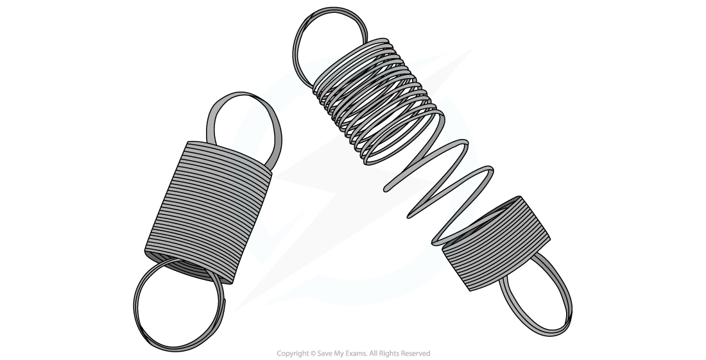

# Hooke's Law

## Hooke's law

> **Spec point** — `spcpt_dwzzxctnxMfgHY4b` · know that the initial linear region of a force-extension graph is associated with Hooke’s law 

## Hooke's law

- The relationship between the extension of an elastic object and the applied force is defined by **Hooke's Law**
- Hooke's Law states that: **The extension of an elastic object is directly proportional to the force applied, up to the limit of proportionality** ** **
- Directly proportional means that as the force is increased, the extension increases

  - If the force is doubled, then the extension will double
  - If the force is halved, then the extension will also halve
- The **limit of proportionality **is the point beyond which the relationship between force and extension is no longer directly proportional

  - This limit varies according to the material

***Hooke's Law states that a force applied to a spring will cause it to extend by an amount proportional to the force***

### The force-extension graph

- Hooke’s law is the **linear** relationship between force and extension

  - This is represented by a **straight line** on a force-extension graph
- Any material beyond its ***limit of proportionality*** will have a non-linear relationship between force and extension

***Hooke's Law is associated with the linear region of a force-extension graph. Beyond the limit of proportionality, Hooke's law no longer applies***

## Elastic behaviour

> **Spec point** — `spcpt_B3zyJrVG8qFK7DcV` · describe elastic behaviour as the ability of a material to recover its original shape after the forces causing deformation have been removed 

## Elastic behaviour

- **Elastic behaviour** is the ability of a material to **recover its original shape** after the forces causing the deformation have been removed
- **Deformation **is a change in the original shape of an object
- Deformation can be either:

  - elastic
  - inelastic

#### Elastic Deformation

- **Elastic deformation** is when the object **does **return to its original shape after the deforming forces are removed
- Elastic deformation results in a change in the object's shape that is **not permanent**

- Examples of materials that undergo elastic deformation are:

  - Rubber bands
  - Fabrics
  - Steel springs

#### Inelastic Deformation

- **Inelastic deformation** is when the object **does not** return to its original shape after the deforming forces are removed
- Inelastic deformation results in a change in the object's shape that** is permanent**

- Examples of materials that undergo inelastic deformation are:

  - Plastic
  - Clay
  - Glass

#### Elastic behaviour of a spring

***The spring on the right has undergone inelastic deformation, it's shape has been permanently deformed***
