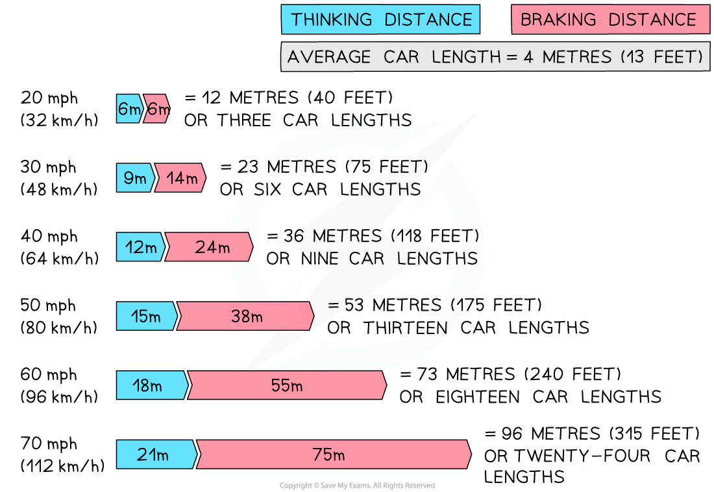

# Stopping Distance

## Stopping distance

> **Spec point** — `spcpt_34kP5TpCGC3yg2zR` · know that the stopping distance of a vehicle is made up of the sum of the thinking distance and the braking distance 

## Stopping distance

- The **stopping distance** of a car is defined as: **The stopping distance of a car is the total distance travelled during the time it takes to stop in an emergency**
- The stopping distance is the sum of the distance travelled as the driver makes the decision to stop plus the distance travelled as the driver applies the brakes

### Stopping distance formula

- The stopping distance is calculated using the following formula:

**Stopping distance = Thinking distance + Braking distance**

### Thinking distance

- **Thinking distance** is defined as **Thinking distance is the distance travelled in the time it takes the driver to react to an emergency and prepare to stop**
- The **main factors** affecting thinking distance are:

  - The **speed **of the car
  - The **reaction time** of the driver
- The **reaction time** is defined as: **A measure of how much time passes between seeing something and reacting to it**
- The average reaction time of a human is 0.25 s
- Reaction time is increased by:

  - **Tiredness**
  - **Distractions** (e.g. using a mobile phone)
  - **Intoxication** (i.e. consumption of **alcohol** or **drugs**)

### Braking distance

- **Braking distance** is defined as **the distance travelled under the braking force in metres (m)**
- For a given braking force, the **greater the speed** of the vehicle, the **greater the stopping distance**

### Calculating stopping distance

- For a given braking force, the **speed** of a vehicle determines the size of the **stopping distance**
- The **greater** **the** **speed** of the vehicle, the **larger the stopping distance**

#### The Effect of speed on stopping distance

***A vehicle's stopping distance increases with speed. At a speed of 20 mph the stopping distance is 12 m, whereas at 60 mph the stopping distance is 73 m (reproduced from the UK Highway Code) ***

#### A Table Showing Speed and Stopping Distance

| **Speed (mph)** | **Speed (m/s)** | **Stopping Distances (m)** |
|---|---|---|
| 20 | 9 | 12 |
| 30 | 14 | 23 |
| 40 | 18 | 36 |
| 50 | 22 | 53 |
| 60 | 27 | 73 |

> **Worked Example**
> At a speed of 20 m/s, a particular vehicle had a stopping distance of 40 metres. The car travelled 14 metres whilst the driver was reacting to the incident in front of him.
> 
> What was the braking distance?
> 
> **A      **54 m
> 
> **B      **34 m
> 
> **C      **26 m
> 
> **D      **6 m
> 
> **ANSWER:  C**
> 
> **Step 1: Identify the different variables**
> 
> - Stopping distance = 40 m
> - Thinking distance = 14 m
> 
> **Step 2: Rearrange the formula for stopping distance**
> 
> Stopping distance = Thinking distance + Braking distance
> 
> Braking distance = Stopping distance – Thinking distance
> 
> **Step 3: Calculate and identify the correct braking distance**
> 
> Braking distance = 40 – 14
> 
> Braking distance = 26 metres
> 
> - Therefore, the answer is **C**

## Factors affecting stopping distance

> **Spec point** — `spcpt_NsK96QdrXB62zMM3` · describe the factors affecting vehicle stopping distance, including speed, mass, road condition and reaction time 

## Factors affecting stopping distance

- There are various factors which can affect a vehicle's stopping distance

  - **Vehicle speed**
  
    - The greater the speed, the greater the vehicle's braking distance will be
    - This is because the brakes will need to do more work to bring the vehicle to a stop
  - **Vehicle mass**
  
    - The more massive the vehicle, the more distance it will travel as it comes to a stop
  - **Road conditions**
  
    - Wet or icy roads make the brakes less effective and the vehicle travels further as it comes to a stop
  - **Driver reaction time**
  
    - Thinking distance is increased if the driver is distracted, for example by a phone, satnav, radio or a person
    - Thinking distance is increased if the driver is tired, on certain types of medication, or is under the influence of alcohol or drugs
