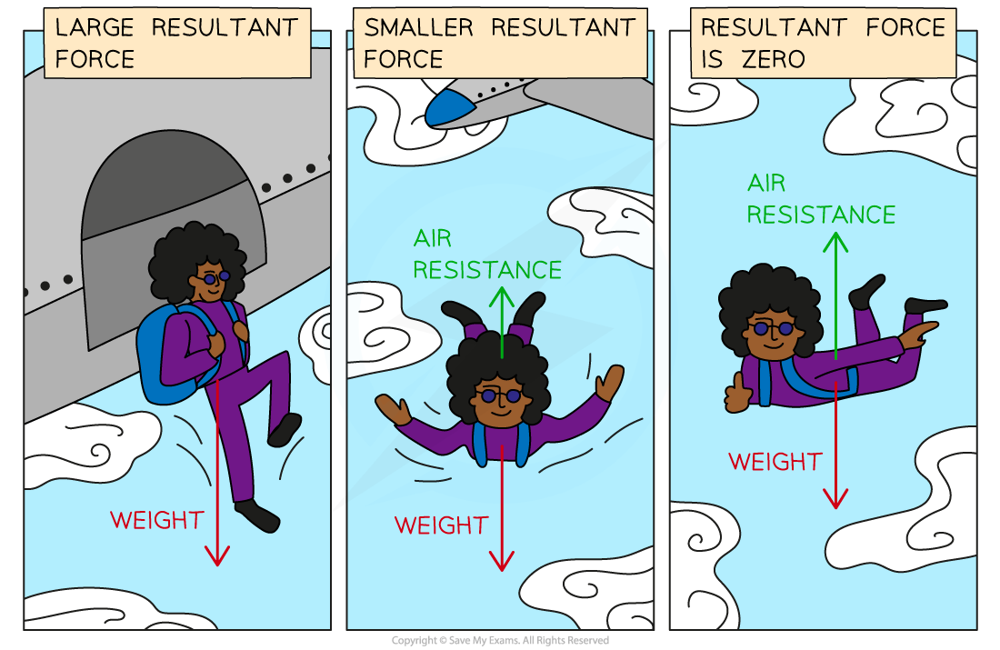

# Terminal Velocity

## Terminal velocity

> **Spec point** — `spcpt_dKVTvhy5Btj5GP83` · describe the forces acting on falling objects (and explain why falling objects reach a terminal velocity) 

## Terminal velocity

- **Terminal velocity** is the fastest speed that an object can reach when falling
- Terminal velocity is reached when the upward and downward acting **forces **are **balanced**

  - The **resultant force **on the object reaches **zero**
  - The object no longer accelerates and a **constant **terminal **velocity **is reached

### Falling objects

- Falling objects experience **two forces**:

  - **Weight**
  - **Air resistance **

- The force of air resistance **increases **as the object's **speed **increases
- This is because the object collides with air particles as it moves through the air

  - The faster the object is travelling, the more collisions it has with the air particles
- The weight of the object does not change
- This is because $W=mg$

  - The mass, $m$, of the object does not change
  - The acceleration of freefall, $g$, does not change

### Reaching terminal velocity

#### Skydiver in freefall reaching terminal velocity

***The skydiver initially accelerates downward due to the force of weight. The upward force of air resistance increases as they fall until eventually it equals the weight force and terminal velocity is reached***

*** ***

- At the **instant **the skydiver steps out of the plane, the support force of the plane is no longer acting on the skydiver, but they are not yet falling, so the only force exerted them is the **weight **force

  - There is a downward acting **resultant force **on the skydiver
  - The resultant force is equal to the weight force
  - The skydiver accelerates downward at **maximum acceleration**

- As the skydiver begins to **fall**, the force of air resistance is very **small **because the skydiver's speed is small

  - There is a downward acting **resultant force** on the skydiver
  - The resultant force is equal to the weight force **minus **the force of air resistance
  - The skydiver accelerates downward but the **acceleration decreases**

- As the skydiver **accelerates**, their speed increases, so the force of **air resistance increases**

  - There is a downward acting **resultant force** on the skydiver
  - The resultant force is equal to the weight force minus the force of air resistance
  - The skydiver accelerates downward but the **acceleration continues to decrease**

- As the skydiver's **acceleration decreases**, their speed increases at a slower and slower rate

  - Eventually, the skydiver reaches a speed at which the force of air resistance is **equal **to the force of weight
  - The forces are **balanced**, so the **resultant force is zero**
  - The skydiver no longer accelerates and a **constant velocity** is reached
  
    - This is **terminal velocity**

> **Worked Example**
> A small object falls out of an aircraft. Choose words from the list to complete the sentences below:
> 
> **Friction       Gravity       Air pressure**
> 
> **Accelerates       Falls at a steady speed       Slows down**
> 
> (a) The weight of an object is the force of __________ which acts on it.
> 
> (b) When something falls, initially it ____________.
> 
> (c) The faster it falls, the larger the force of ______________ which acts on it.
> 
> (d) Eventually it ______________ when the force of friction equals the force of gravity acting on it.
> 
> **Answer:**
> 
> **Part (a)**
> 
> - The weight of an object is the force of **gravity** which acts on it.
> 
>   - The weight force is due to the Earth's gravitational pull on the object, so weight is due to gravity
> 
> **Part (b)**
> 
> - When something falls, initially it **accelerates.**
> - The **resultant force** on the object is **very large** initially, so it accelerates
> - This is because there is a **large unbalanced force** downwards (its weight) - the upward force of air resistance is very small to begin with
> 
> **Part (c)**
> 
> - The faster it falls, the larger the force of **friction** which acts on it.
> - The force of **air resistance** is due to **friction** between the object's motion and **collisions with air particles**
> - Air particles try to slow the object down, so air itself produces a **frictional force**, called air resistance (sometimes called **drag**)
> 
> **Part (d)**
> 
> - Eventually it **falls at a steady speed** when the force of friction equals the force of gravity acting on it.
> - When the upwards **air resistance** grows enough to **balance** the downwards **weight** force, the resultant force on the object is **zero**
> - This means the object isn't accelerating - rather, it is moving at a **steady** (terminal) **speed**

> **Exam Hint**
> The force of gravity on an object is called its **weight**. If you are asked to name this force, use this word: don't call it 'gravity', as this term could also mean gravitational field strength, and so might be marked wrong. Additionally, remember to identify **air resistance** as the upward force on a falling object. This force **gets larger** as the object speeds up, but the weight of the object stays constant. Don't confuse 'air resistance' with 'air pressure' as these are two different concepts!
