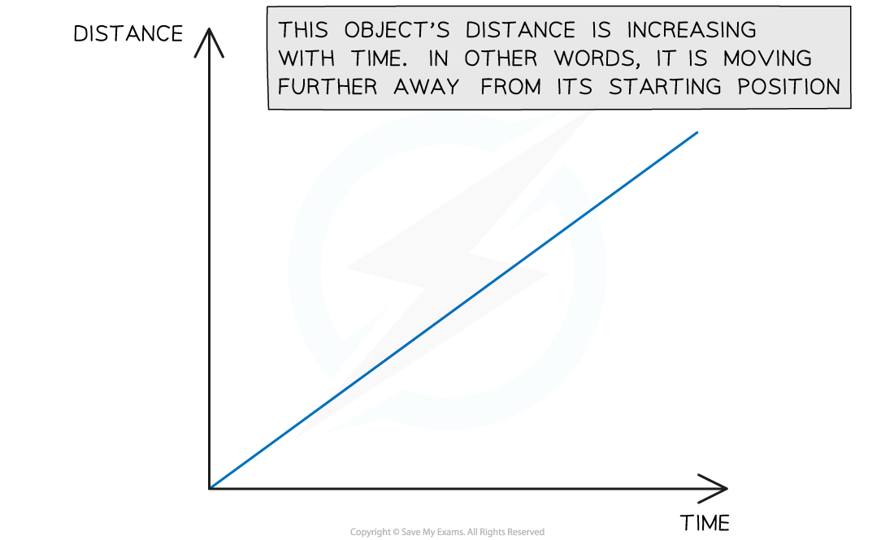
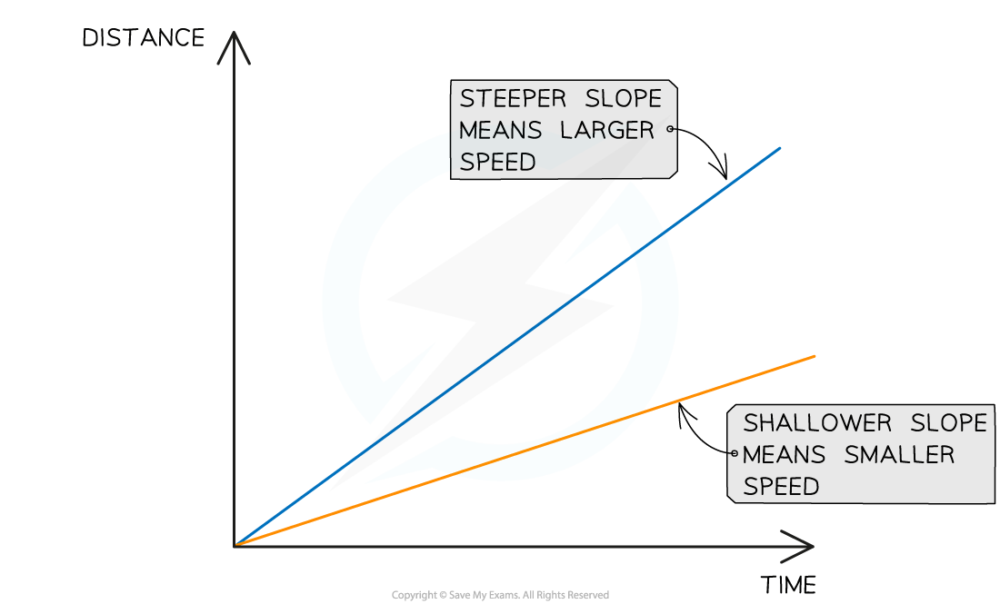
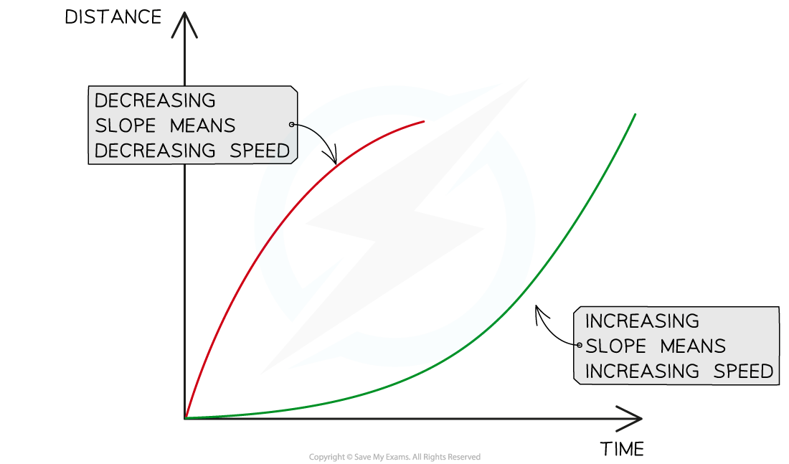
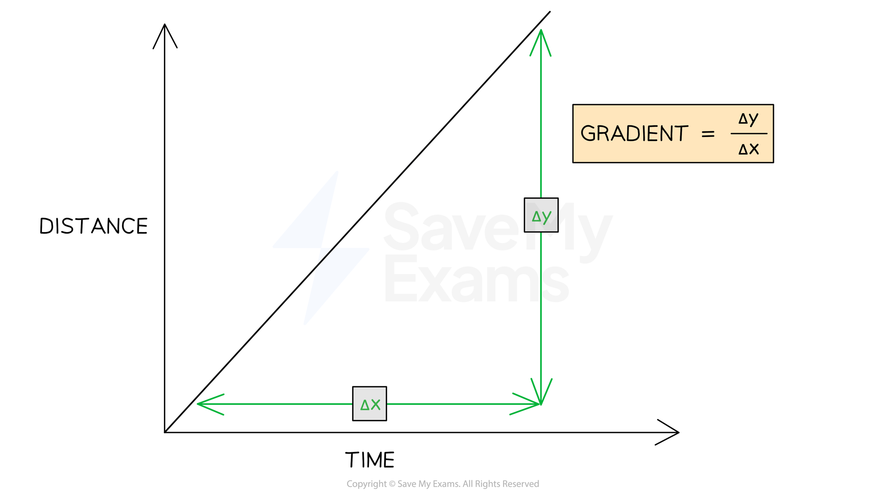

# Distance-Time Graphs

## Distance-time graphs

> **Spec point** — `spcpt_wQCqdR25rtn99cf8` · plot and explain distance−time graphs

## Distance-time graphs

- A distance-time graph shows how the **distance** of an object moving in a straight line (from a starting position) varies over time:

***This graph shows a moving object moving further away from its origin***

### Constant speed on a distance-time graph

- Distance-time graphs also show the following information:

  - Whether the object is moving at a **constant speed**
  - How **large** or **small** the speed is

- A **straight line** represents **constant speed**
- The slope of the straight line represents the **magnitude** of the speed:

  - A very **steep** slope means the object is moving at a **large** speed
  - A **shallow** slope means the object is moving at a **small** speed
  - A **flat**, **horizontal** **line** means the object is **stationary** (not moving)

***This graph shows how the slope of a line is used to interpret the speed of moving objects. Both of these objects are moving with a constant speed, because the lines are straight.***

> **Exam Hint**
> The Edexcel IGCSE Physics specification states that you need to be able to explain distance-time graphs and to be able to plot them.
> 
> Plotting graphs is an important skill in physics and usually comes up in at least one exam paper. If you are not confident in plotting graphs, you should definitely practice before your exam!

### Changing speed on a distance-time graph

- Objects might be moving at a **changing speed**

  - This is represented by a **curve**
- In this case, the slope of the line will be changing

  - If the slope is **increasing**, the **speed** is **increasing** (accelerating)
  - If the slope is **decreasing**, the **speed** is **decreasing** (decelerating)
- The image below shows two different objects moving with changing speeds

***Changing speeds are represented by changing slopes. The red line represents an object slowing down and the green line represents an object speeding up.***

### Calculating speed from a distance-time graph

- The **speed** of a moving object can be calculated from the **gradient** of the line on a **distance-time** graph:

$\mathrm{speed}=\mathrm{gradient}=\frac{\Deltay}{\Deltax}$

***The speed of an object can be found by calculating the gradient of a distance-time graph***

- $\Deltay$ is the **change** in y (distance) values
- $\Deltax$ is the **change** in x (time) values

> **Worked Example**
> A distance-time graph is drawn below for part of a train journey. The train is travelling at a constant speed.
> 
> 
> 
> Calculate the speed of the train.
> 
> **Answer:**
> 
> **Step 1: Draw a large gradient triangle on the graph **
> 
> - The image below shows a large **gradient triangle** drawn with dashed lines
> - $\Deltay$ and $\Deltax$ are labelled, using the **units** as stated on each axes
> 
> 
> 
> **Step 2: Convert units for distance and time into standard units**
> 
> - The distance travelled  = 8 km = **8000 m**
> - The time taken  = 6 mins = **360 s**
> 
> **Step 3: State that speed is equal to the gradient of a distance-time graph**
> 
> - The **gradient** of a **distance-time** graph is equal to the **speed** of a moving object:
> 
> $\mathrm{speed}=\mathrm{gradient}=\frac{\Deltay}{\Deltax}$
> 
> **Step 4: Substitute values in to calculate the speed**
> 
> $\mathrm{speed}=\frac{8000}{360}$
> 
> $\mathrm{speed}=22.2m/s$

> **Worked Example**
> A student decides to take a stroll to the park. They find a bench in a quiet spot and take a seat, picking up where they left off reading a book on Black Holes. After some time reading, the student realises they lost track of time and runs home.
> 
> A distance-time graph for for the student's trip is drawn below:
> 
> 
> 
> a) How long does the student spend reading the book?
> 
> b) Which section of the graph represents the student running home?
> 
> c) What is the total distance travelled by the student?
> 
> **Answer:**
> 
> **Part (a)**
> 
> - The student spends **40 minutes** reading the book
> - The **flat** section of the line (section B) represents an object which is **stationary** - so section B represents the student sitting on the bench reading
> - This section lasts for **40 minutes** - as shown in the graph below
> 
> 
> 
> **Part (b)**
> 
> - **Section C** represents the student running home
> - The **slope** of the line in section C is **steeper** than the slope in section A
> - This means the student was moving with a **larger** speed (running) in section C
> 
> **Part (c)**
> 
> - The total distance travelled by the student is **0.6 km**
> - The total **distance** travelled by an object is given by the final point on the line - in this case, the line ends at **0.6 km** on the **distance** axis. This is shown in the image below:
> 
> 

> **Exam Hint**
> Use the **entire line**, where possible, to calculate the gradient. Examiners tend to award credit if they see a **large gradient triangle** used - so remember to draw these directly on the graph itself!
> 
> Remember to check the **units** of variables measured on each axis. These may not always be in standard units - in our example, the unit of distance was **km** and the unit of time was **minutes**. Double-check which units to use in your answer.
