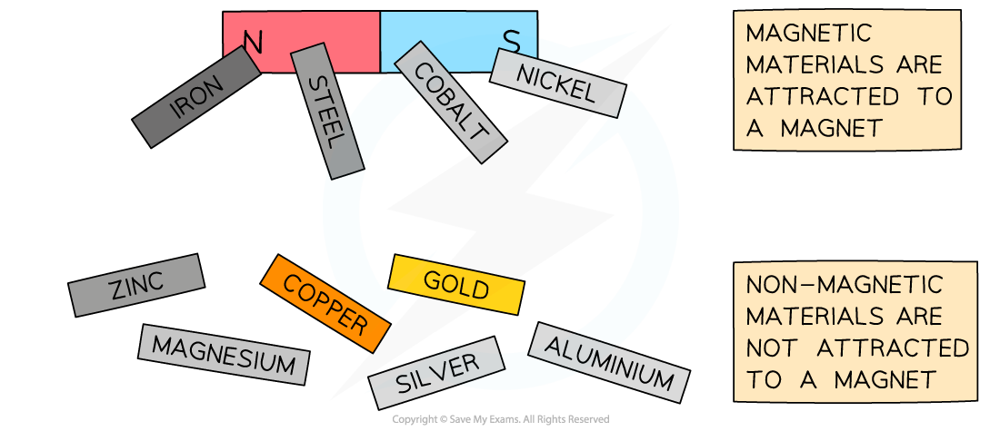
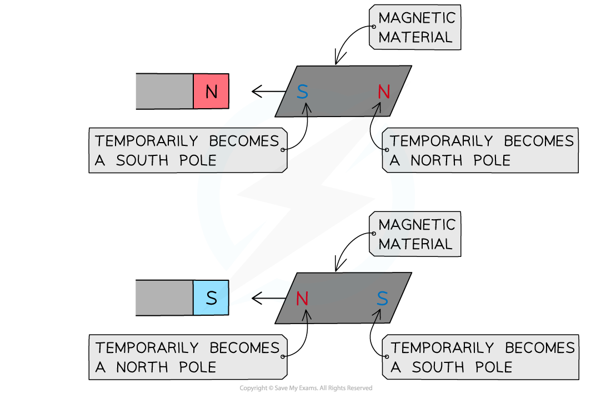

# Permanent & Induced Magnets

## Permanent & induced magnets

> **Spec point** — `spcpt_xHZXH4TND5hXMcnB` · know that magnetism is induced in some materials when they are placed in a magnetic field 

## Permanent & induced magnets

### Magnetic materials

***Magnetic materials are attracted to a magnet; non-magnetic materials are not***

- Magnetic materials are materials which are attracted by magnets

  - Being a magnetic material does **not** mean the material is itself a magnet
- Very few metals in the periodic table are magnetic, these include:

  - Iron
  - Cobalt
  - Nickel
- **Steel **is an alloy which **contains iron**, so it is also magnetic
- Magnetic materials will always be **attracted** to the magnet, regardless of which pole is held close to it

***Magnetic materials attracted to either pole of a magnet***

- To test whether a material is a magnet it should be brought close to a known magnet

  - If it can be **repelled** by the known magnet then the material itself is a magnet
  - If it can only be **attracted** and **not repelled** then it is a magnetic material

- There are two types of magnets

  - Permanent magnets
  - Induced magnets

### Permanent magnets

- Permanent magnets are made out of permanent magnetic materials, for example steel
- A permanent magnet will **produce its own magnetic field**

  - It will not lose its magnetism

### Induced magnets

- When a magnetic material is placed in a magnetic field, the material can temporarily be turned into a magnet.

  - This is called **induced magnetism**
- When magnetism is induced in a material:

  - One end of the material will become a north pole
  - The other end will become a south pole
- Magnetic materials will always be **attracted** to a permanent magnet

  - This means that the end of the material closest to the magnet will have the **opposite** pole to magnets pole closest to the material

***Inducing magnetism in a magnetic material***

- When the magnetic material is removed from the magnetic field it will lose most/all of its magnetism quickly

> **Worked Example**
> The diagram below shows a magnet held close to a piece of metal that is suspended by a light cotton thread. The piece of metal is attracted towards the magnet.
> 
> 
> 
> Which of the following rows in the table gives the correct type of pole at X and the correct material of the suspended piece of metal?
> 
> | ** ** | **Type of pole at X** | **Material of suspended metal** |
> |---|---|---|
> | A | North | Nickel |
> | B | South | Nickel |
> | C | North | Aluminium |
> | D | South | Aluminium |
> 
> **Answer: A**
> 
> - X must be a north pole
> 
>   - The piece of metal is being attracted towards the magnet
>   - The law of magnetism states that opposite poles attract
> - The material of the suspended piece of metal is nickel
> 
>   - Nickel is a magnetic material (It will experience a force when it is placed in a magnetic field, in this case it is attracted towards the magnet)
> 
> - **B** is incorrect because X cannot also be a south pole (and hence is a north pole)
> 
>   - If the pole at X was a south pole then the piece of metal would be repelled from the magnet because the law of magnetism states that like poles repel
> 
> - **C** and **D** are incorrect because aluminium is not a magnetic material
> 
>   - A non-magnetic material would be unaffected by the magnetic field produced by the magnet.
