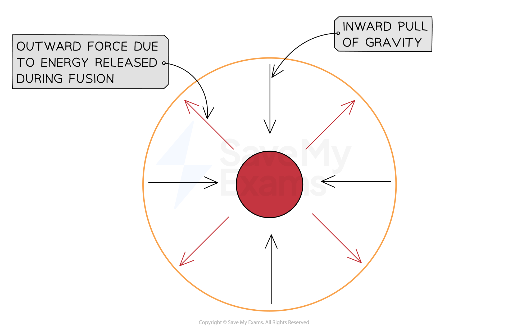

# The Conditions for Fusion

## Fusion in stars

> **Spec point** — `spcpt_B6vd4z88phjpx7r8` · know that fusion is the energy source for stars 

## Fusion reactions in stars

- Stars are huge balls of (mostly) **hydrogen** gas
- In the centre of a star, hydrogen nuclei undergo **nuclear fusion** to form helium nuclei
- An equation for a possible fusion reaction is:

`straight H presubscript 1 presuperscript 2 space plus space straight H presubscript 1 presuperscript 3 space rightwards arrow space He presubscript 2 presuperscript 4 space plus space straight n presubscript 0 presuperscript 1`

- Where `H presubscript 1 presuperscript 2` (deuterium) and `straight H presubscript 1 presuperscript 3` (tritium) are both isotopes of hydrogen

  - These are formed through other fusion reactions in the star

- Fusion reactions release a **huge** amount of energy
- The heat from fusion provides a pressure that prevents the star from collapsing under its own gravity

#### Forces acting on a stable star

***The outward and inward forces within a star are in equilibrium. The central red circle represents the star's core, and the orange circle represents the star's outer layers***

- In larger stars where the temperature gets hot enough, helium nuclei can fuse into heavier elements

> **Exam Hint**
> It is useful to remember that hydrogen is the fuel within stars, but the details of the reaction between deuterium and tritium are not required at this level.

## The conditions for fusion

> **Spec point** — `spcpt_bwSTq5GWHYz5YFP2` · explain why nuclear fusion does not happen at low temperatures and pressures, due to electrostatic repulsion of protons 

## Conditions for nuclear fusion

- Nuclear fusion can only occur when two nuclei get extremely close together
- The two conditions required for nuclear fusion are:

  - extremely **high temperatures**
  - extremely **high pressures**
- These conditions are required because of the **electrostatic repulsion **between protons

  - Since protons are **positively charged**, they repel each other
  - To overcome this repulsion and allow the protons to get close enough to fuse, they must be moving **very fast** — this means they need very **high kinetic energy**

#### Electrostatic repulsion between protons

***Hydrogen nuclei are positively charged protons which repel one another, making it difficult to achieve fusion under normal conditions***

- For hydrogen nuclei (protons) to travel fast enough to fuse, the gas has to be heated to **millions of degrees**

  - Such high temperatures are usually only achievable in the cores of stars
  - The **higher **the **temperature**, the **faster **the nuclei move, and the **more energy** they have to overcome electrostatic repulsion, and the **closer **together they can get
- In regular conditions, such as on Earth, where temperatures and pressures are **low**, the possibility of collisions between nuclei which result in fusion is significantly lower

  - To increase the number of collisions (and hence fusion reactions) that occur between nuclei, high **densities** (and hence **pressures**) are also needed
  - The **higher **the **pressure**, the **smaller **the space the nuclei are forced into, so the **more likely** they are to collide

> **Worked Example**
> An example of a hydrogen fusion reaction which takes place in stars is shown here.
> 
> `straight H presubscript 1 presuperscript 2 space plus space straight H presubscript 1 presuperscript 1 space rightwards arrow space He presubscript 2 presuperscript 3`
> 
> Which of the following is a valid reason as to why hydrogen fusion is not currently possible on Earth?
> 
> **A.   **Hydrogen fusion produces dangerous radioactive waste
> 
> **B.   **Hydrogen nuclei require very high temperature to fuse together
> 
> **C.   **Hydrogen is a rare element that would be difficult to get large amounts of
> 
> **D.   **Hydrogen fusion does not produce enough energy to be commercially viable
> 
> **ANSWER:   B**
> 
> - Hydrogen nuclei have **positive charges**
> - So two hydrogen nuclei would have a **repulsive force** between them
> - High temperatures are required to give the nuclei enough energy to overcome the repulsive force
> 
> - The answer is **not A** because the product of the hydrogen fusion shown in the reaction is helium
> 
>   - Helium is an inert gas, it is not dangerous or radioactive
> 
> - The answer is **not C** because hydrogen is a very abundant element
> 
>   - It is the most common element in the universe
> 
> - The answer is **not D** because hydrogen fusion would produce a huge amount of energy
