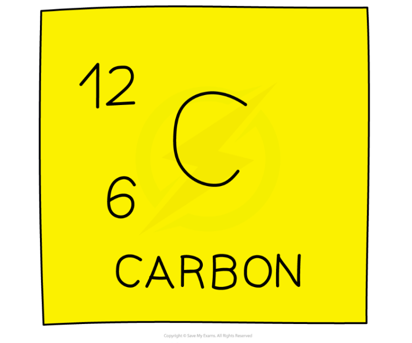
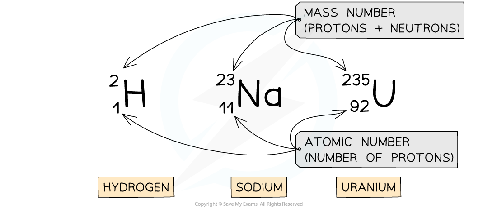

# Atomic Structure

## Atomic structure

> **Spec point** — `spcpt_nKBkn8NNrDzn87qy` · describe the structure of an atom in terms of protons, neutrons and electrons and use symbols such as 14/6  c to describe particular nuclei

## Atomic structure

- Atoms are the building blocks of** all matter**
- They are incredibly small, with a radius of only 1 × 10-10 m

  - This means that about one hundred million atoms could fit side by side across your thumbnail

- Atoms have a tiny, dense **nucleus** at their centre, with **electrons** orbiting around the nucleus
- The radius of the nucleus is over 10,000 times smaller than the whole atom, but it contains almost **all of the mass** of the atom

#### Atomic structure of lithium

***Diagram showing the structure of a Lithium atom. If drawn to scale then the electrons would be around 100 metres away from the nucleus!***

### Particles in the atom

- The nucleus contains:

  - **Protons** - positively charged particles with a relative atomic mass of one unit
  - **Neutrons** – no charge, and also with a relative atomic mass of one unit

- Almost all of the atom is empty space, but moving around the nucleus there are:

  - **Electrons** – negative charge with almost no mass (1/2000 the mass of a proton or neutron)

- The properties of each of the particles are shown in the table below:

#### Table of particle properties

| **Particle** | **Location** | **Relative charge** | **Relative mass** |
|---|---|---|---|
| proton | in the nucleus | +1 | 1 |
| neutron | in the nucleus | 0 | 1 |
| electron | orbiting the nucleus | −1 | 1/2000 (negligible) |

### 

### Charge in the atom

- Although atoms contain particles of different charge, the **total charge** within an atom is **zero**

  - This is because the number of **electrons** is **equal** to the number of **protons**
- The following table sets out the calculation of the total charge in the lithium atom in the diagram above:

#### Calculating total charge table

| **Particle** | **Relative charge** | **Number of particles in lithium atom** | **number × relative charge** | **Total charge** |
|---|---|---|---|---|
| proton | +1 | 3 | +3 | (+3) + 0 + (−3) = 0 |
| neutron | 0 | 4 | 0 |   |
| electron | −1 | 3 | −3 |   |

- If an atom loses electrons, then it is said to be **ionised**
- Symbols are used to describe particular nuclear by their element symbol, atomic number and mass number

  - This notation is called **nuclear notation**

**Carbon 12 in nuclear notation**

> **Worked Example**
> A nucleus of carbon-12 is shown below.
> 
> 
> 
> How many electrons are there in an atom of carbon-12?
> 
> **Answer:**
> 
> **Step 1: Count the number of protons in the carbon nucleus**
> 
> - There are 6 protons in the carbon atom
> 
> **Step 2: Determine the number of electrons**
> 
> - Remember, the number of electrons in an atom is **equal** to the number of protons
> - Therefore there must be **6** electrons in the carbon atom

> **Exam Hint**
> You may have noticed that the number of electrons is not part of the mass number. This is because electrons have a **tiny** mass compared to neutrons and protons. We say their mass is negligible when compared to the particles in the nucleus.

## Atomic & mass number

> **Spec point** — `spcpt_CjCqMDHpBh5ZG6Jg` · know the terms atomic (proton) number, mass (nucleon) number

## Atomic & mass number

### Atomic number

- The number of protons in an atom is called its **atomic number** (it can also be called the **proton** **number**)

  - Elements in the periodic table are ordered by their atomic number
  - Therefore, the number of protons determines which element an atom is

- The atomic number of a particular element is always the same
- For example:

  - Hydrogen has an atomic number of 1. It always has just one proton
  - Sodium has an atomic number of 11. It has 11 protons
  - Uranium has an atomic number of 92. It has 92 protons

- The atomic number is also equal to the number of electrons in an atom

  - This is because atoms have the same number of electrons and protons in order to have no overall charge

### Mass number

- The total number of particles in the nucleus of an atom is called its **mass number **(it can also be called the **nucleon number**)
- The mass number is the number of protons **and** neutrons in the atom
- The number of neutrons can be found by **subtracting** the **atomic** number from the **mass** number

**number of neutrons = mass number – atomic number**

- For example, if a sodium atom has a mass number of 23 and an atomic number of 11, then the number of neutrons would be 23 – 11 = 12

### Nuclear notation

- The mass number and atomic number of an atom are shown by writing them with the atomic symbol

  - This is called **nuclear notation**

- Here are three examples:

***Examples of nuclear notation for atoms of Hydrogen, Sodium and Uranium***

- The top number is the **mass number**

  - This is equal to the total number of particles (protons and neutrons) in the nucleus

- The lower number is the **atomic number**

  - This is equal to the total number of protons in the nucleus
- The atomic and mass number of each type of atom in the examples above is shown in this table:

#### Number of protons, neutrons & electrons table

| **Atom** | **Number of protons** **(atomic number)** | **Number of neutrons** **(mass number − atomic number)** | **Number of electrons** **(same as atomic number)** |
|---|---|---|---|
| hydrogen | 1 | 1 | 1 |
| sodium | 11 | 12 | 11 |
| uranium | 92 | 143 | 92 |

> **Worked Example**
> The element symbol for gold is `Au presubscript 79 presuperscript 197`.
> 
> How many protons, neutrons and electrons are in an atom of gold?
> 
> |   | **number of protons** | **number of neutrons** | **number of electrons** |
> |---|---|---|---|
> | **A.** | 79 | 79 | 79 |
> | **B.** | 197 | 79 | 118 |
> | **C.** | 118 | 118 | 79 |
> | **D.** | 79 | 118 | 79 |
> 
> **ANSWER:  D**
> 
> **Step 1: Determine the atomic and mass number**
> 
> - The gold atom has an atomic number of 79 (lower number) and a mass number of 197 (top number)
> 
> **Step 2: Determine the number of protons**
> 
> - The **atomic** number is equal to the number of **protons**
> - An atom of gold has 79 protons
> 
> **Step 3: Calculate the number of neutrons**
> 
> - The mass number is equal to the number of protons and neutrons
> - The number of neutrons is equal to the mass number minus the atomic number
> 
> number of neutrons = 197 − 79 = 118
> 
> - An atom of gold has 118 neutrons
> 
> **Step 4: Determine the number of electrons**
> 
> - An atom has the **same** number of **protons and electrons**
> - An atom of gold has 79 electrons
