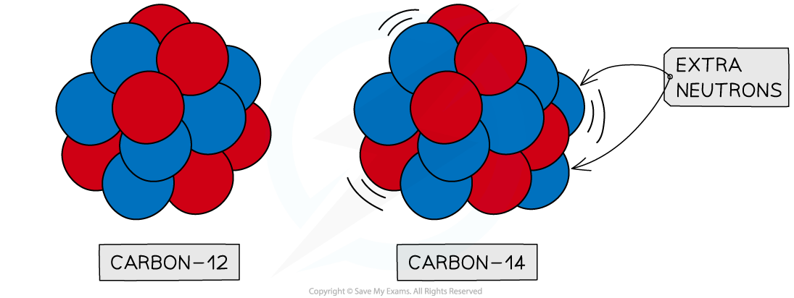
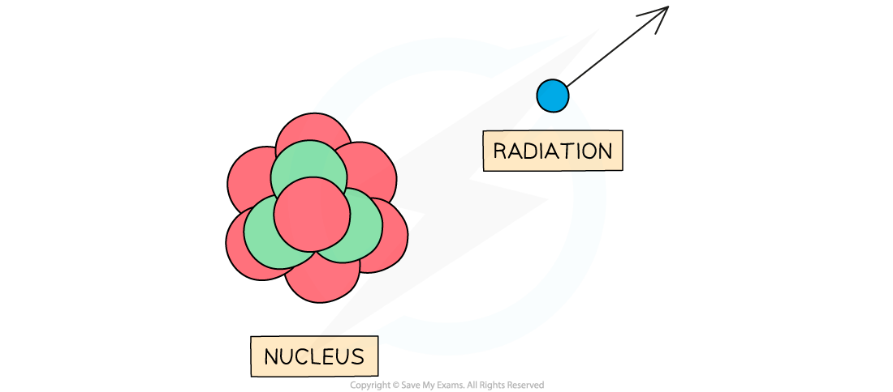
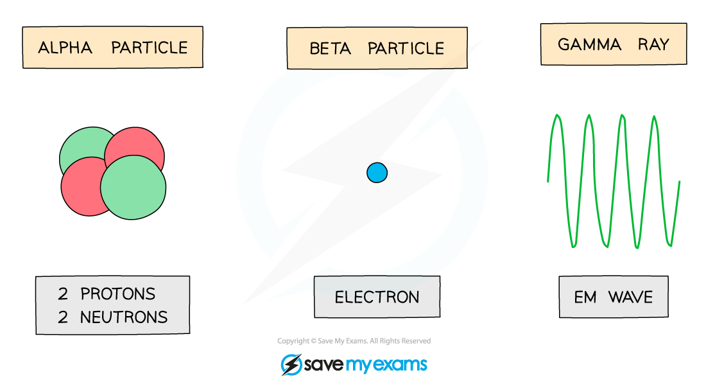
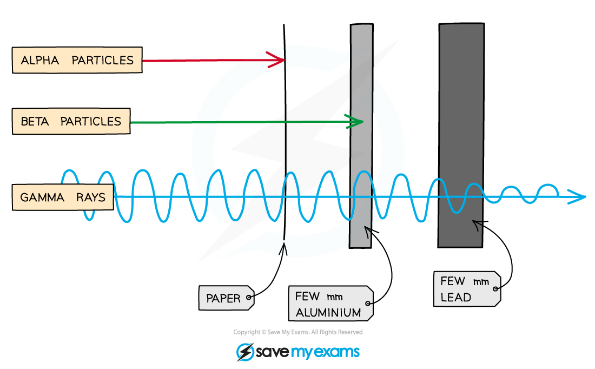

# Types of Radiation

## Types of radiation

> **Spec point** — `spcpt_wqtG5CMpKdHSz3yZ` · know that alpha (α) particles, beta (β−) particles, and gamma (γ) rays are ionising radiations emitted from unstable nuclei in a random process 

## Types of radiation

- Some atomic nuclei are **unstable **and **radioactive**
- This is because of an imbalance of protons or neutrons in the nucleus
- Carbon-14 is an example of an ***isotope*** of carbon which is **unstable**
- This is because it has two extra neutrons compared to a stable nucleus of carbon-12

#### Stable and unstable isotopes of carbon

***Carbon-12 is stable, whereas carbon-14 is unstable because it has two extra neutrons***

- Unstable nuclei can **emit** **radiation** to become more stable
- Radiation can be in the form of a high-energy particle or wave
- This process is known as **radioactive decay**

- As the radiation moves away from the nucleus, it takes some energy with it
- This makes the nucleus more **stable**

#### Radioactive decay of a nucleus

***Unstable nuclei decay by emitting high energy particles or waves***

- When an unstable nucleus decays, it emits **radiation**
- The different types of radiation that can be emitted are:

  - **Alpha (α) **particles
  - **Beta (β****-****) **particles
  - **Gamma (γ) **radiation

- These changes are** *****spontaneous***** **and **random**

> **Worked Example**
> Which of the following statements is **not** true?
> 
> **A**    Isotopes can be unstable because they have too many or too few neutrons
> 
> **B**    The process of emitting particles or waves of energy from an unstable nucleus is called radioactive decay
> 
> **C**    Scientists can predict when a nucleus will decay
> 
> **D**    Radiation refers to the particles or waves emitted from a decaying nucleus
> 
> **ANSWER:  C**
> 
> - Answer A is **true.** The number of neutrons in a nucleus determines the stability
> - Answer B is **true.** This is a suitable description of radioactive decay
> - Answer D is **true.** Radiation is about emissions. It is different to radioactive particles
> - Answer C is **not true**
> - Radioactive decay is a random process
> - It is not possible to predict precisely when a particular nucleus will decay

> **Exam Hint**
> The terms **unstable**, **random** and **decay** have very particular meanings in this topic. Remember to use them correctly when answering questions!

## Properties of radiation

> **Spec point** — `spcpt_ck6TWjj56YJgS8bB` · describe the nature of alpha (α) particles, beta (β−) particles, and gamma (γ) rays, and recall that they may be distinguished in terms of penetrating power and ability to ionise 

## Properties of alpha, beta and gamma radiation

### Alpha particles

- The symbol for alpha is **α**
- An alpha particle is the same as a helium nucleus
- This is because it consists of two neutrons and two protons

### Beta particles

- The symbol for beta is **β****−**
- Beta particles are high-energy electrons
- They are produced in nuclei when a neutron changes into a proton and an electron

### Gamma rays

- The symbol for gamma is **γ**
- Gamma rays are electromagnetic waves
- They have the highest energy of the different types of electromagnetic waves

#### Alpha, beta & gamma radiation

***Alpha particles, beta particles and gamma waves can be emitted from unstable nuclei***

### Properties of alpha, beta & gamma

- Alpha (α), beta (β) and gamma (γ) radiation can be identified by their:

  - **Nature** (what type of particle or radiation they are)
  - **Ionising ability** (how easily they ***ionise*** other atoms)
  - **Penetrating power** (how far can they travel before they are stopped completely)

- Alpha, beta and gamma **penetrate** materials in different ways
- This means they are stopped, or reduced, by different materials

#### Penetrating power of alpha, beta and gamma

***Alpha, beta and gamma are different in how they penetrate materials. Alpha is the least penetrating, and gamma is the most penetrating***

- Alpha is stopped by **paper**, whereas beta and gamma pass through it
- Beta is stopped by a few millimetres of aluminium
- Gamma rays can pass through **aluminium **but are** **only partially stopped by thick **lead**

#### Summary of the properties of nuclear radiation

| **Particle** | **Nature** | **Range in air** | **Penetrating power** | **Ionising ability** |
|---|---|---|---|---|
| Alpha (α) | helium nucleus (2 protons, 2 neutrons) | a few cm | low; stopped by a thin sheet of paper | high |
| Beta (β) | high-energy electron | a few 10s of cm | moderate; stopped by a few mm of aluminium foil or Perspex | moderate |
| Gamma (γ) | electromagnetic wave | infinite | high; reduced by a few cm of lead | low |

> **Worked Example**
> A student has an unknown radioactive source. They are trying to work out which type of ionising radiation is being emitted.
> 
> They measure the count rate, using a Geiger-Muller tube, when the source is placed behind different materials. Their results are recorded in a table.
> 
> |   | **no material between source and detector** | **thin sheet of paper between source and detector** | **5 mm aluminium foil between source and detector** | **5mm lead plate between source and detector** |
> |---|---|---|---|---|
> | **Count-rate** | 4320 | 4318 | 256 | 244 |
> 
> Which type(s) of ionising radiation is/are emitted by the source?
> 
> **A**    Alpha particles
> 
> **B**    Beta particles
> 
> **C**    Gamma rays
> 
> **D**    Alpha, beta and gamma radiation
> 
> **ANSWER:  B**
> 
> - The answer is **not A or D** because the radiation passed through the paper almost unchanged
> 
>   - This means it is **not** alpha as alpha is stopped by a thin sheet of paper
>   - It is usual to find some variance between readings, you need to look for a significant change
> 
> - The answer is **not C** because the lead plate did not decrease the count rate significantly
> 
> - It was the aluminium that decreased the count rate significantly
> 
>   - Beta particles are blocked by a few mm of aluminium, therefore  the source must be **beta** particles

> **Exam Hint**
> Students often get confused about whether** beta particles** can pass though **aluminium foil**. Beta particles **can be stopped** by aluminium foil if it is thick enough (**a few mm** thick); if the foil is thin enough, they can pass through. This is the basis of using beta radiation to measure the thickness of aluminium foil (a common exam question!). The thicker the foil, the fewer beta particles pass through and are measured by a detector on the other side of the foil.
