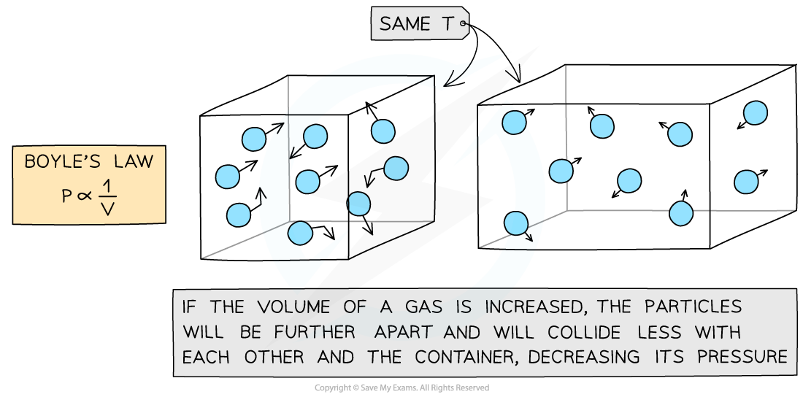
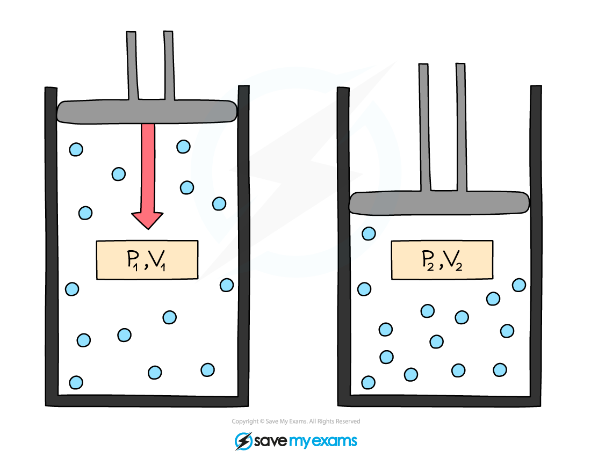

# Boyle's Law

## Boyle's law

> **Spec point** — `spcpt_rzHKy6jNMWnHyXMS` · use the relationship between the pressure and volume of a fixed mass of gas at constant temperature: 
p1 V1 = p2 V2

## Boyle's law

- For a fixed mass of a gas held at a constant temperature, the Boyle's law formula is:

***pV***** = constant**

- Where:

  - *p* = pressure in pascals (Pa)
  - *V* = volume in metres cubed (m3)

- This means that the pressure and volume are** inversely proportional **to each other

  - When the volume **decreases** (compression), the pressure **increases**
  - When the volume **increases** (expansion), the pressure **decreases**

- This is because when the volume decreases, the same number of particles collide with the walls of a container but** more frequently** as there is **less space**

  - However, the particles still collide with the same amount of **force **meaning greater force per unit area (pressure)
- The key assumption is that the **temperature** and the **mass** (and number) of the particles remains the same

***Increasing the volume of a gas decreases its pressure***

- This equation can also be rewritten for comparing the pressure and volume before and after a change in a gas:

***p******1******V******1***** = *****p******2******V******2***

- Where:

  - *p**1 *= initial pressure in pascals (Pa)
  - *V**1 *= initial volume in metres cubed (m3)
  - *p**2 *= final pressure in pascals (Pa)
  - *V**2 *= final volume in metres cubed (m3)

- This equation is sometimes referred to as **Boyle's Law**

***Initial pressure and volume, p******1****** and V******1******, and final pressure and volume, p******2****** and V******2******. When volume decreases, pressure increases***

> **Worked Example**
> A gas occupies a volume of 0.70 m3 at a pressure of 200 Pa. Calculate the pressure exerted by the gas if it is compressed to a volume of 0.15 m3.Assume that the temperature and mass of the gas stay the same.
> 
> **Answer:**
> 
> **Step 1: List the known quantities**
> 
> - Initial volume,* V**1* = 0.70 m3
> - Initial pressure, *p**1* = 200 Pa
> - Final volume, *V**2* = 0.15 m3
> 
> **Step 2: Write the relevant equation**
> 
> $p_{1}V_{1}=p_{2}V_{2}$
> 
> **Step 3: Rearrange for the final pressure, *****p******2***
> 
> - Divide both sides by *V**2* to get the *p**2* term on its own
> 
> `fraction numerator p subscript 1 V subscript 1 over denominator V subscript 2 end fraction space equals space fraction numerator p subscript 2 up diagonal strike V subscript 2 end strike over denominator up diagonal strike V subscript 2 end strike end fraction`
> 
> $\frac{p_{1}V_{1}}{V_{2}}=p_{2}$
> 
> **Step 4: Substitute in the values**
> 
> $p_{2}=\frac{p_{1}V_{1}}{V_{2}}=\frac{200\times0.70}{0.15}$
> 
> $p_{2}=930\mathrm{Pa}$ (2 s.f.)

> **Exam Hint**
> Always check whether your final answer makes sense. If the gas has been **compressed, **the final pressure is expected to be **more** than the initial pressure (like in the worked example). If this is not the case, double-check the rearranging of any formulae and the values put into your calculator.
