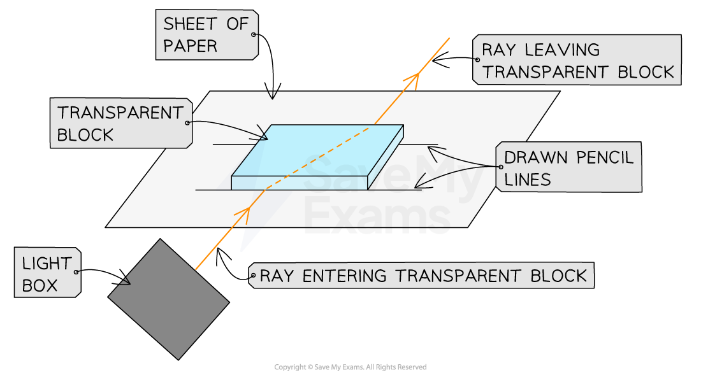
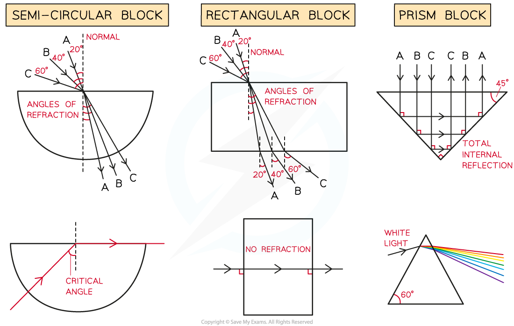

# Core Practical: Investigating Refraction

## Core practical 4: investigating refraction

> **Spec point** — `spcpt_HgkwxkJSJtVtCtcW`

## Core practical 4: investigating refraction

### Aim of the experiment

- To investigate the refraction of light using transparent rectangular blocks, semi-circular blocks and triangular prisms

  - To review your understanding of refraction use the revision note [Reflection & refraction](https://www.savemyexams.com/igcse/science/edexcel/double-award/17/physics/revision-notes/waves/reflection-and-refraction/reflection-and-refraction/)

### Variables

- ***Independent variable*** = shape of the block
- ***Dependent variable*** = direction of refraction
- Control variables:

  - Width of the light beam
  - Same frequency / wavelength of the light

#### Equipment list

| **Equipment** | **Purpose** |
|---|---|
| Ray Box | To provide a narrow beam of light that can be easily refracted |
| Protractor | To measure the angles of incidence and refraction |
| Sheet of Paper | To mark the lines indicating the incident and refracted rays |
| Pencil | To draw the incident and refracted ray lines onto the paper |
| Ruler | To draw the incident and refracted ray lines onto the paper |
| Perspex blocks (rectangular block, semi-circular block & prism) | To refract the light beam |

- ***Resolution*** of measuring equipment:

  - Protractor = 1°
  - Ruler = 1 mm

### Method

#### Refraction experiment set up

***Apparatus to investigate refraction***

1. Place the glass block on a sheet of paper, and carefully draw around the rectangular perspex block using a pencil
2. Switch on the ray box and direct a beam of light at the side face of the block
3. Mark on the paper:

  - A point on the ray close to the ray box
  - The point where the ray enters the block
  - The point where the ray exits the block
  - A point on the exit light ray which is a distance of about 5 cm away from the block
4. Draw a dashed line normal (at right angles) to the outline of the block where the points are
5. Remove the block and join the points marked with three straight lines
6. Replace the block within its outline and repeat the above process for a ray striking the block at a different angle
7. Repeat the procedure for each shape of perspex block (prism and semi-circular)

### Results

- Consider the light paths through the different-shaped blocks

#### Refraction experiment results with different media

***Refraction of light through different shapes of perspex blocks***

- The final diagram for each shape will include multiple light ray paths for the different angles of incidences (*i*) at which the light strikes the blocks
- This will help demonstrate how the angle of refraction (*r*) changes with the angle of incidence

  - Label these paths clearly with (1) (2) (3) or **A**, **B**, **C** to make these clearer
- Use the laws of refraction to analyse these results

  - You can use the revision note [Reflection & refraction](https://www.savemyexams.com/igcse/science/edexcel/double-award/17/physics/revision-notes/waves/reflection-and-refraction/reflection-and-refraction/) to do this

### Evaluating the experiment

***Systematic Errors:***

- An error could occur if the 90° lines are drawn incorrectly

  - Use a set square to draw perpendicular lines

***Random Errors:***

- The points for the incoming and reflected beam may be inaccurately marked

  - Use a sharpened pencil and mark in the middle of the beam
- The protractor resolution may make it difficult to read the angles accurately

  - Use a protractor with a higher resolution

#### Safety considerations

- The ray box light could cause burns if touched

  - Run burns under cold running water for at least five minutes
- Looking directly into the light may damage the eyes

  - Avoid looking directly at the light
  - Stand behind the ray box during the experiment
- Keep all liquids away from the electrical equipment and paper

> **Exam Hint**
> You may be asked questions on how to perform this refraction experiment in your exam. You may also be required to complete a table of results or deduce the path of a refracted ray.
