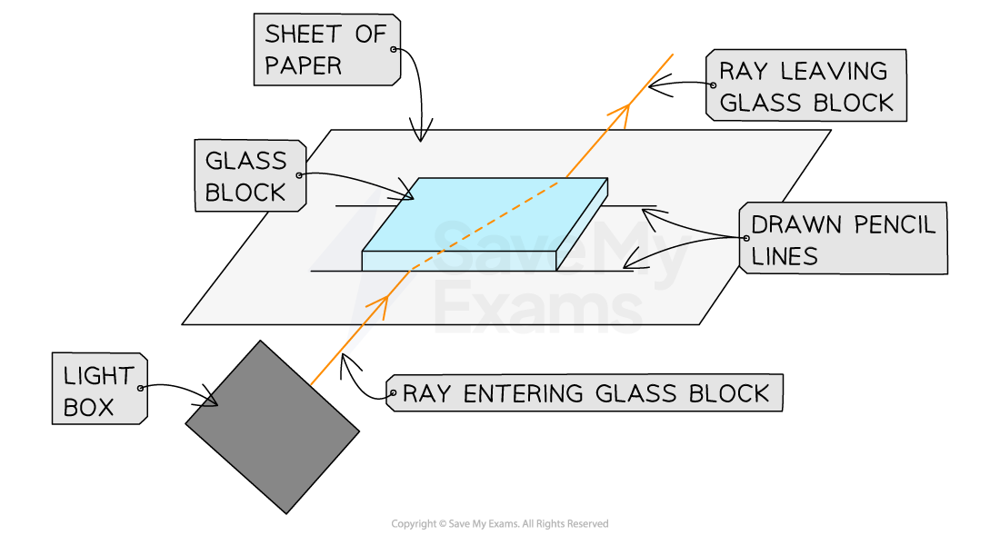
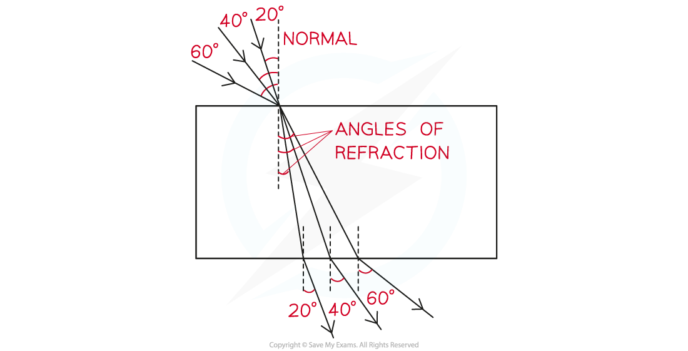

# Core Practical: Investigating Snell's law

## Core practical 5: investigating snell's law

> **Spec point** — `spcpt_FDgGnTP2KQ4pqgp5`

## Core practical 5: investigating snell's law

### Aims of the experiment

- To investigate the refractive index of glass, using a glass block

### Variables

- ***Independent variable*** = angle of incidence,* i*
- ***Dependent variable*** = angle of refraction , *r*
- Control variables:

  - Use of the same perspex block
  - Width of the light beam
  - Same frequency / wavelength of the light

### Equipment

#### Equipment list

| **Equipment** | **Purpose** |
|---|---|
| Ray Box | To provide a narrow beam of light that can be easily refracted |
| Protractor | To measure the angles of incidence and refraction |
| Sheet of Paper | To mark the lines indicating the incident and refracted rays |
| Pencil | To draw the incident and refracted ray lines onto the paper |
| Ruler | To draw the incident and refracted ray lines onto the paper |
| Perspex rectangle | To refract the light beam |

- ***Resolution*** of measuring equipment:

  - Protractor = 1°
  - Ruler = 1 mm

### Method

#### Diagram of equipment set up

***Apparatus set-up to investigate Snell's Law***

1. Place the glass block on a sheet of paper, and carefully draw around the block using a pencil
2. Draw a dashed line normal (at right angles) to the outline of the block
3. Use a protractor to measure the angles of incidence to be studied and mark these lines on the paper
4. Switch on the ray box and direct a beam of light at the side face of the block at the first angle to be investigated
5. Mark on the paper:

  - A point on the ray close to the ray box
  - The point where the ray enters the block
  - The point where the ray exits the block
  - A point on the exit light ray which is a distance of about 5 cm away from the block
6. Remove the block and join the points marked with three straight lines
7. Replace the block within its outline and repeat the above process for a rays striking the block at the next angle

#### An example results table

| **Angle of incidence, *****i *****/ °** | **Angle of refraction, *****r *****/ °** |
|---|---|
| 0 |   |
| 10 |   |
| 20 |   |
| 30 |   |
| 40 |   |
| 50 |   |
| 60 |   |
| 70 |   |
| 80 |   |

### Analysis of results

- If the angles have been measured correctly, the paper should end up looking like this:

#### A diagram showing how to measure the angles of incidence and refraction

- Snell's Law relates the angles of incidence and refraction

  - This is covered in the [Snell's law](https://www.savemyexams.com/igcse/science/edexcel/double-award/17/physics/revision-notes/waves/reflection-and-refraction/snells-law/) revision note
- Plot a graph of sin i on the y-axis against sin r on the x-axis

  - The refractive index is equal to the gradient of the graph

#### A graph of the results of snell's law experiment

### Evaluating the experiment

***Systematic Errors:***

- An error could occur if the 90° lines are drawn incorrectly

  - Use a set square to draw perpendicular lines

***Random Errors:***

- The points for the incoming and reflected beam may be inaccurately marked

  - Use a sharpened pencil and mark in the middle of the beam
- The protractor resolution may make it difficult to read the angles accurately

  - Use a protractor with a higher resolution

#### Safety considerations

- The ray box light could cause burns if touched

  - Run burns under cold running water for at least five minute
- Looking directly into the light may damage the eyes

  - Avoid looking directly at the light
  - Stand behind the ray box during the experiment
- Keep all liquids away from the electrical equipment and paper
