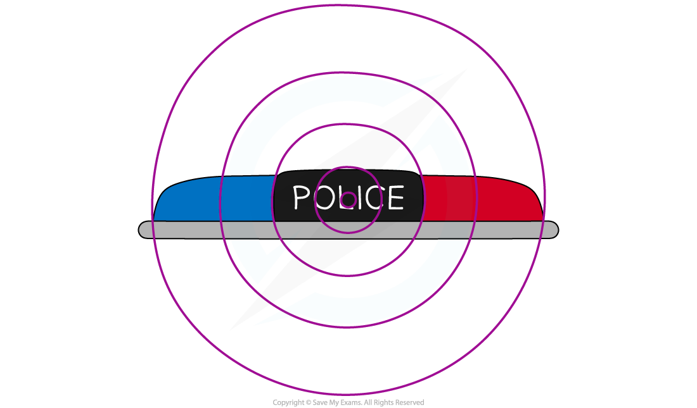
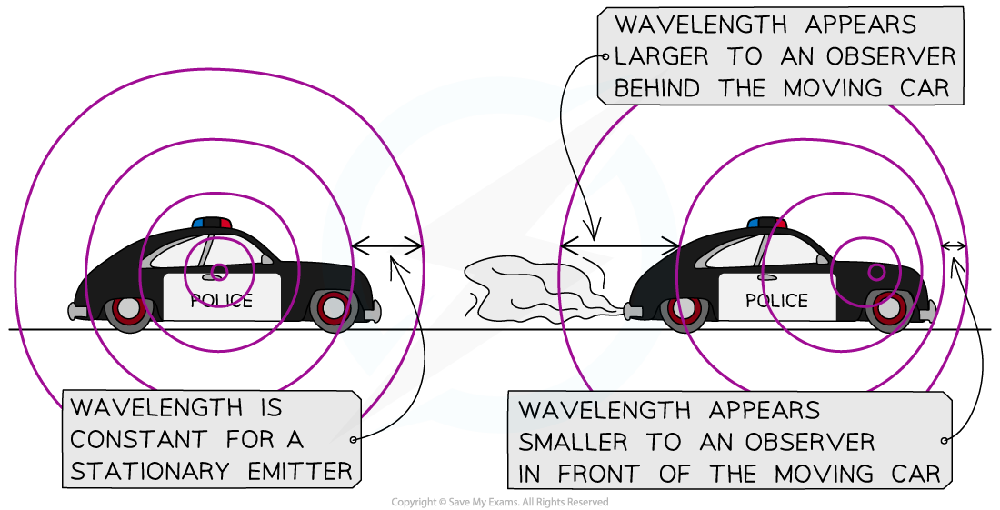

# The Doppler Effect

## The Doppler effect

> **Spec point** — `spcpt_XWs4wcMV9s3Ntd5Q` · explain why there is a change in the observed frequency and wavelength of a wave when its source is moving relative to an observer, and that this is known as the Doppler effect 

## The Doppler effect

- The **Doppler effect** is defined as: **The apparent change in observed wavelength and frequency of a wave emitted by a moving source relative to an observer**
- The Doppler effect can be observed whenever sources of waves **move**

  - The **frequency** of the sound waves emitted by ambulance or police sirens goes from a **high pitch** (high frequency) to a **low pitch** (low frequency) as the vehicle whizzes past
  - Galaxies in outer space emit light waves which appear **redder** (longer wavelength) to an observer on Earth because the stars are moving **away** from us

### Explaining the Doppler effect

- Usually, when a **stationary** object emits waves, the waves spread out **symmetrically**

#### A stationary source of sound waves

***This stationary police car emits sound from the siren and the waves spread out symmetrically***

- To an observer standing in front of an object moving towards them:

  - The waves appear to get **squashed** together because the wavelength appears to get **shorter** (and the **frequency** appears to get **higher**)
- To an observer standing behind an object moving away from them:

  - The waves appear to get **stretched** apart because the wavelength appears to get **longer** (and the **frequency** appears to get **lower**)

#### The Doppler effect is observed when the source of the sound waves is moving

***To an observer in front of the moving car, the wavelength appears smaller because they squash together. To an observer behind the moving car, the waves appear to stretch out***

> **Exam Hint**
> Remember that the Doppler effect is an **apparent** change in wavelength and frequency. This only happens because a wave emitter **moves** away from or towards an observer. The **speed** of the waves emitted stays constant, so if the wavelength of the wave appears to **decrease** this must mean the frequency appears to **increase**, and vice versa.
