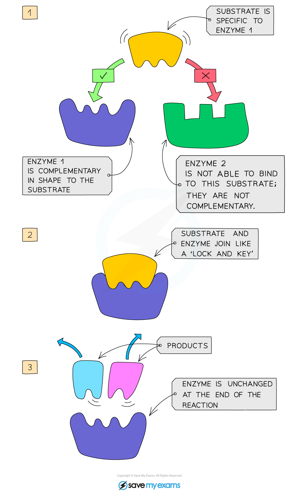

# Role of Enzymes

## Enzymes as Biological Catalyst

> **Spec point** — `spcpt_s25pZ6cHSssmypkv` · understand the role of enzymes as biological catalysts in metabolic reactions

## Enzymes as Biological Catalysts

- Enzymes are proteins that act as **biological catalysts** to **speed up** the rate of a chemical reaction **without being changed** or used up in the reaction
- They are **biological** because they are made in** living cells**
- Enzymes are necessary to all living organisms as they **maintain reaction speeds** of all ***metabolic reactions*** at a rate that can **sustain life**

  - For example, if we did not produce digestive enzymes, it would take around 2 - 3 weeks to digest one meal; with enzymes, it takes around 4 hours
  - Often the products of one reaction are the reactants for another (and so on)

#### The mechanism of enzyme action

- Enzymes are **specific** to one particular substrate(s) as the **active site** of the enzyme, where the substrate attaches, is a complementary shape to the substrate
- When the substrate moves into the enzyme’s active site they become known as the **enzyme-substrate complex**
- After the reaction has occurred, the **products** leave the enzyme’s active site as they no longer fit it and it is free to take up another substrate

  - **Step One:** Enzymes and substrates randomly move about in solution
  - **Step Two:** When an enzyme and its complementary substrate randomly collide an enzyme-substrate complex forms, and the reaction occurs
  - **Step Three:** A product (or products) forms from the substrate(s) which are then released from the active site. The enzyme is unchanged and will go on to catalyse further reactions

***How enzymes work***
