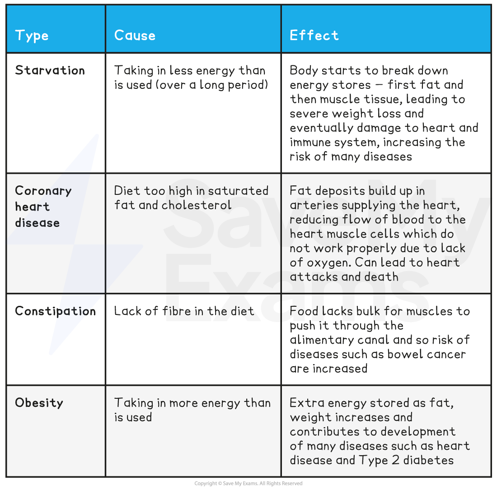

# Balanced Diet

## The Importance of a Balanced Diet

> **Spec point** — `spcpt_MBQ5VGHt9S2MTvsJ` · understand that a balanced diet should include appropriate proportions of carbohydrate, protein, lipid, vitamins, minerals, water and dietary fibre

## The Importance of a Balanced Diet

- A **balanced diet** consists of all of the food groups in the **correct proportions**
- The necessary key food groups are:

  - **Carbohydrates**
  - **Proteins**
  - **Lipids**
  - **Dietary fibre**
  - **Vitamins**
  - **Minerals (mineral ions)**
  - **Water**

#### Malnutrition

- Having an **unbalanced diet** can lead to **malnutrition**
- Malnutrition can cause a variety of different health problems in humans

#### Causes and effects of malnutrition table

## Sources & Functions of Dietary Elements

> **Spec point** — `spcpt_8ZTRyqymmJpVBgbv` · identify the sources and describe the functions of carbohydrate, protein, lipid (fats and oils), vitamins A, C and D, the mineral ions calcium and iron, water and dietary fibre as components of the diet

## Sources & Functions of Dietary Elements

- There are seven main food groups. These are:

  - **Carbohydrates**
  
    - Function: source of **energy**
    - Sources: bread, cereals, pasta, rice, potatoes
  - **Protein**
  
    - Function: **growth **and** repair**
    - Sources: meat, fish, eggs, pulses, nuts
  - **Lipid** (fats and oils)
  
    - Function: **insulation** and **energy storage**
    - Sources: butter, oil, nuts
  - **Dietary fibre**
  
    - Function: provides** bulk (roughage) for the intestine** to push food through it
    - Sources: vegetables, whole grains
  - **Vitamins and minerals**
  
    - Function: needed in small quantities to **maintain health**
    - Sources: fruits and vegetables, meats, dairy products
  - **Water**
  
    - Function: needed for **chemical reactions **to take place in the body
    - Sources: water, juice, milk, fruits and vegetables

- Some examples of vitamins and minerals include:** **

  - **Calcium** is needed for **strong teeth and bones** and is involved in the clotting of blood
  
    - Calcium is found in milk, cheese, and eggs
    - A deficiency can lead later in life to osteoporosis, a condition in which the **bones become less dense **and more fragile, making them more likely to break (fracture)
  - **Vitamin D** helps the body to **absorb calcium** and is required for **strong bones and teeth**
  
    - Vitamin D can be found in oily fish and dairy products, and is also made naturally by the body in sunlight
    - A severe deficiency of vitamin D can lead to rickets, a condition in children characterised by poor bone development
  - **Vitamin C** forms an essential part of **collagen protein**, which makes up the skin, hair, gums, and bones
  
    - A deficiency can cause scurvy. It is found in citrus fruits and some green vegetables
  - **Vitamin A** is needed to make the pigment in the **retina for vision**
  
    - It can be found in meat, liver, dairy, leafy green vegetables like spinach, and eggs
  - **Iron** is needed to make **haemoglobin**, the pigment in red blood cells that **helps to carry oxygen**
  
    - It can be found in red meat, liver, leafy green vegetables, and spinach

## Variation in Energy Requirements

> **Spec point** — `spcpt_tTm3MgHpRTXgdB9j` · understand how energy requirements vary with activity levels, age and pregnancy

## Variation in Energy Requirements

- The nutritional requirements for individuals will vary throughout their lifetime
- An individual will still require the same key food groups, but in different **quantities** depending on a number of factors such as age, height, sex, activity levels, pregnancy and breastfeeding

  - The amount of energy that **young people** need increases towards adulthood as this energy is needed for growth. Children need a higher proportion of protein in their diet than adults as this is required for growth
  
    - Energy needs of adults decrease as they age
  - The **more active**, the more energy required for movement as muscles are contracting more and respiring faster
  - During **pregnancy,** energy requirements increase as energy is needed to support the growth of the developing fetus, as well as the larger mass that the mother needs to carry around. Extra calcium and iron are also needed in the diet to help build the bones, teeth, and blood of the fetus
  - For **breastfeeding mothers**, energy requirements increase and extra calcium is still needed to make high-quality breast milk
