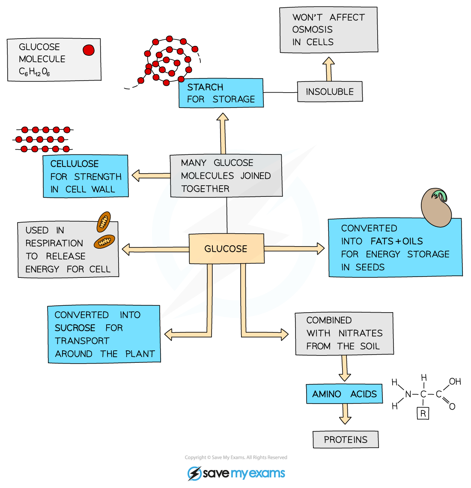
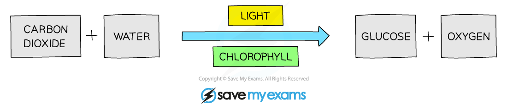
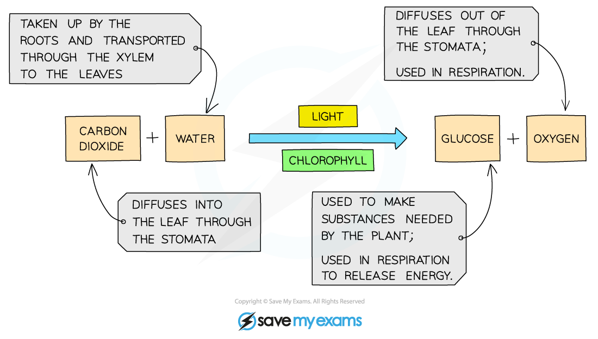

# The Process of Photosynthesis

## Photosynthesis Theory

> **Spec point** — `spcpt_63jKBWT2dNmpyYzN` · understand the process of photosynthesis and its importance in the conversion of light energy to chemical energy

## Photosynthesis Theory

- Photosynthesis is a process in which energy from sunlight is transferred to the chloroplasts in green plants

  - Energy from sunlight is **absorbed by chlorophyll**, a green pigment found inside chloroplasts
  - Green plants use this energy to make the carbohydrate **glucose** from the raw materials **carbon dioxide** and **water**
  - At the same time, **oxygen** is made and released as a waste product
- Photosynthesis can be defined as **the process by which plants manufacture carbohydrates from raw materials using energy from light**
- Plants are **producers **–** **they can make their own food and so are the first organism at the start of all food chains

#### The products of photosynthesis

- Plants use the glucose they make as a **source of energy** in **respiration**
- They can also use it to

  - Produce **starch** for storage
  - Synthesise **lipids** for an energy source in seeds
  - To form **cellulose** to make cell walls
  - Produce **amino acids** (used to make proteins) when combined with nitrogen and other mineral ions absorbed by roots

***Once the carbon from carbon dioxide is taken into the plant and converted to glucose in photosynthesis, it can then be converted and used in many different types of biological molecule.***

> **Exam Hint**
> If asked for the raw materials required for photosynthesis, the answer is **carbon dioxide** **and water. **Although required for the reaction to take place, light energy is not a substance and therefore cannot be a raw material.

## Photosynthesis Equations

> **Spec point** — `spcpt_kVhtRFT37Z9VkGKy` · know the word equation and the balanced chemical symbol equation for photosynthesis

## Photosynthesis Equations

- Photosynthesis can be summarised in a word equation as shown below:

***Word equation for photosynthesis***

***Sources of the reactants and uses of the products of photosynthesis***

- This equation can also be shown as a **balanced chemical symbol equation**

  - **Six** carbon dioxide molecules combine with **six** water molecules to make **one** glucose molecule and **six** oxygen molecules

***The balanced symbol equation for photosynthesis***

> **Exam Hint**
> The photosynthesis equation is the exact reverse of the aerobic respiration equation so if you have learned one you also know the other one!
