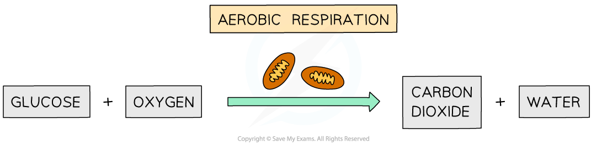
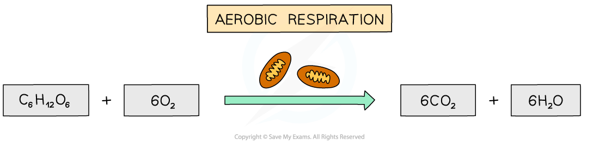
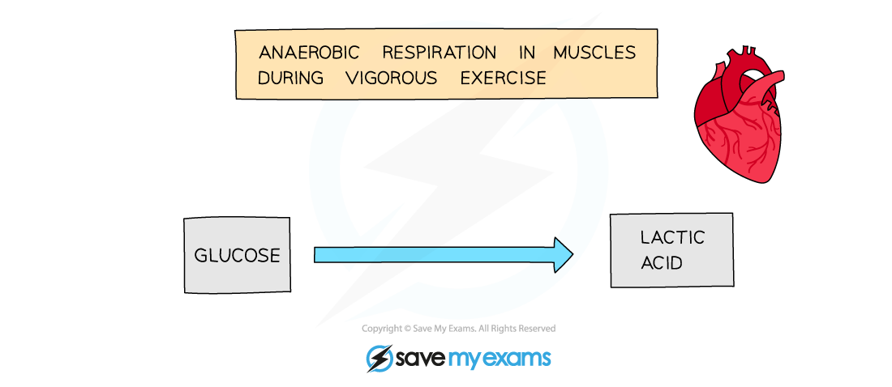
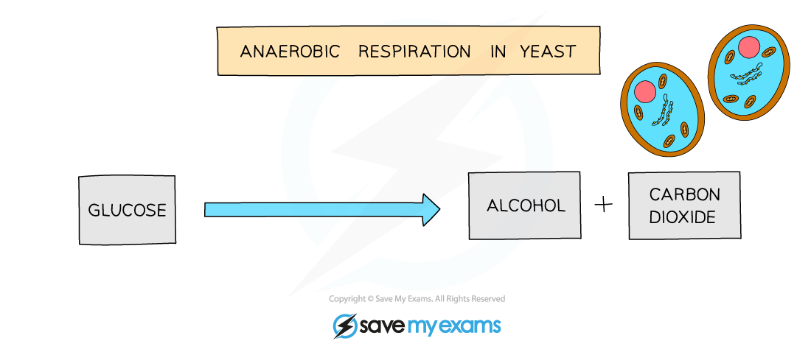

# Aerobic & Anaerobic Respiration

## Aerobic Respiration

> **Spec point** — `spcpt_pNnndtTpHxZjxwTq` · know the word equation and the balanced chemical symbol equation for aerobic respiration in living organisms

## Aerobic Respiration

- **Aerobic** respiration requires **oxygen **and takes place in the mitochondria** **in the cell

  - It is defined as **the chemical process in cells that uses oxygen to break down nutrient molecules to release energy in the form of ATP**
- **Aerobic respiration** is the complete breakdown of glucose to release a relatively large amount of **energy** in the form of **ATP** for use in cellular processes and reactions.
- **Carbon dioxide **and** water** are also produced as waste products

#### Word equation for aerobic respiration

#### Symbol equation for aerobic respiration

- This equation can also be shown as a **balanced chemical equation**

  - **One** molecule of glucose reacts with **six** molecules of oxygen to produce **six **molecules of carbon dioxide and** six** molecules of water

> **Exam Hint**
> You need to know **both** the **word** equation **and** the **balanced** chemical symbol **equation** for **aerobic respiration** in living organisms. If an exam question asks you to give the balanced symbol equation for respiration, then you must write out the symbol equation and it will need to be balanced for full marks. If you give the word equation when asked for the balanced symbol equation, you will not be given credit.
> 
> Always check what the question is asking you for!

## Anaerobic Respiration

> **Spec point** — `spcpt_6JnMm83wDsMfH6Y2` · know the word equation for anaerobic respiration in plants and in animals

## Anaerobic Respiration

- **Anaerobic** respiration does **not require oxygen**

  - It is defined as the chemical process in cells that breaks down nutrient molecules to release energy** without using oxygen**
- It involves the **incomplete breakdown of glucose** and so releases a a smaller** **amount of **energy** in the form of ATP than aerobic respiration
- Different waste products are formed depending on the **type of organism** that the anaerobic respiration is taking place in

### Anaerobic respiration in animals

- Anaerobic respiration mainly takes place in **muscle cells **during vigorous exercise
- When we exercise at high intensities, our muscles have a **higher demand for energy**
- Our bodies can only deliver so much oxygen to our muscle cells for aerobic respiration
- When oxygen supply is insufficient, some glucose is broken down without it anaerobically, producing **lactic acid** instead
- Glucose has not been fully broken down meaning there is still energy stored within the bonds of lactic acid molecules

  - **Lactic acid** builds up in muscle cells and **lowers the pH** of the muscle tissue (making the conditions more acidic)
  
    - Acidic conditions can **denature the enzymes in cells**
  - Lactic acid will eventually be broken down using **oxygen** to produce **carbon dioxide** and **water** as waste products
- Anaerobic respiration releases **less energy **than aerobic respiration

### Anaerobic respiration in plants and fungi

- Plants and yeast can respire **without oxygen** as well, breaking down glucose in the absence of oxygen to produce **ethanol** and **carbon dioxide**
- Anaerobic respiration in yeast cells is called **fermentation**

  - Fermentation is economically important in the manufacture of **bread** (where the carbon dioxide produced helps the dough to rise)

> **Exam Hint**
> You need to know the word equations for anaerobic respiration in **animals** and **plants (or fungi) but not the symbol equations. **

## Comparing Anaerobic & Aerobic Respiration

> **Spec point** — `spcpt_4dmJ4Fg7Xntvqwds` · describe the differences between aerobic and anaerobic respiration

## Comparing Anaerobic & Aerobic Respiration

- The processes of aerobic and anaerobic respiration can be compared with regard to the need for oxygen, the products and the relative amounts of ATP produced/energy transferred

|   | Aerobic | Anaerobic |
|---|---|---|
| Oxygen used | Yes | No |
| Glucose breakdown | Complete | Incomplete |
| Products | Carbon dioxide and water | In animal cells: lactic acid  In yeast and plant cells: carbon dioxide and ethanol |
| Relative amount of ATP produced/energy released per glucose molecule | A lot | A little |
