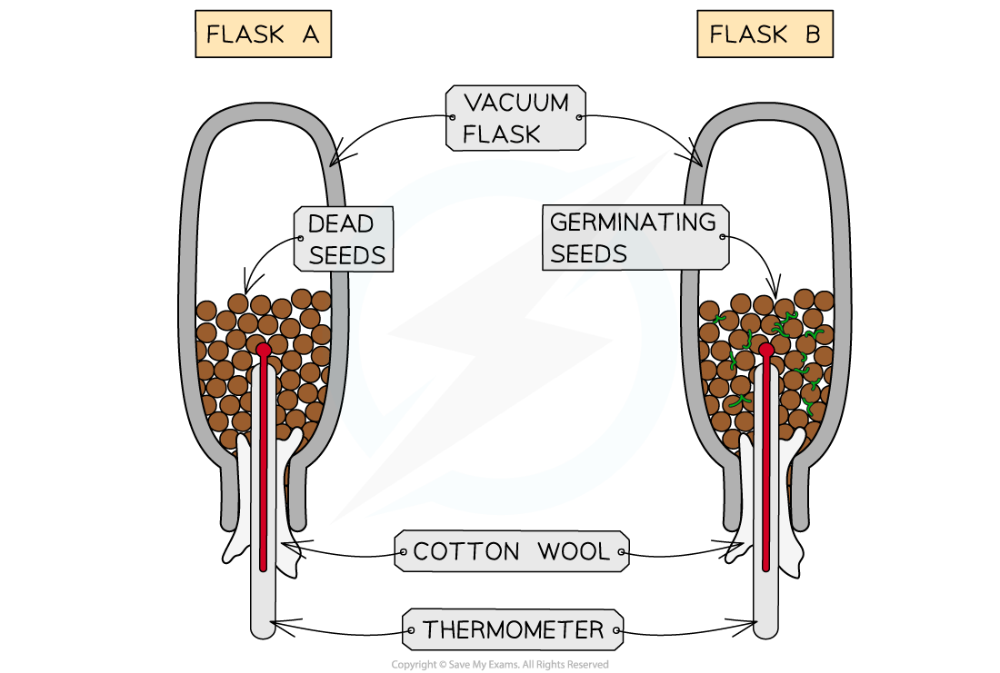

# Practical: Investigating Respiration

## Practical: Investigating Respiration

> **Spec point** — `spcpt_3pv9yByyFQjX8MxD` · practical: investigate the evolution of carbon dioxide and heat from respiring seeds or other suitable living organisms

## Practical: Investigating Respiration

- We can investigate the production of **carbon dioxide** and **heat** from **respiration** through experiments using germinating seeds or other living organisms (eg. blowfly larvae)

### Practical investigation: demonstrating the production of carbon dioxide from respiration

#### Apparatus

- Measuring cylinder
- 3 sets of boiling tubes (two per set)
- 3 rubber bungs with delivery tubes
- Limewater (calcium hydroxide solution)
- Damp cotton wool
- 10 germinating seeds (eg. peas)
- 10 boiled/dead seeds (control)
- 10 glass beads (control for volume)
- Stand and clamps

#### Method

- Prepare the limewater tubes by pouring 2 cm3 of limewater into the bottom of each of three boiling tubes
- Prepare the seed tubes by adding damp cotton wool to the bottom of three other boiling tubes:

  - Tube A: 10 germinating seeds
  - Tube B: 10 boiled/dead seeds
  - Tube C: 10 glass beads
- Seal the seed tubes with a rubber bung and delivery tube, connecting each seed tube to a boiling tube of limewater

  - Ensure that the end of each delivery tube is submerged a few millimetres below the limewater so that any gas released is bubbled through the limewater
- Place the apparatus in a warm environment (around 25-30°C) for several hours/overnight
- Observe any colour changes in the limewater

#### Results

- The following results would be expected for this investigation:

| Seed tube | Observation | Explanation |
|---|---|---|
| A - germinating seeds | Limewater turns cloudy | Germinating seeds respire, releasing carbon dioxide which reacts with limewater, turning it cloudy/milky in colour. |
| B - boiled seeds | No change | Boiled seeds will be dead and so will not respire, so no carbon dioxide is released, limewater remains clear. |
| C - glass beads | No change | No living material = no respiration = no carbon dioxide produced so limewater remains clear. |

> **Exam Hint**
> You could be asked in the exam to give the name of a suitable chemical that could be used as indicator to show that a living organism (eg. germinating seeds, yeast) is respiring . Limewater (calcium hydroxide) changes from a clear solution to cloudy/milky solution when carbon dioxide is bubbled through it. 
> 
> Other indicators can be used eg. hydrogen carbonate changes colour from orange to yellow when carbon dioxide levels are high.

### Practical investigation: demonstrating the production of heat

#### Apparatus

- 2 vacuum flasks
- 2 thermometers
- Moist cotton wool
- Weak bleach solution
- 10 germinating seeds (eg. wheat seeds)
- 10 boiled/dead seeds (killed control, should be same seed type as germinating seeds)
- Tweezers

#### Preparation

- Before using the seeds and the vacuum flasks they need to be sterilised  carefully with a weak bleach solution (or disinfectant). This is to prevent any respiration from any microbes present causing an increase in temperature, rather than the respiring seeds

#### Method

- Set up the flasks as shown in the diagram below:

  - **Flask A** with the **dead seeds**
  - **Flask B** with the **germinating seeds**
- Insert a thermometer into each flask so that the bulb is among the seeds
- Seal the top of both flasks with cotton wool

  - This holds the thermometer in place and also reduces heat loss from the flasks
- Invert both flasks and place in an environment where the temperature will remain constant
- Record the **initial temperature **of each flask
- After **2-3 days**, record the **final temperature **of each flask

**Experiment to demonstrate the production of heat by living material during respiration**

#### Results

- The following results would be expected for this investigation:

| Flask | Initial temperature (°C) | Final temperature (°C) | Temperature change (°C) | Explanation |
|---|---|---|---|---|
| A - boiled dead seeds | 20.0 | 20.0 | 0.0 | Boiled seeds will be dead and so will not respire, so no temperature change would be expected. |
| B - germinating seeds | 20.0 | 25.5 | +5.5 | Germinating seeds are respiring, releasing heat energy |

- The thermometer in the flask with the **germinating seeds** (**Flask B**) should show an **increase in temperature,** as these seeds will respire which releases heat energy
- The seeds in **flask A** are **not respiring** because they are dead

  - If there is a change in temperature in flask A, it is likely due to any change in the room temperature
  - Therefore an important consideration is to measure the room temperature in addition to the temperature of the flasks

> **Exam Hint**
> It's really important that you mention that the seeds (and vacuum flasks) must be sterilised in this experiment to kill any microorganisms present. Otherwise there will be microbial decay during the experiment, which will lead to an increase in the temperature of both flasks.

### Applying CORMS

- The CORMS prompt can be used to design investigations

***The CORMS framework***

- This is how CORMS could be applied to an investigation demonstrating  that carbon dioxide is released by respiring organisms:

  - **Change** - change the content of the boiling tube (germinating seeds, dead seeds or glass beads)
  - **Organism** - the seeds used should all be of the same type and number/mass
  - **Repeat** - repeat the investigation several times to ensure  results are reliable
  - **Measurement 1** - observe the change in the limewater indicator
  - **Measurement 2** - ...after 3 hours
  - **Same** - control the volume of indicator, the number of seeds/beads, the temperature of the environment
- This is how CORMS could be applied to an investigation demonstrating  that heat is released by respiring organisms:

  - **Change** - change the content of the flasks (germinating seeds or dead seeds)
  - **Organism** - the seeds used should all be of the same type and number/mass
  - **Repeat** - repeat the investigation several times to ensure our results are reliable
  - **Measurement 1** - observe the change in the temperature on the thermometer
  - **Measurement 2** - ...after 4 days
  - **Same** - control the number of seeds, the room/environmental temperature, the material and size of the flasks
