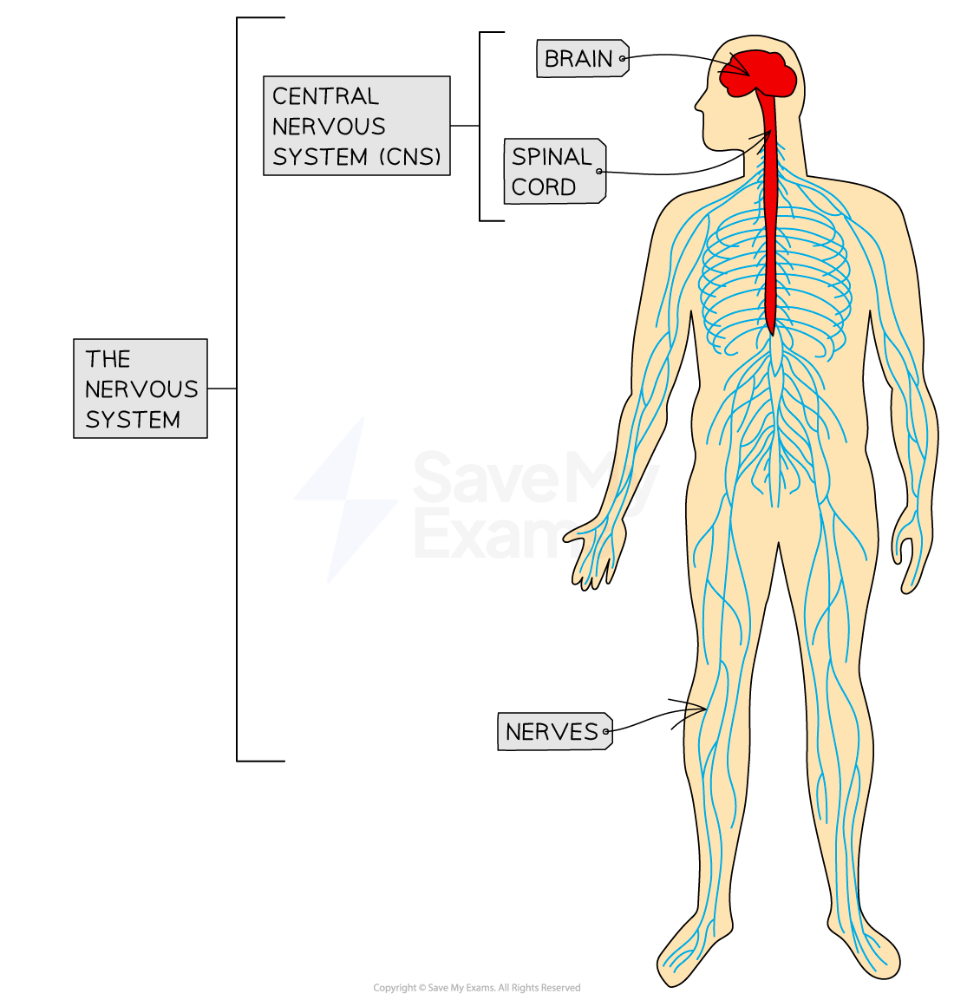

# Nervous & Hormonal Control

## The Human Nervous System & Endocrine System

> **Spec point** — `spcpt_wPvwQQhTjXZ8zgPS` · describe how nervous and hormonal communication control responses and understand the differences between the two systems

## The Human Nervous System & Endocrine System

- There are **two different control systems** in humans that work together to help us **respond** to **stimuli**. These are:

  - The **nervous system**
  - The **hormonal system** (also known as the **endocrine system**)
- **Changes** in our **external environment** or in the **internal environment** of our bodies act as **stimuli**
- The nervous and hormonal systems **coordinate** a **suitable response** to these stimuli
- This allows us to make sense of our surroundings, to respond to the changes that occur in our surroundings and **coordinate and regulate body functions**

### The nervous system

- Information is sent through the nervous system as **electrical impulses** – these are electrical signals that pass along **nerve cells** known as **neurones**
- These impulses travel along neurones at **very high speeds** (up to 100 metres per second)
- This allows **rapid responses** to stimuli (e.g. the **withdrawal reflex** that causes you to move your hand away extremely quickly when it touches a flame)
- The nervous system coordinates the activities of sensory **receptors** (e.g. those in the eye), decision-making centres in the ***central nervous system***, and **effectors** such as muscles and glands
- The nervous system is used to control functions that **need instant **(or **very rapid**)** responses**

***The human nervous system***

### The endocrine system

- Information is sent through the endocrine (hormonal) system as **chemical substances** known as **hormones**
- Hormones are carried by the **blood** and can therefore circulate around the whole body
- Hormones transmit information from one part of the organism to another and bring about a **change** (they provide a **signal** that triggers a **response**)
- Hormones alter the activity of one or more specific **target organs**
- Hormones are used to control functions that **do not need instant responses**
- Hormones are produced by **endocrine glands**

  - A gland is a group of cells that produces and releases one or more substances (a process known as secretion)
- The endocrine glands that produce hormones in animals are known collectively as the **endocrine system**

#### A comparison of the nervous and endocrine systems table

|   | **Nervous system** | **Endocrine system** |
|---|---|---|
| Made up of | Nerves (bundles of neurones), brain, spinal cord | Glands |
| Type of message | Electrical (impulse) | Chemical (hormone) |
| Transmission of message | Along neurones | Through the bloodstream (in plasma) |
| Speed of action | Very fast | Slower |
| Type of effect | Specific/localised (acts on specific cells) | Widespread (affects many cells/organs) |
| Duration of effect | Short (stops quickly) | Long (lasts until the hormone is broken down) |
